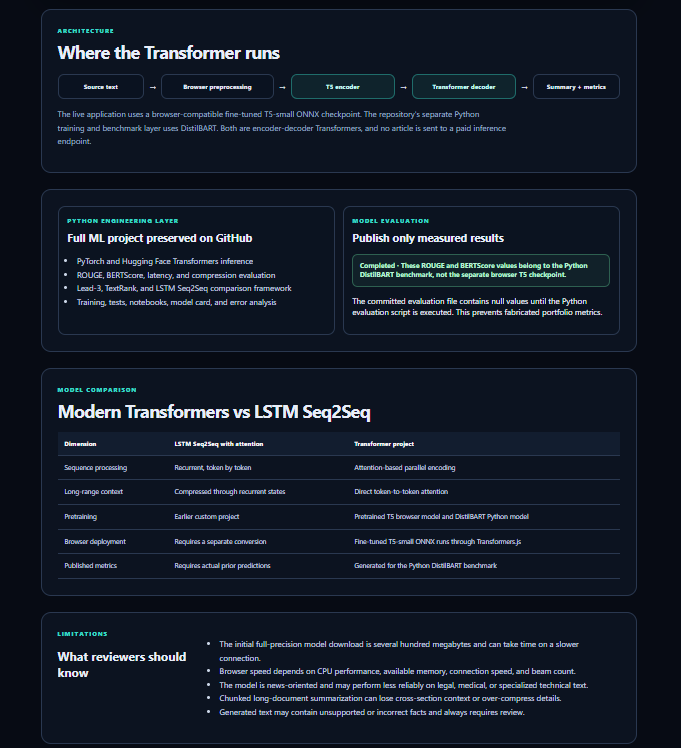
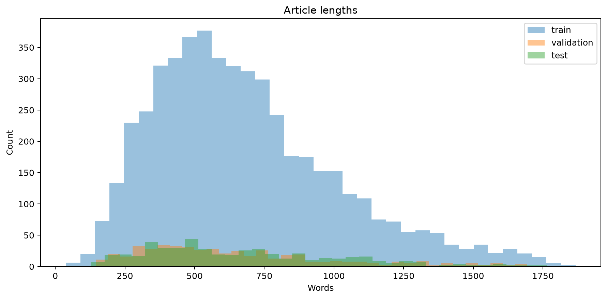
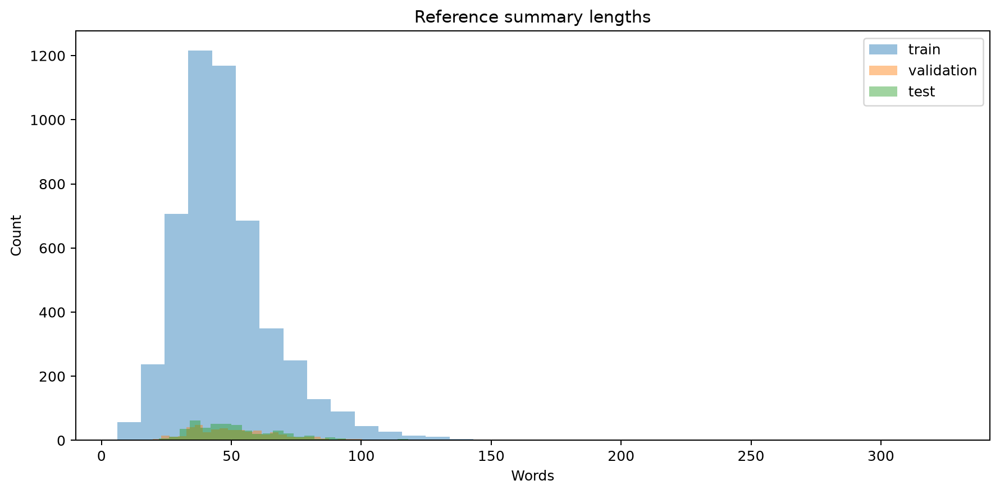
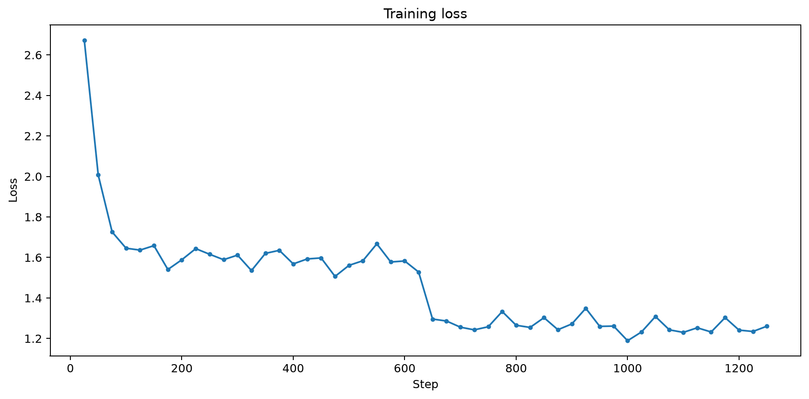
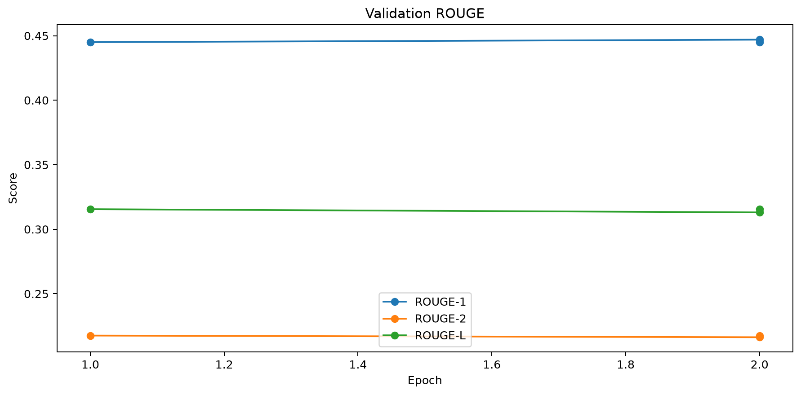
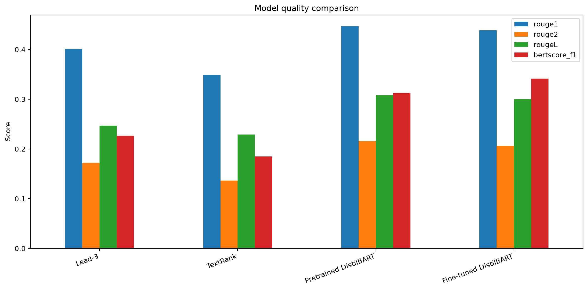
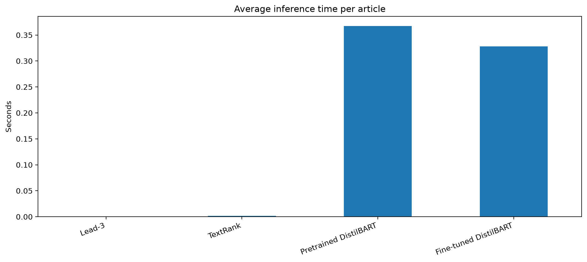
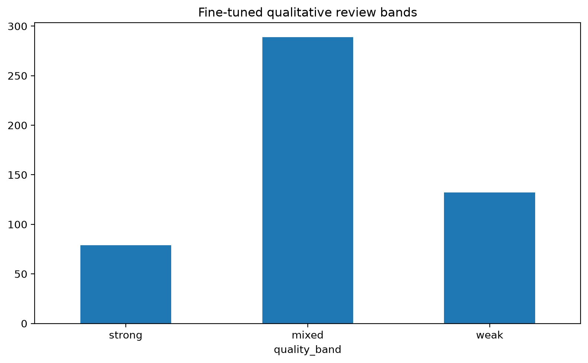
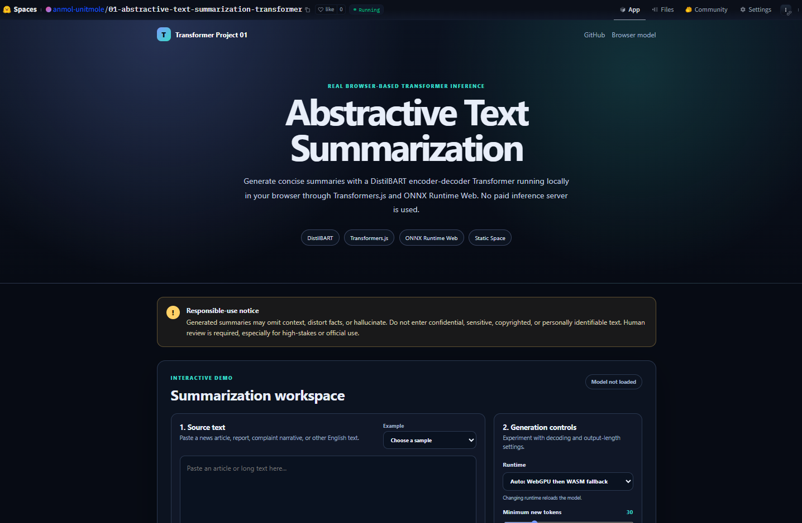
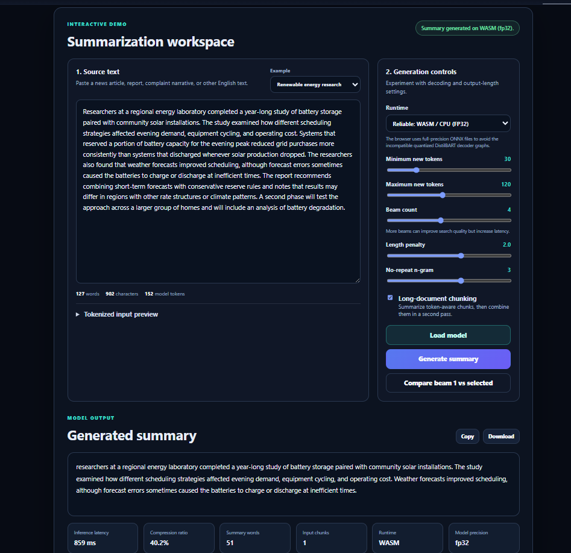

# Abstractive Text Summarization with DistilBART and Transformers.js

[](https://www.python.org/)
[](https://pytorch.org/)
[](https://huggingface.co/docs/transformers/)
[](https://huggingface.co/sshleifer/distilbart-cnn-12-6)
[](https://huggingface.co/docs/transformers.js/)
[](https://huggingface.co/spaces/anmol-unitmole/01-abstractive-text-summarization-transformer)
[](https://github.com/unit-mole/transformer-projects/actions/workflows/01-abstractive-text-summarization-transformer.yml)
[](web/LICENSE)

An end-to-end natural-language-processing project that fine-tunes and evaluates an **encoder-decoder DistilBART Transformer** for abstractive text summarization. The repository includes reproducible dataset preparation, RTX GPU fine-tuning, baseline comparison, ROUGE and BERTScore evaluation, latency analysis, error analysis, saved JSON/CSV/PNG evidence, Python inference, automated testing, and a free browser-based Hugging Face Static Space.

**Status:** Portfolio-ready, evaluated, and deployed  
**Live demo:** [Open the Abstractive Text Summarization Transformer](https://huggingface.co/spaces/anmol-unitmole/01-abstractive-text-summarization-transformer)  
**Primary stack:** Python · PyTorch · Hugging Face Transformers · DistilBART · T5-small · Transformers.js · ONNX Runtime Web · JavaScript · HTML · CSS · GitHub Actions · Hugging Face Spaces

---

## Responsible Use

This project is intended for educational, technical-learning, experimentation, and portfolio demonstration purposes.

- Generated summaries may omit important context, alter meaning, distort facts, or hallucinate unsupported details.
- Numbers, names, dates, technical terms, and causal statements must be checked against the original source.
- ROUGE and BERTScore measure similarity to reference summaries; they do not guarantee factual correctness.
- Do not paste private, confidential, copyrighted, sensitive, regulated, or personally identifiable text into a public demonstration.
- The application must not be used as the sole basis for medical, legal, financial, safety-critical, academic, journalistic, employment, quality-release, or official decisions.
- Human review is required before generated summaries are shared or used operationally.

---

## Business Problem

Organizations receive large volumes of unstructured text through customer complaints, quality investigations, service cases, technical reports, news articles, root-cause narratives, and operational documentation. Reviewing and condensing this material manually can be slow, inconsistent, and difficult to scale.

This project answers:

> Given a long English document, can an encoder-decoder Transformer generate a concise abstractive summary while preserving the most important information?

The system supports practical use cases such as:

- Customer-complaint summarization
- GCS case and issue-detail summarization
- Root-cause narrative summarization
- Quality-review preparation
- Technical-report condensation
- News and business-article summarization
- Historical-case review
- Human-in-the-loop analytics workflows

The application returns:

- Generated abstractive summary
- Browser or Python runtime details
- Inference latency
- Compression ratio
- Source and summary word counts
- Generation configuration
- Model-loading progress
- Responsible-use guidance

---

## Project Objective

Build a professional summarization system that can:

1. Load and validate long English text.
2. Preserve important entities, dates, numbers, punctuation, and sentence structure.
3. Fine-tune a pretrained DistilBART encoder-decoder Transformer.
4. Evaluate the pretrained and fine-tuned checkpoints on the same held-out dataset.
5. Compare the neural model against Lead-3 and TextRank baselines.
6. Measure ROUGE-1, ROUGE-2, ROUGE-L, BERTScore, latency, and compression ratio.
7. Detect repetition, missing numbers, and possible numeric hallucinations.
8. Save reproducible JSON, CSV, Markdown, notebook, and chart artifacts.
9. Provide Python, Gradio, and browser-based inference layers.
10. Deploy a free Static Space without a paid Python inference server.
11. Validate the project through GitHub Actions.
12. Communicate limitations and model distinctions honestly.

---

## Portfolio Architecture

Project 01 uses separate layers for model development and free browser deployment.

| Portfolio component | Purpose |
|---|---|
| GitHub repository | Complete Python ML project, GPU training, evaluation, notebooks, tests, artifacts, documentation, and browser source |
| Python model layer | Pretrained and personally fine-tuned DistilBART checkpoints |
| Browser deployment layer | Fine-tuned T5-small ONNX checkpoint running through Transformers.js and ONNX Runtime Web |
| Hugging Face Static Space | Free interactive summarization demo with no paid Python server |
| GitHub Actions | Python testing, browser testing, Vite build validation, and isolated Space deployment |

```text
GitHub repository
├── Python DistilBART model-development layer
│   ├── dataset preparation
│   ├── RTX fine-tuning
│   ├── pretrained vs fine-tuned evaluation
│   ├── Lead-3 and TextRank baselines
│   ├── ROUGE and BERTScore
│   └── error and latency analysis
│
├── Browser application layer
│   ├── Transformers.js
│   ├── ONNX Runtime Web WASM
│   ├── browser-compatible T5-small summarization checkpoint
│   └── static HTML/CSS/JavaScript interface
│
└── GitHub Actions
    ├── test Python project
    ├── test and build Static Space
    └── deploy isolated Project 01 Space
```

### Honest model distinction

The repository's primary model-development and evaluation work uses:

```text
sshleifer/distilbart-cnn-12-6
```

The free live browser demo uses:

```text
onnx-community/text_summarization-ONNX
```

The browser checkpoint is a fine-tuned T5-small encoder-decoder Transformer selected for reliable full-precision ONNX Runtime Web inference. The Python DistilBART benchmark metrics must not be represented as browser T5 metrics.

---

## Project Overview



*Project overview showing the summarization objective, Transformer workflow, evaluation layer, and deployment architecture.*

---

## Dataset

The completed portfolio benchmark uses the **CNN/DailyMail 3.0.0** summarization dataset.

| Property | Value |
|---|---|
| Task | Abstractive text summarization |
| Dataset ID | `abisee/cnn_dailymail` |
| Dataset configuration | `3.0.0` |
| Source field | `article` |
| Reference-summary field | `highlights`, renamed to `reference_summary` |
| Training examples | 5,000 |
| Validation examples | 500 |
| Held-out test examples | 500 |
| Random seed | 42 |
| Maximum source tokens | 768 |
| Maximum target tokens | 128 |
| Published claim | Controlled portfolio subset, not full-dataset leaderboard training |

The full CNN/DailyMail dataset is downloaded through Hugging Face Datasets when required and is not committed to GitHub. The repository keeps safe example CSV files and generated benchmark artifacts.

### Article-length distribution



*Distribution of article lengths across the deterministic benchmark subsets.*

### Reference-summary length distribution



*Distribution of reference-summary lengths used to configure truncation and generation settings.*

---

## Tools and Technologies

| Area | Technology |
|---|---|
| Languages | Python, JavaScript, HTML, CSS |
| Deep learning | PyTorch |
| NLP framework | Hugging Face Transformers |
| Python model | DistilBART encoder-decoder Transformer |
| Browser model | Fine-tuned T5-small encoder-decoder Transformer |
| Dataset access | Hugging Face Datasets |
| Browser inference | Transformers.js, ONNX Runtime Web WASM |
| Evaluation | ROUGE, BERTScore, pandas, NumPy, Matplotlib |
| Baselines | Lead-3, TextRank |
| Interface | Gradio for local Python use, responsive Static Space for deployment |
| Testing | pytest, Node.js test runner, compile and structure validation |
| Automation | GitHub Actions |
| Hosting | Hugging Face Static Spaces |
| Frontend build | Vite |
| Experiment tracking | JSON, CSV, Markdown, notebook output, PNG charts |

---

## Project Workflow

```text
CNN/DailyMail articles and reference summaries
                │
                ▼
Deterministic seeded subset selection
                │
                ▼
Text validation and preprocessing
                │
                ▼
Lead-3 and TextRank baseline generation
                │
                ▼
Pretrained DistilBART inference
                │
                ▼
Tokenization and truncation
                │
                ▼
DistilBART GPU fine-tuning
                │
                ▼
Best-checkpoint selection using validation ROUGE-L
                │
                ▼
Fine-tuned checkpoint inference on held-out test set
                │
                ▼
ROUGE, BERTScore, latency, compression, and risk analysis
                │
                ▼
JSON, CSV, Markdown, and PNG artifact generation
                │
                ▼
Python and browser application validation
                │
                ▼
GitHub Actions
                │
                ▼
Free Hugging Face Static Space deployment
```

---

## Text Preprocessing

The project uses conservative preprocessing because aggressive cleaning can remove important meaning.

- Unicode-safe text normalization
- Whitespace cleanup
- Empty-text and minimum-length validation
- Preservation of numbers, dates, punctuation, and named entities
- Consistent article and reference-summary columns
- Tokenizer-based truncation
- Maximum source length of 768 tokens for Python training and evaluation
- Maximum target length of 128 tokens
- Long-document chunking for interactive inference
- Sentence-aware chunk boundaries where possible

The same generation assumptions are used across pretrained and fine-tuned DistilBART evaluation so that comparisons remain fair.

---

## DistilBART Architecture

The Python model-development layer uses `sshleifer/distilbart-cnn-12-6`.

```text
Source article
     ↓
BART tokenizer
     ↓
DistilBART encoder
     ↓
Multi-head self-attention representations
     ↓
Autoregressive Transformer decoder
     ↓
Beam-search generation
     ↓
Abstractive summary
```

### Why DistilBART?

DistilBART is a compressed encoder-decoder Transformer derived from BART. It retains the sequence-to-sequence structure required for abstractive summarization while reducing the computational cost of the original model.

The encoder processes the source document using self-attention. The decoder generates the summary token by token while attending to the encoded source representation. This structure supports paraphrasing and abstraction rather than simply selecting existing sentences.

---

## Browser T5 Architecture

The free Static Space uses a browser-compatible fine-tuned T5-small checkpoint.

```text
Source text in browser
        ↓
Transformers.js tokenizer
        ↓
T5 encoder
        ↓
Autoregressive T5 decoder
        ↓
ONNX Runtime Web WASM
        ↓
Generated summary and runtime statistics
```

The full-precision browser checkpoint avoids the incompatible quantized DistilBART decoder graphs encountered during Static Space deployment. It still performs genuine encoder-decoder Transformer inference locally inside the visitor's browser.

---

## Why Transformers Instead of LSTM Seq2Seq?

| Dimension | LSTM Seq2Seq with Attention | Encoder-Decoder Transformer |
|---|---|---|
| Sequence processing | Recurrent, step by step | Attention-based parallel encoding |
| Long-range context | Compressed through recurrent states | Direct token-to-token attention |
| Training efficiency | Limited by sequential recurrence | Better parallelization |
| Pretraining | Usually trained from task-specific data | Benefits from large-scale language pretraining |
| Generation | Often requires custom decoding logic | Mature beam search and generation controls |
| Browser deployment | Requires separate conversion work | Supported through Transformers.js and ONNX |
| Portfolio value | Demonstrates classical Seq2Seq progression | Demonstrates modern pretrained NLP engineering |

A measured LSTM benchmark is not included in the published Project 01 result table because real predictions on the exact 500-example held-out subset were not supplied. No LSTM metrics are invented.

---

## Fine-Tuning Strategy

The completed portfolio run uses:

| Setting | Value |
|---|---:|
| Base model | `sshleifer/distilbart-cnn-12-6` |
| Training samples | 5,000 |
| Validation samples | 500 |
| Test samples | 500 |
| Epochs | 2 |
| Learning rate | 0.00002 |
| Physical training batch size | 1 |
| Evaluation batch size | 2 |
| Gradient accumulation | 8 |
| Weight decay | 0.01 |
| Warmup ratio | 0.05 |
| Beam count | 4 |
| Gradient checkpointing | Enabled |
| Mixed precision | BF16 on supported CUDA GPU |
| Best-model metric | Validation ROUGE-L |
| Random seed | 42 |

### Recorded training environment

| Component | Recorded environment |
|---|---|
| Operating system | Windows 11 |
| Python | 3.13.14 for the completed local GPU run |
| GPU | NVIDIA GeForce RTX 5090 |
| GPU memory | Approximately 31.84 GB |
| PyTorch | 2.12.1 with CUDA 13.2 support |
| CUDA available | Yes |
| BF16 supported | Yes |

---

## Training Results

| Epoch | Training Loss | Validation Loss | ROUGE-1 | ROUGE-2 | ROUGE-L |
|---:|---:|---:|---:|---:|---:|
| 1 | 1.528100 | 1.542324 | 0.444994 | 0.217583 | **0.315544** |
| 2 | 1.260700 | 1.573217 | **0.446943** | 0.216284 | 0.313058 |

Epoch 2 reduced training loss and produced the highest validation ROUGE-1. Epoch 1 produced the strongest validation ROUGE-2 and ROUGE-L. Because the training pipeline selects the best checkpoint using ROUGE-L, the validation process protects against automatically choosing the final epoch when it is not the strongest checkpoint for the configured metric.

### Training-loss curve



*Training loss recorded during the two-epoch RTX fine-tuning run.*

### Validation ROUGE curve



*Validation ROUGE-1, ROUGE-2, and ROUGE-L across the completed fine-tuning run.*

---

## Held-Out Benchmark

The final validation completed successfully on **500 held-out test examples**.

| Approach | Evaluation status | Test examples | Role |
|---|---|---:|---|
| Lead-3 | Completed | 500 | Position-based extractive baseline |
| TextRank | Completed | 500 | Graph-based extractive baseline |
| Pretrained DistilBART | Completed | 500 | Before-fine-tuning neural reference |
| Fine-tuned DistilBART | Completed | 500 | Personally fine-tuned Transformer |

The exact aggregate results are versioned in:

```text
outputs/benchmark/latest/model_metrics.json
outputs/benchmark/latest/model_comparison.json
outputs/benchmark/latest/model_comparison.csv
outputs/model_metrics.json
outputs/rouge_scores.json
outputs/bertscore_results.json
outputs/inference_time_results.json
```

### Model-performance comparison



*Actual comparison of Lead-3, TextRank, pretrained DistilBART, and fine-tuned DistilBART on the same held-out subset.*

Aggregate results are specific to the documented 500-example portfolio subset and configuration. They are not full CNN/DailyMail leaderboard claims.

---

## Evaluation

The evaluation pipeline supports:

- ROUGE-1
- ROUGE-2
- ROUGE-L
- BERTScore precision
- BERTScore recall
- BERTScore F1
- Average inference latency
- Minimum and maximum latency
- Median and p95 latency
- Generated-summary length
- Reference-summary length
- Compression ratio
- Reference-number recall
- Possible hallucinated-number count
- Repeated-trigram ratio
- Strong, mixed, and weak qualitative bands
- Per-example prediction review

### Why multiple metrics matter

- **ROUGE-1** measures unigram overlap with the reference summary.
- **ROUGE-2** measures bigram overlap and is more sensitive to phrase-level agreement.
- **ROUGE-L** measures longest-common-subsequence similarity.
- **BERTScore** measures contextual semantic similarity using pretrained representations.
- **Latency** measures operational performance on the recorded hardware and settings.
- **Compression ratio** measures how aggressively the document was shortened.
- **Number preservation** helps identify missing or newly generated numeric content.
- **Repetition analysis** helps detect poor decoding behavior.
- **Qualitative review** remains necessary because automatic scores cannot guarantee factuality.

### Inference-latency comparison



*Average inference-time comparison for the evaluated approaches on the recorded environment.*

### Error-analysis summary



*Generated strong, mixed, and weak review bands based on ROUGE, compression, repetition, and numeric-risk indicators.*

---

## Browser Demo

The static application performs real Transformer inference directly in the visitor's browser.

It supports:

- Long-text input
- Safe example documents
- Browser-local tokenization
- Model-loading progress
- Minimum and maximum generated-token controls
- Beam-count control
- Length penalty
- No-repeat n-gram control
- Long-document chunking
- Generated summary
- Copy and download actions
- Inference latency
- Compression ratio
- Source and summary word counts
- Runtime and model-precision details
- Responsible-use information

No Python backend or paid inference endpoint is required for the Static Space.

### Live Application

[](https://huggingface.co/spaces/anmol-unitmole/01-abstractive-text-summarization-transformer)

### Application Overview



*Free browser-based summarization interface deployed through a Hugging Face Static Space.*

### Generated Summary Example



*Generated summary with source text, decoding controls, runtime information, compression statistics, and browser inference output.*

---

## Browser Inference Workflow

```text
User enters or selects source text
                │
                ▼
Browser validates the text
                │
                ▼
Transformers.js loads tokenizer and ONNX model
                │
                ▼
ONNX Runtime Web initializes the WASM session
                │
                ▼
Text is tokenized and truncated or chunked
                │
                ▼
T5 encoder processes the source sequence
                │
                ▼
Autoregressive decoder generates the summary
                │
                ▼
Summary is decoded into readable text
                │
                ▼
Latency, word count, compression, and runtime are displayed
```

The first visit may require a substantial model download. Browser caching should reduce loading time on later visits.

---

## Generation Controls

| Control | Default | Purpose |
|---|---:|---|
| Minimum new tokens | 30 | Reduces extremely short outputs |
| Maximum new tokens | 120 | Limits summary length |
| Beam count | 4 | Retains multiple candidate sequences during decoding |
| Length penalty | 2.0 | Adjusts preference for shorter or longer generations |
| No-repeat n-gram | 3 | Reduces repeated phrases |
| Early stopping | Enabled | Stops completed beam search appropriately |
| Long-document chunking | Enabled | Summarizes safe token-sized sections before aggregation |

Higher beam counts may improve search quality but increase inference time.

---

## Model Artifacts

| Artifact | Purpose |
|---|---|
| `models/model_metadata.json` | Base-model and generation metadata |
| `models/distilbart_cnn_finetuned/` | Local fine-tuned checkpoint, excluded from normal Git tracking |
| `outputs/benchmark/latest/benchmark_manifest.json` | Reproducibility and run metadata |
| `outputs/benchmark/latest/training_summary.json` | Training history and best-checkpoint information |
| `outputs/benchmark/latest/model_metrics.json` | Aggregate benchmark metrics |
| `outputs/benchmark/latest/model_comparison.csv` | Baseline and Transformer comparison table |
| `outputs/benchmark/latest/all_predictions.csv` | Per-example generated summaries |
| `outputs/benchmark/latest/error_analysis.csv` | Per-example quality and risk analysis |
| `outputs/benchmark/latest/error_analysis_examples.md` | Recruiter-readable qualitative examples |
| `outputs/benchmark/latest/PORTFOLIO_RESULTS.md` | Summary of the completed benchmark |
| `outputs/generated_summary_examples.csv` | Canonical generated examples |
| `outputs/rouge_scores.json` | ROUGE results |
| `outputs/bertscore_results.json` | BERTScore results |
| `outputs/inference_time_results.json` | Latency results |
| `web/public/evaluation-results.json` | Browser-visible benchmark metadata |

Large checkpoints, dataset caches, virtual environments, and trainer checkpoints are excluded through `.gitignore`.

---

## Complete Notebook Pipeline

The main reproducible notebook is:

```text
notebooks/complete_distilbart_training_evaluation_pipeline.ipynb
```

It performs:

1. Dependency validation
2. CUDA and GPU audit
3. Deterministic dataset loading
4. Dataset statistics and charts
5. Lead-3 and TextRank generation
6. Pretrained DistilBART inference
7. RTX fine-tuning
8. Training-curve generation
9. Fine-tuned checkpoint inference
10. BERTScore calculation
11. Aggregate evaluation
12. Error analysis
13. Chart generation
14. JSON, CSV, and Markdown publication
15. Final artifact validation

The notebook ends only after the portfolio benchmark is marked valid.

---

## Run the Browser Demo Locally

### 1. Open the browser project

```bash
cd transformer-projects/01-abstractive-text-summarization-transformer/web
```

### 2. Install dependencies

```bash
npm install
```

### 3. Run tests

```bash
npm test
```

### 4. Start the development server

```bash
npm run dev
```

### 5. Open the application

Use the local URL displayed by Vite, normally:

```text
http://localhost:5173
```

### 6. Build the production application

```bash
npm run build
```

The generated deployment files are placed under:

```text
web/dist/
```

---

## Run the Python Project Locally

### 1. Create a virtual environment

**Windows**

```bat
py -3.11 -m venv .venv
.venv\Scripts\activate
```

**macOS / Linux**

```bash
python3 -m venv .venv
source .venv/bin/activate
```

### 2. Install runtime dependencies

```bash
python -m pip install --upgrade pip
python -m pip install -r requirements.txt
```

### 3. Run tests

```bash
python -m pytest -q
python -m pip check
```

### 4. Launch the local Gradio application

```bash
python scripts/run_gradio.py
```

The local interface normally opens at:

```text
http://127.0.0.1:7860
```

### 5. Run a small evaluation

```bash
python scripts/evaluate_model.py --input-csv data/sample_summaries.csv --compute-bertscore
```

---

## Run GPU Fine-Tuning and Benchmarking

Install a CUDA-enabled PyTorch build that matches the local NVIDIA environment before running the GPU notebook.

```bat
python -m pip install -r requirements-training.txt
python scripts\check_gpu.py
jupyter lab
```

Open:

```text
notebooks/complete_distilbart_training_evaluation_pipeline.ipynb
```

The configured profiles are:

| Profile | Training | Validation | Testing | Epochs |
|---|---:|---:|---:|---:|
| `smoke` | 200 | 50 | 50 | 1 |
| `balanced` | 2,000 | 200 | 200 | 1 |
| `portfolio` | 5,000 | 500 | 500 | 2 |
| `portfolio_plus` | 10,000 | 1,000 | 500 | 3 |

Use `smoke` to validate the pipeline and `portfolio` for the published project results.

After the completed run:

```bat
python scripts\validate_portfolio_outputs.py --minimum-samples 200
python -m pytest -q
python -m pip check
```

---

## Deployment

- **Repository:** `unit-mole/transformer-projects`
- **Source branch:** `main`
- **Project folder:** `01-abstractive-text-summarization-transformer/`
- **Workflow:** `.github/workflows/01-abstractive-text-summarization-transformer.yml`
- **Hosting:** Hugging Face Static Spaces
- **Space repository:** `anmol-unitmole/01-abstractive-text-summarization-transformer`
- **Live application:** https://huggingface.co/spaces/anmol-unitmole/01-abstractive-text-summarization-transformer
- **Static application file:** `index.html`
- **Paid build command:** Not used
- **Server-side inference:** Not used by the Static Space

The GitHub Actions workflow:

1. Checks out the repository.
2. Creates a Python 3.11 CI environment.
3. Installs lightweight compatible Python dependencies.
4. Runs Python unit tests and import validation.
5. Validates benchmark source files and generated artifacts.
6. Creates a Node.js environment.
7. Installs browser dependencies.
8. Runs JavaScript utility tests.
9. Builds the Vite frontend on GitHub.
10. Validates the generated `dist/` bundle.
11. Confirms that the deployment destination is Project 01.
12. Blocks any Project 06 destination.
13. Uploads the prebuilt static files to Hugging Face.
14. Serves the application without a paid Hugging Face build job.

---

## Project Structure

```text
transformer-projects/
├── .github/
│   └── workflows/
│       └── 01-abstractive-text-summarization-transformer.yml
│
└── 01-abstractive-text-summarization-transformer/
    ├── configs/
    │   ├── config.yaml
    │   └── portfolio_experiment.yaml
    ├── data/
    │   ├── sample_articles.csv
    │   ├── sample_summaries.csv
    │   └── lstm_predictions.csv
    ├── docs/
    │   ├── GPU_FINE_TUNING_EVALUATION_GUIDE.md
    │   ├── HUGGING_FACE_DEPLOYMENT.md
    │   ├── LOCAL_RUN.md
    │   ├── PORTFOLIO_POSITIONING.md
    │   └── STATIC_SPACE_DEPLOYMENT.md
    ├── images/
    │   ├── benchmark_article_length_distribution.png
    │   ├── benchmark_summary_length_distribution.png
    │   ├── Description.png
    │   ├── error_analysis_summary.png
    │   ├── generated_summary_result.png
    │   ├── latency_comparison.png
    │   ├── live_application_overview.png
    │   ├── model_performance_comparison.png
    │   ├── training_curve.png
    │   └── validation_rouge_curve.png
    ├── models/
    │   ├── model_metadata.json
    │   └── distilbart_cnn_finetuned/
    ├── notebooks/
    │   ├── abstractive_text_summarization_transformer.ipynb
    │   ├── complete_distilbart_training_evaluation_pipeline.ipynb
    │   └── transformer_vs_lstm_seq2seq_comparison.ipynb
    ├── outputs/
    │   ├── benchmark/
    │   │   ├── latest/
    │   │   └── runs/
    │   ├── bertscore_results.json
    │   ├── generated_summary_examples.csv
    │   ├── inference_time_results.json
    │   ├── model_metrics.json
    │   └── rouge_scores.json
    ├── scripts/
    │   ├── check_gpu.py
    │   ├── compare_with_lstm.py
    │   ├── evaluate_model.py
    │   ├── run_gradio.py
    │   ├── train_model.py
    │   └── validate_portfolio_outputs.py
    ├── src/
    │   ├── baselines.py
    │   ├── benchmark_utils.py
    │   ├── data_preprocessing.py
    │   ├── dataset_loader.py
    │   ├── inference_pipeline.py
    │   ├── model_evaluation.py
    │   ├── model_training.py
    │   ├── summarization_model.py
    │   ├── summarization_pipeline.py
    │   └── text_preprocessing.py
    ├── tests/
    │   ├── test_benchmark_utils.py
    │   ├── test_inference_pipeline.py
    │   ├── test_model_evaluation.py
    │   ├── test_summarization_pipeline.py
    │   └── test_text_preprocessing.py
    ├── web/
    │   ├── public/
    │   │   └── evaluation-results.json
    │   ├── src/
    │   ├── tests/
    │   ├── index.html
    │   ├── package.json
    │   └── vite.config.js
    ├── app.py
    ├── gradio_app.py
    ├── MODEL_CARD.md
    ├── README.md
    ├── requirements-ci.txt
    ├── requirements-training.txt
    └── requirements.txt
```

---

## Limitations

- Abstractive summaries may omit facts or introduce unsupported statements.
- Automatic metrics cannot guarantee factual correctness.
- CNN/DailyMail is news-oriented and may not fully represent quality, technical, legal, scientific, or conversational text.
- The published benchmark uses a controlled subset rather than the full dataset.
- Source documents longer than the configured token limit require truncation or chunking.
- Chunk-level summarization can lose relationships that span distant sections.
- Beam search can increase latency.
- BERTScore requires a separate semantic-evaluation model and additional GPU memory.
- Browser inference performance depends on CPU speed, available memory, browser support, and network speed.
- The live T5 browser checkpoint is different from the Python DistilBART benchmark model.
- Fine-tuned model weights are intentionally excluded from normal Git tracking because of size.
- The system has not been validated for safety-critical or production use.

---

## Future Improvements

- Publish the personally fine-tuned DistilBART checkpoint to a dedicated Hugging Face model repository.
- Convert the personal DistilBART checkpoint into a validated browser-compatible ONNX model.
- Add factual-consistency metrics such as entailment-based evaluation.
- Add entity and number-preservation scoring.
- Add human evaluation for factuality, relevance, fluency, and completeness.
- Expand evaluation to XSum and quality-domain text.
- Add domain-adaptive fine-tuning on safe complaint or technical-report data.
- Add confidence and uncertainty indicators.
- Add a side-by-side pretrained versus fine-tuned summary view.
- Add downloadable benchmark tables to the live demo.
- Add browser integration tests.
- Improve mobile responsiveness and first-load messaging.
- Add model-card synchronization from completed benchmark artifacts.

---

## Skills Demonstrated

- Natural-language processing
- Encoder-decoder Transformers
- DistilBART
- T5
- Abstractive text summarization
- Hugging Face Transformers
- PyTorch GPU fine-tuning
- Mixed-precision training
- Gradient accumulation
- Gradient checkpointing
- Beam-search decoding
- Long-document chunking
- ROUGE evaluation
- BERTScore evaluation
- Baseline comparison
- Error analysis
- Latency benchmarking
- Responsible AI communication
- Model artifact management
- Reproducible experiment configuration
- Jupyter notebook pipelines
- Python package organization
- Unit testing
- Transformers.js
- ONNX Runtime Web
- Browser-based machine learning
- Static web application development
- GitHub Actions
- Hugging Face Static Space deployment
- Portfolio-focused ML engineering

---

## Portfolio Positioning

**One-line description:** End-to-end abstractive text-summarization project featuring RTX fine-tuning of DistilBART, controlled held-out evaluation, baseline comparison, error analysis, and free browser-based Transformer inference through Hugging Face Spaces.

**Pinned repository description:** Production-structured NLP portfolio project with DistilBART fine-tuning, CNN/DailyMail evaluation, ROUGE and BERTScore, Lead-3 and TextRank baselines, latency and factual-risk analysis, Transformers.js browser inference, automated testing, and Hugging Face Static Space deployment.

This project connects naturally to a Quality Data Scientist background because summarization can support complaint review, issue-detail condensation, root-cause narratives, GCS case preparation, quality-report generation, historical-case retrieval, corrective-action review, and human-in-the-loop quality analytics.

---

## Author

**Anmol Tripathi**

Quality Data Scientist building a professional portfolio in Data Science, Machine Learning, Applied AI, Natural Language Processing, Analytics Engineering, and Quality Analytics.
