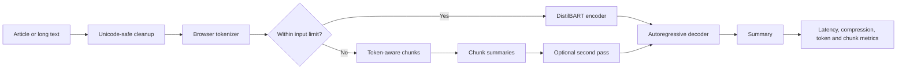

# 01 — Abstractive Text Summarization Transformer

[](https://github.com/unit-mole/transformer-projects/actions/workflows/01-abstractive-text-summarization-transformer.yml)
[](https://www.python.org/)
[](https://huggingface.co/docs/transformers.js/)
[](https://huggingface.co/spaces)
[](../LICENSE)

A portfolio-ready encoder-decoder Transformer system that creates concise abstractive summaries from news articles, quality reports, complaint narratives, root-cause descriptions, and other long English text. The repository preserves the complete Python ML engineering project and adds a separate, fully interactive **free Hugging Face Static Space** where the Transformer runs inside the visitor's browser.

> **Responsible use:** Generated summaries may omit context, distort facts, over-compress important information, or hallucinate. Do not paste private, confidential, sensitive, copyrighted, or personally identifiable text into a public demo. Do not use outputs as the sole basis for legal, medical, financial, safety-critical, academic, journalistic, or official decisions. Human review is required.

## Portfolio Deployment Architecture

Static deployment changes where inference runs; it does not turn the application into a mock demo.

| Portfolio component | Purpose |
|---|---|
| GitHub repository | Complete Python implementation, evaluation, tests, notebooks, baselines, LSTM comparison, and engineering documentation |
| Hugging Face model references | Honest documentation of the original Python checkpoint and its browser-compatible ONNX conversion |
| Hugging Face Static Space | Live browser-based summarization using Transformers.js and ONNX Runtime Web without paid compute |

```text
GitHub
└── Complete Python ML project

Hugging Face Model Hub
├── sshleifer/distilbart-cnn-12-6           # Python base checkpoint
└── Xenova/distilbart-cnn-12-6              # Browser-compatible ONNX conversion

Hugging Face Static Space
└── web/                                     # Live Transformers.js demo
```

The project does **not** claim that either public checkpoint was trained by the portfolio author. A separate personal model repository should be created only after actual fine-tuning or model conversion.

## Live Links

- **GitHub project:** https://github.com/unit-mole/transformer-projects/tree/main/01-abstractive-text-summarization-transformer
- **Hugging Face Static Space:** `https://huggingface.co/spaces/anmol-unitmole/01-abstractive-text-summarization-transformer`
- **Python base model:** https://huggingface.co/sshleifer/distilbart-cnn-12-6
- **Browser ONNX model:** https://huggingface.co/Xenova/distilbart-cnn-12-6

## Strict Project Pattern

| Requirement | Implementation |
|---|---|
| Application | Generate concise summaries from pasted news articles and long text |
| Comparison | Transformer vs prior LSTM Seq2Seq framework, plus Lead-3 and TextRank baselines |
| Controls | Minimum/maximum output tokens, beam count, length penalty, no-repeat n-grams, early stopping |
| Python model | `sshleifer/distilbart-cnn-12-6` |
| Browser model | `Xenova/distilbart-cnn-12-6` with quantized ONNX weights |
| Dataset | Safe bundled examples; bounded XSum or CNN/DailyMail subsets for offline evaluation and optional fine-tuning |
| Metrics | ROUGE-1, ROUGE-2, ROUGE-L, BERTScore, inference time, lengths, and compression ratio |
| Deployment | Free Hugging Face Static Space using Transformers.js; Python/Gradio retained for local development |

## Why the Static Space Is Still a Real Transformer Project

The live application imports `@huggingface/transformers`, downloads quantized ONNX weights from the Hugging Face Hub, tokenizes the source text, executes the DistilBART encoder and autoregressive decoder in the browser, and returns the generated summary. It does not call a Python backend or a paid inference API.

The browser layer demonstrates:

- encoder-decoder Transformer inference;
- quantized ONNX model deployment;
- WebGPU with a WASM fallback;
- model download and browser caching;
- decoding controls and beam-search experiments;
- token counts and token-ID previews;
- long-document chunking and second-pass aggregation;
- latency, compression, word-count, runtime, and chunk metrics;
- accessible UI, error states, copy, and download actions.

## Models

### Python engineering model

```text
sshleifer/distilbart-cnn-12-6
```

Used by `app.py`, `gradio_app.py`, the Python inference pipeline, evaluation scripts, and optional fine-tuning workflow.

### Static browser model

```text
Xenova/distilbart-cnn-12-6
```

This repository contains ONNX weights prepared for Transformers.js. The Static Space selects:

- `q4f16` with WebGPU when supported;
- `q8` with WASM as the compatibility fallback.

The initial download is substantial and can take several minutes. Browser caching makes later visits faster.

## System Architecture



The Python implementation follows the same conceptual flow and adds offline training, dataset loading, formal evaluation, plots, baselines, and comparison scripts.

## Static Demo Features

The application in `web/` provides:

- article/long-text entry and safe sample documents;
- automatic WebGPU-to-WASM fallback;
- model-loading progress and cache messaging;
- minimum and maximum generated-token controls;
- beam count, length penalty, and no-repeat n-gram controls;
- optional token-aware long-document chunking;
- generated summary with copy and download actions;
- latency, compression ratio, word count, chunk count, runtime, and quantization details;
- input token count and token-ID preview;
- beam 1 versus selected-beam comparison;
- architecture, Python engineering, evaluation, LSTM comparison, limitations, and responsible-use sections.

## Python Project Capabilities

The existing Python project remains the technical foundation and should not be deleted. It includes:

- direct `AutoTokenizer` and `AutoModelForSeq2SeqLM` inference;
- token-aware long-input processing;
- XSum and CNN/DailyMail dataset loaders;
- optional fine-tuning scripts;
- ROUGE and BERTScore evaluation;
- average/minimum/maximum latency reporting;
- Lead-3 and TextRank-style baselines;
- strict LSTM Seq2Seq comparison framework;
- error-analysis templates;
- Gradio application for local use or eligible compute-backed hosting;
- Python unit tests and lightweight GitHub CI.

## Dataset Strategy

Large news datasets are not committed to GitHub.

- `data/sample_articles.csv` contains safe original/synthetic examples.
- `data/sample_summaries.csv` contains reference summaries.
- `src/dataset_loader.py` loads bounded public subsets when requested.
- `data/README_data.md` documents source, columns, intended use, and redistribution limits.

The same cleaning logic preserves entities, dates, numbers, punctuation, and Unicode text without aggressive meaning-destroying preprocessing.

## Generation Controls

| Control | Default | Purpose |
|---|---:|---|
| Minimum new tokens | 30 | Reduces extremely short outputs |
| Maximum new tokens | 120 | Caps summary length |
| Beam count | 4 | Retains multiple decoding candidates; higher values increase latency |
| Length penalty | 2.0 | Adjusts preference for shorter or longer sequences |
| No-repeat n-gram | 3 | Reduces repeated phrases |
| Early stopping | Enabled | Stops completed beam search appropriately |
| Long-document chunking | Enabled | Summarizes safe token-sized sections before optional aggregation |

## Evaluation

Offline evaluation reports:

- **ROUGE-1:** unigram overlap;
- **ROUGE-2:** bigram overlap;
- **ROUGE-L:** longest-common-subsequence overlap;
- **BERTScore:** contextual semantic similarity;
- **inference time:** average, minimum, maximum, and per-example latency;
- **compression ratio:** generated-summary words divided by source words;
- **generated/reference lengths:** useful for diagnosing over-compression.

Run actual evaluation before publishing numbers:

```bash
python scripts/evaluate_model.py --input-csv data/sample_summaries.csv --compute-bertscore
```

The committed JSON and CSV files remain honest `not_run` templates until a real run is completed. Copy verified results into `web/public/evaluation-results.json` only after evaluation.

## Transformer vs LSTM Seq2Seq

| Dimension | LSTM Seq2Seq with Attention | DistilBART Transformer |
|---|---|---|
| Sequence processing | Recurrent, step by step | Attention-based parallel encoding |
| Long-range context | Compressed through recurrent states | Direct token-to-token attention |
| Pretraining | Depends on the earlier custom project | Large-scale pretrained language model |
| Decoding | Often custom beam logic | Mature generation controls |
| Browser deployment | Requires a separate conversion | ONNX checkpoint runs through Transformers.js |
| Metric publication | Requires actual prior predictions | Evaluated through repository scripts |

Place real LSTM predictions in a CSV with:

```text
id,article,reference_summary,lstm_summary
```

Then run:

```bash
python scripts/compare_with_lstm.py --lstm-csv data/lstm_comparison_template.csv
```

No LSTM metrics are invented.

## Repository Structure

```text
01-abstractive-text-summarization-transformer/
├── app.py                         # Local Python/Gradio entry point
├── gradio_app.py                  # Python interactive application
├── configs/
├── data/
├── docs/
├── models/
├── notebooks/
├── outputs/
├── scripts/
├── src/
├── tests/
├── web/                           # Free Hugging Face Static Space
│   ├── README.md                  # Static Space metadata/card
│   ├── index.html
│   ├── package.json
│   ├── vite.config.js
│   ├── public/
│   ├── src/
│   │   ├── main.js
│   │   ├── model-worker.js
│   │   ├── summarizer-client.js
│   │   ├── samples.js
│   │   ├── text-utils.js
│   │   └── styles.css
│   └── tests/
├── MODEL_CARD.md
├── README_HUGGINGFACE.md
├── requirements.txt
└── requirements-ci.txt
```

## Run the Python Application Locally

```bash
git clone https://github.com/unit-mole/transformer-projects.git
cd transformer-projects/01-abstractive-text-summarization-transformer
python -m venv .venv
```

Windows CMD:

```bat
.venv\Scripts\activate
pip install -r requirements.txt
python app.py
```

The first inference request downloads the Python checkpoint. Training is never performed during startup.

## Run the Static Application Locally

```bash
cd web
npm install
npm run dev
```

Production validation:

```bash
npm test
npm run build
npm run preview
```

## Free Hugging Face Static Space Deployment

The workflow can automatically create or update the Space after GitHub tests pass.

1. Create a Hugging Face write token.
2. In the GitHub repository, open **Settings → Secrets and variables → Actions**.
3. Add the repository secret:

```text
HF_TOKEN=<your Hugging Face write token>
```

4. Add the repository variable:

```text
HF_SPACE_REPO=anmol-unitmole/01-abstractive-text-summarization-transformer
```

5. Push changes to `main` or manually run the Project 01 workflow.
6. The `sync-to-hugging-face` job uploads only `web/`, creates the Space with `space_sdk="static"` when needed, and allows Hugging Face to run `npm run build`.

See `docs/STATIC_SPACE_DEPLOYMENT.md` for the complete setup and troubleshooting guide.

## Limitations

- The first browser download is large.
- Performance depends on connection speed, memory, browser, WebGPU support, and beam count.
- WebGPU support is still browser- and device-dependent; WASM is slower but more compatible.
- DistilBART is oriented toward English news and may underperform on specialized domains.
- Chunked summarization can lose context spanning distant sections.
- Generated text may omit or invent details.

## Skills Demonstrated

Transformer architecture, abstractive NLP, DistilBART, PyTorch, Hugging Face Transformers, Transformers.js, ONNX Runtime Web, WebGPU/WASM deployment, quantization, tokenization, beam search, long-document handling, ROUGE, BERTScore, latency analysis, baselines, error analysis, testing, GitHub Actions, browser workers, accessible frontend development, and free Hugging Face Static Space deployment.
