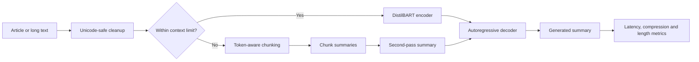

# 01 — Abstractive Text Summarization Transformer

[](https://www.python.org/)
[](https://huggingface.co/docs/transformers/)
[](https://www.gradio.app/)
[](../LICENSE)

A portfolio-ready encoder-decoder Transformer application that generates concise abstractive summaries from news articles, quality reports, complaint narratives, root-cause descriptions, and other long text. The project exposes decoding controls, evaluates quality and latency, and provides a strict comparison framework for the earlier LSTM Seq2Seq summarizer.

> **Responsible use:** This project is for educational and portfolio demonstration purposes. Generated summaries may be incomplete, inaccurate, biased, over-compressed, or hallucinated. Do not use them as the sole basis for legal, medical, financial, safety-critical, academic, journalistic, or official decisions. Do not paste private, confidential, sensitive, copyrighted, or personally identifiable text into a public demo. Human review is required before real-world use.

## Live Links

- **Hugging Face Space:** `https://huggingface.co/spaces/<YOUR_USERNAME>/abstractive-text-summarization-transformer`
- **Hugging Face model repository:** `https://huggingface.co/<YOUR_USERNAME>/distilbart-summarization-portfolio`
- **GitHub repository:** `https://github.com/<YOUR_GITHUB_USERNAME>/transformer-projects`

## Strict Project Pattern

| Requirement | Implementation |
|---|---|
| Application | Summarize pasted news articles and long text |
| Comparison | Transformer vs previous LSTM Seq2Seq framework, plus Lead-3 and TextRank baselines |
| Controls | Minimum/maximum summary length, beams, length penalty, no-repeat n-grams, early stopping |
| Model | `sshleifer/distilbart-cnn-12-6` by default; configurable through `MODEL_NAME` |
| Dataset | Bundled safe samples; XSum and CNN/DailyMail loaders for evaluation/fine-tuning |
| Metrics | ROUGE-1, ROUGE-2, ROUGE-L, BERTScore, compression ratio, inference time |
| Deployment | Gradio application prepared for Hugging Face Spaces |

## Why DistilBART

The original notebook referenced `sshleifer/distilbart-cnn-12-6` but disabled Transformer inference by default. This rebuilt project makes that encoder-decoder model the actual inference engine. DistilBART is selected because it is already trained for English news summarization, supports beam-search generation settings directly, and is smaller and faster than full BART-large while retaining strong summarization quality. The app loads the tokenizer and sequence-to-sequence model directly instead of using the removed Transformers v5 summarization pipeline interface.

## Architecture



DistilBART is an encoder-decoder Transformer. The encoder creates contextual representations of the source text; the decoder generates the summary token by token while attending to the encoded source. Unlike a recurrent LSTM Seq2Seq model, Transformer attention processes token relationships in parallel and handles long-range dependencies without recurrent hidden-state propagation.

## Dataset Strategy

The repository intentionally does not redistribute a large news dataset.

- `data/sample_articles.csv` contains original, synthetic demonstration articles that are safe to publish.
- `data/sample_summaries.csv` contains their human-written reference summaries.
- `src/dataset_loader.py` can load a bounded XSum or CNN/DailyMail subset through Hugging Face Datasets.
- Training and evaluation scripts record the dataset name, split, sample count, article column, summary column, and split configuration.

The original notebook successfully loaded 80 synthetic rows and 80 XSum rows, but it evaluated only extractive baselines because Transformer execution was disabled. The rebuilt notebooks and scripts keep the useful dataset-loading idea while replacing the repetitive notebook structure with modular, testable code.

## Text Preprocessing

The preprocessing pipeline:

1. converts missing values safely;
2. decodes HTML entities and removes HTML tags;
3. normalizes Unicode without deleting non-ASCII names or language characters;
4. removes control characters and repeated whitespace;
5. preserves facts, entities, dates, numbers, and punctuation;
6. applies the same cleaning during evaluation and inference;
7. uses token-aware truncation/chunking rather than cutting arbitrary words.

Default maximum input size is 900 model tokens per chunk, with a 64-token overlap. The model itself supports up to 1,024 positions.

## Generation Controls

| Control | Default | Purpose |
|---|---:|---|
| Minimum summary length | 30 tokens | Prevents extremely short outputs |
| Maximum summary length | 120 tokens | Caps output size |
| Number of beams | 4 | Keeps multiple candidate sequences during decoding |
| Length penalty | 2.0 | Controls preference for longer or shorter sequences |
| No-repeat n-gram size | 3 | Reduces repeated phrases |
| Early stopping | Enabled | Stops when beam candidates are complete |

Beam search keeps several candidate summaries at every generation step. More beams can improve output fluency or coverage, but increase latency and memory use. The demo includes a beam-comparison tab so reviewers can observe this trade-off.

## Evaluation

The evaluation script reports:

- **ROUGE-1:** unigram overlap with the reference summary.
- **ROUGE-2:** bigram overlap.
- **ROUGE-L:** longest-common-subsequence overlap.
- **BERTScore:** contextual semantic similarity.
- **Inference time:** average, minimum, maximum, and per-example latency.
- **Compression ratio:** generated-summary word count divided by article word count.
- **Generated/reference lengths:** helps detect over-compression or excessive verbosity.

Run actual evaluation before publishing metrics:

```bash
python scripts/evaluate_model.py --input-csv data/sample_summaries.csv --compute-bertscore
```

Results are written to `outputs/runs/<timestamp>/`. The committed JSON and CSV files in `outputs/` are honest `not_run` templates—not fabricated scores.

## Transformer vs LSTM Seq2Seq

| Dimension | LSTM Seq2Seq with Attention | DistilBART Transformer |
|---|---|---|
| Sequence processing | Recurrent, step by step | Attention-based parallel encoding |
| Long-range dependencies | Can weaken across long sequences | Direct token-to-token attention |
| Pretraining | Depends on the earlier custom project | Large-scale pretrained language model |
| Decoding | Autoregressive, often custom beam logic | Mature generation API with beam controls |
| Comparison status | Awaiting actual prior predictions/metrics | Ready for evaluation |

To avoid invented results, place actual LSTM predictions in a CSV with:

```text
id,article,reference_summary,lstm_summary
```

Then run:

```bash
python scripts/compare_with_lstm.py --lstm-csv data/lstm_comparison_template.csv
```

The script evaluates the same rows and creates a comparison table only when real LSTM summaries are supplied.

## Error Analysis

Review examples for:

- missing important context;
- incorrect entities, numbers, or dates;
- hallucinated facts;
- overly generic or short summaries;
- repetition;
- over-compression;
- failure on very long inputs;
- domain mismatch between news-trained models and quality/manufacturing text.

Use `outputs/error_analysis_examples.md` as the reporting template and replace placeholders with actual model outputs.

## Folder Structure

```text
01-abstractive-text-summarization-transformer/
├── app.py
├── gradio_app.py
├── configs/config.yaml
├── data/
├── docs/
├── images/
├── models/
├── notebooks/
├── outputs/
├── scripts/
├── src/
├── tests/
├── MODEL_CARD.md
├── README_HUGGINGFACE.md
├── requirements.txt
├── Dockerfile
└── pyproject.toml
```

## Local Setup

```bash
git clone https://github.com/<YOUR_GITHUB_USERNAME>/transformer-projects.git
cd transformer-projects/01-abstractive-text-summarization-transformer
python -m venv .venv
```

Windows PowerShell:

```powershell
.venv\Scripts\Activate.ps1
pip install -r requirements.txt
python app.py
```

macOS/Linux:

```bash
source .venv/bin/activate
pip install -r requirements.txt
python app.py
```

The first summary request downloads the pretrained model and caches it locally. Training is never performed during app startup.

## Evaluation and Training

```bash
# Evaluate the pretrained model
python scripts/evaluate_model.py --input-csv data/sample_summaries.csv --compute-bertscore

# Compare actual LSTM outputs
python scripts/compare_with_lstm.py --lstm-csv data/lstm_comparison_template.csv

# Optional fine-tuning; GPU strongly recommended
python scripts/train_model.py --dataset xsum --train-samples 2000 --validation-samples 200
```

Fine-tuned artifacts are saved under `models/transformer_summarization_model/` and tokenizer files under `models/tokenizer/`. Large weights are ignored by Git and should be pushed to a Hugging Face model repository or tracked with Git LFS.

## Hugging Face Deployment

1. Create a Space and select **Gradio**.
2. Copy this project folder’s contents to the root of the Space repository.
3. Keep `app.py`, `requirements.txt`, and the YAML metadata at the top of `README.md` in the Space root.
4. Use `cpu-basic` for the suggested hardware.
5. Push the files and inspect the build logs.
6. Add the final Space URL to this README and the root portfolio README.

**Current platform note (July 2026):** Hugging Face documentation says newly created Gradio/Docker Spaces require an eligible paid plan even though CPU Basic has no hourly hardware charge. Static Spaces remain free. This repository is fully Gradio-ready, but a strictly free account may need a separate Static Space/Transformers.js implementation or local Gradio sharing. See `docs/HUGGING_FACE_DEPLOYMENT.md`.

## Docker

```bash
docker build -t abstractive-summarizer .
docker run --rm -p 7860:7860 abstractive-summarizer
```

## Portfolio Positioning

**One-line description**

> Built and deployed a DistilBART abstractive summarization system with configurable beam search, long-text handling, ROUGE/BERTScore evaluation, latency analysis, and a rigorous LSTM Seq2Seq comparison framework.

**Quality Data Science relevance**

The same architecture can support complaint summaries, GCS case summaries, issue-detail condensation, root-cause narratives, customer-feedback summarization, quality-report summarization, and automated business reporting—with human review and domain-specific validation.

## Limitations

- The default checkpoint is trained primarily on news-style summarization.
- CPU inference can be slow, especially with multiple chunks or high beam counts.
- Long-document map-reduce summarization can lose cross-chunk context.
- ROUGE rewards lexical overlap and does not guarantee factual correctness.
- BERTScore is semantic but can still miss factual errors.
- The system does not verify claims against external evidence.

## Future Improvements

- Fine-tune on a documented CNN/DailyMail or XSum subset.
- Add quality-domain data with appropriate governance and de-identification.
- Add factual-consistency metrics and named-entity preservation checks.
- Export an optimized ONNX model for browser/static deployment.
- Add quantization and caching to reduce CPU latency.
- Publish a versioned Hugging Face model card with actual benchmark results.

## Skills Demonstrated

Transformer architecture, encoder-decoder modeling, generative NLP, DistilBART, beam search, long-text chunking, ROUGE, BERTScore, latency benchmarking, baseline design, LSTM comparison, Gradio, Hugging Face deployment, testing, CI/CD, Docker, responsible AI, and professional ML repository design.
