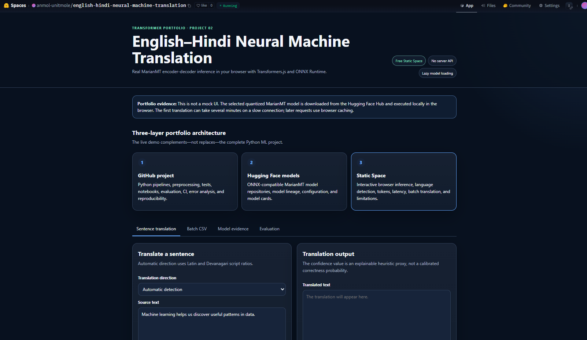
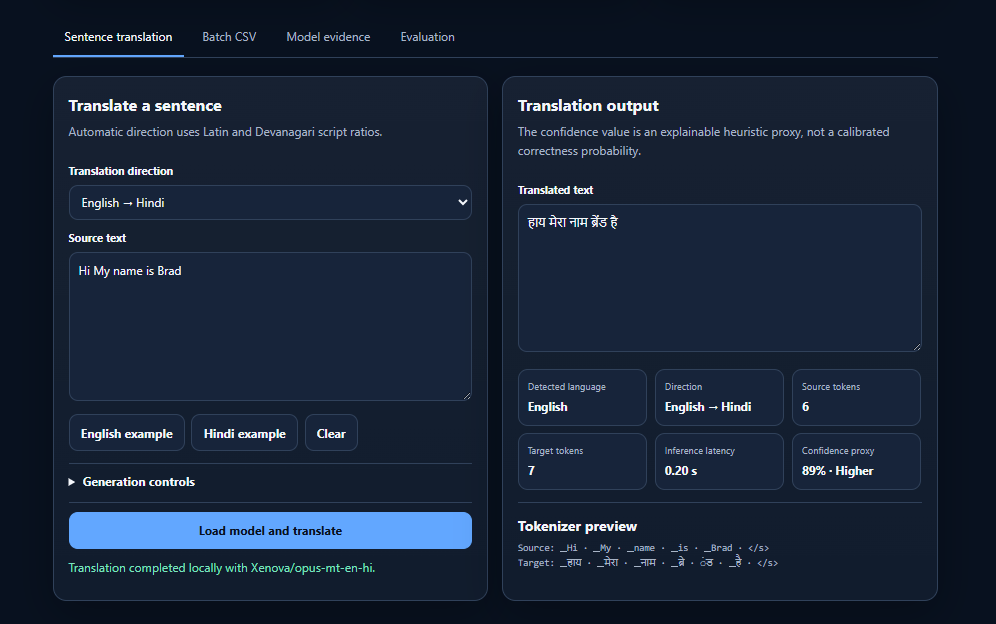
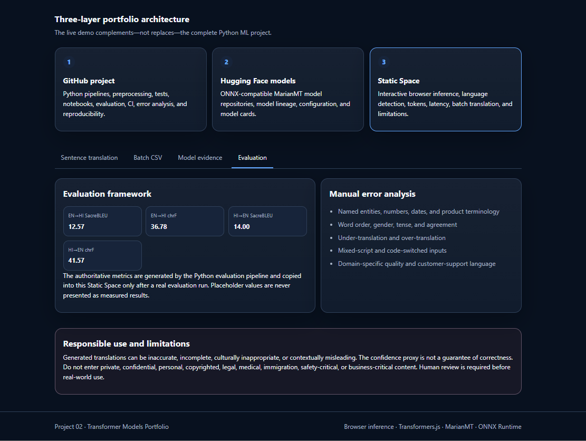

# English–Hindi Neural Machine Translation with MarianMT Transformers

[](https://www.python.org/)
[](https://pytorch.org/)
[](https://huggingface.co/docs/transformers/)
[](https://huggingface.co/docs/transformers/model_doc/marian)
[](https://huggingface.co/docs/transformers.js/)
[](https://huggingface.co/spaces/anmol-unitmole/english-hindi-neural-machine-translation)
[](https://github.com/unit-mole/transformer-projects/actions/workflows/02-neural-machine-translation-transformer.yml)
[](https://github.com/unit-mole/transformer-projects/actions/workflows/02-neural-machine-translation-transformer-huggingface.yml)
[](LICENSE)

An end-to-end multilingual NLP project for **English-to-Hindi and Hindi-to-English neural machine translation** using MarianMT encoder-decoder Transformers. The project combines reproducible preprocessing, bidirectional fine-tuning, pretrained-versus-fine-tuned evaluation, manual error analysis, automated testing, browser-side ONNX inference, and deployment through a free Hugging Face Static Space.

**Status:** Portfolio-ready, evaluated, CI-validated, and deployed  
**Live application:** [Open the English–Hindi Neural Machine Translation Space](https://huggingface.co/spaces/anmol-unitmole/english-hindi-neural-machine-translation)  
**Primary stack:** Python · PyTorch · Hugging Face Transformers · MarianMT · SentencePiece · SacreBLEU · Transformers.js · ONNX Runtime Web · JavaScript · HTML · CSS · GitHub Actions · Hugging Face Spaces

---

## Responsible Use

This project is intended for educational, technical-learning, experimentation, and portfolio demonstration purposes.

- Generated translations can be incomplete, inaccurate, culturally inappropriate, grammatically incorrect, or contextually misleading.
- The displayed confidence value is an explainable heuristic proxy, not a calibrated probability of correctness.
- Automatic evaluation metrics do not replace bilingual human review.
- Do not enter private, confidential, personal, copyrighted, legal, medical, immigration, financial, safety-critical, or business-critical text into a public demonstration.
- The application must not be used as the sole basis for high-impact decisions.
- Human validation is required before using a translation in a real operational workflow.

---

## Business Problem

Organizations often receive customer feedback, quality reports, service notes, product complaints, technical instructions, and operational communication in multiple languages. Manual translation can be slow, inconsistent, expensive, and difficult to scale across large volumes of text.

This project answers:

> Can an encoder-decoder Transformer translate English and Hindi text in both directions, provide measurable quality evidence, and run as an interactive browser application without a paid Python backend?

The deployed application returns:

- Translated text
- Detected source language
- Translation direction
- Source and target token counts
- Browser inference latency
- Confidence proxy
- Tokenizer preview
- Batch CSV translation support
- Model and evaluation evidence
- Responsible-use guidance

---

## Project Objective

Build a professional neural machine translation solution that can:

1. Translate English text into Hindi.
2. Translate Hindi text into English.
3. Detect translation direction using Latin and Devanagari script ratios.
4. Apply Unicode-safe preprocessing and SentencePiece tokenization.
5. Establish pretrained MarianMT baselines.
6. Fine-tune separate direction-specific MarianMT models.
7. Evaluate both directions on the same held-out test data.
8. Report SacreBLEU, chrF, chrF++, TER, latency, throughput, and preservation diagnostics.
9. Perform structured manual error analysis on difficult examples.
10. Save reproducible JSON, CSV, and PNG artifacts.
11. Validate Python and browser code through GitHub Actions.
12. Deploy a static browser application through Hugging Face Spaces.

---

## Dataset

The portfolio-grade experiment uses deterministic subsets of the **IIT Bombay English–Hindi Parallel Corpus** through the Hugging Face dataset integration.

| Property | Portfolio configuration |
|---|---:|
| Task | Bidirectional neural machine translation |
| Language directions | English → Hindi and Hindi → English |
| Training pairs | 50,000 |
| Validation pairs | 520 |
| Held-out test pairs | 1,000 per direction |
| Training epochs | 2 |
| Fine-tuned models | Two direction-specific MarianMT models |
| Manual review set | 30 automatically selected difficult translations |
| Dataset committed to GitHub | No |

The full downloaded corpus, cached data, model checkpoints, and optimizer states are excluded from normal Git tracking. Reproducible dataset metadata and evaluation summaries are retained in the repository.

---

## Tools and Technologies

| Area | Technology |
|---|---|
| Language | Python, JavaScript |
| Deep learning | PyTorch |
| Transformer library | Hugging Face Transformers |
| Architecture | MarianMT encoder-decoder Transformer |
| Base models | `Helsinki-NLP/opus-mt-en-hi`, `Helsinki-NLP/opus-mt-hi-en` |
| Browser models | `Xenova/opus-mt-en-hi`, `Xenova/opus-mt-hi-en` |
| Tokenization | SentencePiece, Sacremoses |
| Dataset processing | Hugging Face Datasets, pandas, NumPy |
| Training | `Seq2SeqTrainer`, mixed precision, gradient accumulation |
| Evaluation | SacreBLEU, chrF, chrF++, TER, bootstrap analysis |
| Visualization | Matplotlib |
| Browser inference | Transformers.js, ONNX Runtime Web |
| Web interface | HTML, CSS, JavaScript, Web Worker |
| Testing | pytest, Node-based frontend tests, structure validation |
| Automation | GitHub Actions |
| Hosting | Hugging Face Static Space |
| Artifact formats | JSON, CSV, PNG, PyTorch checkpoints, ONNX-compatible model repositories |

---

## Project Workflow

```text
IIT Bombay English–Hindi parallel corpus
        │
        ▼
Deterministic train, validation, and test subsets
        │
        ▼
Unicode normalization and text validation
        │
        ▼
SentencePiece tokenization
        │
        ├───────────────────────────────────────┐
        ▼                                       ▼
Pretrained EN→HI MarianMT              Pretrained HI→EN MarianMT
        │                                       │
        ▼                                       ▼
Baseline evaluation                    Baseline evaluation
        │                                       │
        ▼                                       ▼
Direction-specific fine-tuning         Direction-specific fine-tuning
        │                                       │
        ▼                                       ▼
Fine-tuned EN→HI model                 Fine-tuned HI→EN model
        └───────────────────┬───────────────────┘
                            ▼
Common held-out evaluation set
                            │
                            ▼
SacreBLEU · chrF · chrF++ · TER · latency · throughput
                            │
                            ▼
Bootstrap comparison and preservation diagnostics
                            │
                            ▼
Manual review of 30 difficult translations
                            │
                            ▼
JSON · CSV · PNG portfolio artifacts
                            │
                            ▼
GitHub Actions validation
                            │
                            ▼
Transformers.js Static Space deployment
```

---

## Text Preprocessing

The project applies consistent text preparation across training and inference.

- Unicode-safe reading and writing
- Whitespace normalization
- Empty-text validation
- Latin and Devanagari script-ratio detection
- Direction-specific source and target selection
- SentencePiece tokenization
- Configurable maximum source and target lengths
- Dynamic padding for sequence-to-sequence batches
- Attention-mask construction
- Label padding compatible with cross-entropy loss
- Number and script-preservation diagnostics

Maintaining consistent preprocessing is important because differences between training, Python inference, and browser inference can materially change translation quality.

---

## MarianMT Architecture

```text
Source sentence
      ↓
SentencePiece source tokenizer
      ↓
Token IDs + attention mask
      ↓
Marian Transformer encoder
      ↓
Contextual encoder representations
      ↓
Marian Transformer decoder
      ↓
Beam-search token generation
      ↓
SentencePiece target decoder
      ↓
Translated sentence
```

### Why MarianMT?

MarianMT is a sequence-to-sequence Transformer architecture designed for machine translation. It uses a Transformer encoder to represent the source sentence and an autoregressive Transformer decoder to generate the target sentence.

The selected Helsinki-NLP checkpoints provide strong pretrained multilingual translation foundations while remaining compact enough for local GPU fine-tuning and browser-oriented ONNX deployment.

---

## Fine-Tuning Strategy

Two independent models are fine-tuned because each translation direction has different vocabulary, syntax, tokenization behavior, and generation characteristics.

### English → Hindi

```text
Base model: Helsinki-NLP/opus-mt-en-hi
Output: models/fine_tuned_en_hi
```

### Hindi → English

```text
Base model: Helsinki-NLP/opus-mt-hi-en
Output: models/fine_tuned_hi_en
```

The portfolio training workflow includes:

- RTX GPU acceleration
- Mixed-precision training
- Gradient accumulation
- Gradient checkpointing
- Validation after each epoch
- Best-checkpoint restoration
- Early-stopping support
- Generation-aware sequence-to-sequence evaluation
- Saved training histories and summaries
- Deterministic configuration and seeds

Large model weights, optimizer states, dataset copies, and checkpoints are intentionally excluded from GitHub.

---

## Model Results

All results below were generated locally from the documented **portfolio profile** using **1,000 held-out test pairs per direction**.

### Complete comparison

| System | Direction | SacreBLEU ↑ | chrF ↑ | chrF++ ↑ | TER ↓ | Avg latency (s) ↓ | P95 latency (s) ↓ | Sentences/sec ↑ | Number preservation ↑ |
|---|---|---:|---:|---:|---:|---:|---:|---:|---:|
| Pretrained | EN → HI | 9.6561 | 32.1131 | 30.5585 | 81.9286 | 0.023225 | 0.034148 | 43.0567 | 0.921 |
| Fine-tuned | EN → HI | **12.5665** | **36.7752** | **35.1802** | **75.7373** | 0.023610 | 0.034823 | 42.3548 | **0.928** |
| Pretrained | HI → EN | 13.3014 | 40.6827 | 38.5463 | **70.8942** | **0.020338** | **0.027700** | **49.1685** | **0.929** |
| Fine-tuned | HI → EN | **14.0044** | **41.5662** | **39.6603** | 71.7204 | 0.022530 | 0.033359 | 44.3854 | 0.928 |

### Fine-tuning impact

| Direction | SacreBLEU change | chrF change | Interpretation |
|---|---:|---:|---|
| EN → HI | +2.9104, approximately +30.1% | +4.6621, approximately +14.5% | Clear improvement across quality metrics, TER, and number preservation |
| HI → EN | +0.7030, approximately +5.3% | +0.8835, approximately +2.2% | Modest quality improvement, with slightly worse TER and latency |

The English-to-Hindi experiment shows the strongest gain. Hindi-to-English improves in SacreBLEU, chrF, and chrF++, while TER moves slightly in the opposite direction. This difference is reported openly because translation metrics measure overlapping but non-identical aspects of quality.

---

## Evaluation

The evaluation pipeline supports:

- SacreBLEU
- SacreBLEU reproducibility signature
- chrF
- chrF++
- TER
- Average latency
- Median latency
- P95 latency
- Minimum and maximum latency
- Sentences per second
- Peak GPU memory
- Number-preservation rate
- Expected-script ratio
- Empty-output rate
- Output-to-reference length ratio
- Bootstrap confidence intervals
- Paired system comparison
- Direction-wise prediction files
- Latency analysis by sentence length
- Training-history plots

### Why multiple metrics matter

- **SacreBLEU** measures word and phrase overlap using a reproducible evaluation configuration.
- **chrF** measures character n-gram overlap and is useful for morphologically rich languages.
- **chrF++** extends chrF with word-level information.
- **TER** estimates the editing effort required to transform a prediction into the reference; lower is better.
- **Latency** measures practical inference speed.
- **Throughput** measures how many sentences can be translated per second.
- **Preservation diagnostics** expose failures involving numbers, scripts, empty outputs, and length distortion.
- **Manual review** identifies errors that aggregate automatic metrics cannot explain.

---

## Manual Error Analysis

The notebook automatically selects 30 difficult fine-tuned translations using sentence-level metrics and error heuristics. These examples are then reviewed manually.

### Reviewed error categories

| Error category | Count |
|---|---:|
| Other severe or incoherent output | 9 |
| Named entity | 6 |
| Missing information | 4 |
| Number or date | 3 |
| Technical terminology | 3 |
| Word order | 2 |
| Good translation | 2 |
| Under-translation | 1 |

### Human quality assessment

| Quality | Count |
|---|---:|
| Weak | 21 |
| Acceptable | 7 |
| Good | 2 |

### Severity assessment

| Severity | Count |
|---|---:|
| High | 19 |
| Medium | 8 |
| Low | 3 |

These 30 rows are intentionally selected from the weakest translations. Their distribution must not be interpreted as the quality distribution of the complete 1,000-pair test set. The analysis is designed to expose failure modes such as named-entity corruption, numerical errors, missing information, repetition, terminology errors, and unnatural word order.

---

## Browser Demo

The deployed Static Space performs real Transformer inference directly in the user's browser.

It supports:

- English-to-Hindi translation
- Hindi-to-English translation
- Automatic direction detection
- Manual direction selection
- Model-loading progress
- Source and target token counts
- Inference latency
- Confidence proxy
- Tokenizer preview
- Configurable generation controls
- CSV batch translation
- Downloadable translated CSV
- Model evidence and architecture details
- Fine-tuned evaluation metrics
- Manual error-analysis summary
- Responsible-use information

No Python or Gradio server is required for the live application.

### Live Application

[](https://huggingface.co/spaces/anmol-unitmole/english-hindi-neural-machine-translation)

### Application Overview



*Live browser-based neural machine translation interface deployed as a Hugging Face Static Space.*

### Live Translation and Diagnostics



*English-to-Hindi MarianMT translation with detected language, token counts, inference latency, confidence proxy, and tokenizer diagnostics.*

### Evaluation Dashboard



*Portfolio evaluation dashboard showing direction-wise SacreBLEU and chrF results, manual error-analysis categories, architecture layers, and responsible-use limitations.*

---

## Browser Inference Workflow

```text
User enters English or Hindi text
          │
          ▼
Browser validates and normalizes the input
          │
          ▼
Latin and Devanagari script ratios are calculated
          │
          ▼
Translation direction is selected
          │
          ▼
Transformers.js loads the directional model
          │
          ▼
SentencePiece tokenization runs in the browser
          │
          ▼
Quantized Marian encoder-decoder ONNX inference
          │
          ▼
Beam-search output tokens are decoded
          │
          ▼
Translation, latency, token counts, and confidence proxy are displayed
```

The selected model is loaded lazily and cached by the browser, so the first translation can take longer than later requests.

---

## Current Browser Model Status

The Python evaluation pipeline compares the original pretrained checkpoints with locally fine-tuned MarianMT models.

The current Static Space performs live browser inference using:

```text
Xenova/opus-mt-en-hi
Xenova/opus-mt-hi-en
```

These are browser-compatible quantized ONNX conversions of the pretrained MarianMT models.

The evaluation dashboard displays verified fine-tuned Python metrics, but the live browser worker must not yet be described as serving the fine-tuned checkpoints. A future deployment step will export, quantize, validate, and upload the fine-tuned models for Transformers.js.

---

## Model Artifacts

| Artifact | Purpose |
|---|---|
| `models/fine_tuned_en_hi/` | Locally saved fine-tuned English-to-Hindi model; excluded from GitHub |
| `models/fine_tuned_hi_en/` | Locally saved fine-tuned Hindi-to-English model; excluded from GitHub |
| `outputs/model_comparison.csv` | Pretrained-versus-fine-tuned metric comparison |
| `outputs/sacrebleu_scores.json` | Direction-wise SacreBLEU results |
| `outputs/chrf_scores.json` | Direction-wise chrF results |
| `outputs/translation_latency_results.json` | Local latency results |
| `outputs/model_metrics.json` | Consolidated model evidence |
| `outputs/portfolio_evaluation/comparison_summary.json` | Detailed system comparison |
| `outputs/portfolio_evaluation/manual_error_analysis_candidates.csv` | Human-review worksheet |
| `outputs/portfolio_evaluation/manual_error_analysis_summary.json` | Completed manual-review summary |
| `outputs/portfolio_evaluation/plots/` | Training, quality, TER, and latency visualizations |
| `web/data/evaluation-results.json` | Verified metrics displayed by the Static Space |
| `web/src/translation.worker.js` | Browser model loading and translation worker |

Large checkpoints and optimizer states are not committed to GitHub. They remain available locally for model conversion and Hugging Face Model Hub publication.

---

## Run the Browser Demo Locally

### 1. Open the web directory

```bash
cd transformer-projects/02-neural-machine-translation-transformer/web
```

### 2. Start a local server

```bash
python -m http.server 8000
```

### 3. Open the application

```text
http://localhost:8000
```

A local HTTP server is required because browser workers and ES modules should not be loaded through a direct `file://` path.

### 4. Validate the frontend

```bash
npm run validate
```

---

## Run the Python Project Locally

### 1. Open the project

```bash
cd transformer-projects/02-neural-machine-translation-transformer
```

### 2. Create and activate a virtual environment

**Windows**

```bat
python -m venv .venv
call .venv\Scripts\activate.bat
```

**macOS / Linux**

```bash
python3 -m venv .venv
source .venv/bin/activate
```

### 3. Install runtime dependencies

```bash
python -m pip install --upgrade pip
python -m pip install -r requirements.txt
```

### 4. Run the local Python interface

```bash
python app.py
```

### 5. Run tests

```bash
python -m pytest -q
```

---

## Run the Portfolio Evaluation

GPU-based fine-tuning uses a separate evaluation environment.

### 1. Install a CUDA-enabled PyTorch build

Install the PyTorch build that matches the local NVIDIA environment before installing the remaining evaluation dependencies.

### 2. Install evaluation dependencies

```bash
python -m pip install -r requirements-evaluation.txt
```

### 3. Open the master notebook

```bash
jupyter lab notebooks/03_portfolio_grade_marianmt_finetuning_evaluation.ipynb
```

### 4. Select an experiment profile

```python
PROFILE = "quick"      # Functional validation
PROFILE = "portfolio"  # Final recruiter-facing experiment
PROFILE = "full"       # Larger optional experiment
```

### 5. Complete manual review

After Step 8 generates the worksheet, review:

```text
outputs/portfolio_evaluation/manual_error_analysis_candidates.csv
```

Then rerun Steps 9 and 10 to synchronize all final portfolio and Static Space result files.

The two older notebooks remain supporting material. The portfolio-grade notebook is the master fine-tuning and evaluation workflow.

---

## Deployment

- **GitHub repository:** `unit-mole/transformer-projects`
- **Project folder:** `02-neural-machine-translation-transformer/`
- **Source branch:** `main`
- **Published folder:** `02-neural-machine-translation-transformer/web/`
- **Hosting:** Hugging Face Static Space
- **Space owner:** `anmol-unitmole`
- **Space repository:** `english-hindi-neural-machine-translation`
- **Live application:** https://huggingface.co/spaces/anmol-unitmole/english-hindi-neural-machine-translation

### CI workflow

```text
.github/workflows/02-neural-machine-translation-transformer.yml
```

The CI workflow:

1. Checks out the repository.
2. Installs lightweight CI dependencies.
3. Runs Python tests.
4. Performs import and compilation validation.
5. Runs Static frontend tests.
6. Verifies the browser application structure.

### Hugging Face deployment workflow

```text
.github/workflows/02-neural-machine-translation-transformer-huggingface.yml
```

The deployment workflow:

1. Checks out the repository.
2. Reads the dedicated `HF_TOKEN_PROJECT_02` GitHub secret.
3. Selects only the `web/` subdirectory from the monorepo.
4. Synchronizes the files to the Hugging Face Space.
5. Publishes the application using `sdk: static`.
6. Runs automatically when the Static frontend changes.

---

## Project Structure

```text
transformer-projects/
├── .github/
│   └── workflows/
│       ├── 02-neural-machine-translation-transformer.yml
│       └── 02-neural-machine-translation-transformer-huggingface.yml
│
└── 02-neural-machine-translation-transformer/
    ├── app.py
    ├── gradio_app.py
    ├── archive/
    ├── configs/
    │   ├── model_config.yaml
    │   └── portfolio_evaluation.yaml
    ├── data/
    ├── images/
    │   ├── HuggingFace_Evaluation_Results.png
    │   ├── HuggingFace_Live_Translation.png
    │   └── HuggingFace_Live_Translation_Demo.png
    ├── models/
    │   ├── fine_tuned_en_hi/          # Local only
    │   └── fine_tuned_hi_en/          # Local only
    ├── notebooks/
    │   ├── neural_machine_translation_transformer.ipynb
    │   ├── translation_evaluation_and_error_analysis.ipynb
    │   └── 03_portfolio_grade_marianmt_finetuning_evaluation.ipynb
    ├── outputs/
    │   ├── portfolio_evaluation/
    │   │   ├── fine_tuned/
    │   │   ├── pretrained/
    │   │   ├── plots/
    │   │   ├── training/
    │   │   ├── comparison_summary.json
    │   │   ├── manual_error_analysis_candidates.csv
    │   │   ├── manual_error_analysis_summary.json
    │   │   └── model_comparison.csv
    │   ├── chrf_scores.json
    │   ├── model_comparison.csv
    │   ├── model_metrics.json
    │   ├── sacrebleu_scores.json
    │   └── translation_latency_results.json
    ├── scripts/
    │   ├── run_portfolio_evaluation.py
    │   └── summarize_manual_error_analysis.py
    ├── src/
    │   └── portfolio_evaluation.py
    ├── tests/
    │   └── test_portfolio_evaluation.py
    ├── web/
    │   ├── README.md
    │   ├── index.html
    │   ├── package.json
    │   ├── assets/
    │   ├── data/
    │   │   └── evaluation-results.json
    │   ├── src/
    │   │   ├── confidence.js
    │   │   ├── csv.js
    │   │   ├── language-detection.js
    │   │   ├── main.js
    │   │   ├── styles.css
    │   │   └── translation.worker.js
    │   └── tests/
    ├── DEPLOYMENT_HUGGINGFACE_STATIC.md
    ├── EVALUATION_WORKFLOW.md
    ├── MODEL_CARD.md
    ├── PORTFOLIO_DEPLOYMENT_MAP.md
    ├── README.md
    ├── requirements-ci.txt
    ├── requirements-dev.txt
    ├── requirements-evaluation.txt
    └── requirements.txt
```

---

## Limitations

- The model can mistranslate names, organizations, locations, numbers, dates, units, and technical terminology.
- Long or syntactically complex sentences can be under-translated or over-translated.
- Mixed Hindi-English input can produce uncertain direction detection or unstable output.
- Automatic reference-based metrics depend on the quality and wording of the reference translation.
- A valid translation can receive a low overlap score when it uses different but correct wording.
- The manual review set contains deliberately difficult examples and does not represent the full test distribution.
- Fine-tuning improved English-to-Hindi more strongly than Hindi-to-English.
- Hindi-to-English TER became slightly worse even though SacreBLEU and chrF improved.
- Local GPU latency is not identical to browser latency.
- First-time browser inference can be slower because model assets must be downloaded and cached.
- Browser performance varies by device, available memory, WebAssembly support, and browser implementation.
- The current live worker uses pretrained quantized ONNX models rather than the locally fine-tuned checkpoints.
- The system has not been validated for production or safety-critical use.

---

## Future Improvements

- Export both fine-tuned MarianMT models to browser-compatible ONNX format.
- Quantize and publish the fine-tuned EN→HI and HI→EN models on Hugging Face Model Hub.
- Replace the current pretrained browser models with the fine-tuned ONNX models.
- Add a direct pretrained-versus-fine-tuned browser comparison mode.
- Add COMET or another learned translation-quality metric.
- Increase the training subset and tune learning rate, batch size, warmup, and generation settings.
- Add named-entity and number-preservation constrained decoding.
- Add domain-specific fine-tuning for quality reports, service notes, and customer complaints.
- Add confidence calibration and uncertainty analysis.
- Add a translation history panel stored only in browser memory.
- Add downloadable evaluation reports from the Static Space.
- Add automated browser integration tests.
- Add mobile-performance profiling and progressive model-loading improvements.

---

## Skills Demonstrated

- Transformer encoder-decoder architecture
- MarianMT
- Neural machine translation
- Multilingual NLP
- English and Hindi text processing
- SentencePiece tokenization
- PyTorch
- Hugging Face Transformers
- Hugging Face Datasets
- GPU fine-tuning
- Mixed-precision training
- Sequence-to-sequence generation
- SacreBLEU
- chrF and chrF++
- TER
- Latency and throughput analysis
- Bootstrap evaluation
- Manual error analysis
- Named-entity and number-preservation review
- Model artifact management
- Transformers.js
- ONNX Runtime Web
- Browser Web Workers
- Static web application development
- GitHub Actions
- Hugging Face Spaces deployment
- Responsible AI communication
- Portfolio-focused ML engineering

---

## Portfolio Positioning

**One-line description:** Bidirectional English–Hindi MarianMT Transformer system with GPU fine-tuning, reproducible translation evaluation, structured error analysis, and browser inference deployed through a Hugging Face Static Space.

**Pinned repository description:** End-to-end multilingual NLP portfolio project featuring MarianMT fine-tuning, English↔Hindi translation, SacreBLEU/chrF/TER evaluation, manual error analysis, Transformers.js browser inference, automated CI, and Hugging Face deployment.

This project connects naturally to a Quality Data Scientist background because multilingual translation can support international customer complaints, quality reports, service records, product feedback, issue descriptions, supplier communication, and cross-region operational analysis.

---

## Author

**Anmol Tripathi**

Quality Data Scientist building a professional portfolio in Data Science, Machine Learning, Applied AI, Natural Language Processing, Analytics Engineering, and Quality Analytics.
