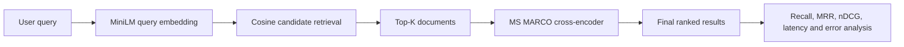

# 03 — Cross-Encoder + Bi-Encoder Ranking System

[](#python-implementation)
[](#hugging-face-static-space)
[](#hugging-face-static-space)
[](#local-gradio-demo)
[](../LICENSE)

> A professional two-stage Transformer ranking system that retrieves candidates
> with MiniLM sentence embeddings and reranks them with an MS MARCO
> cross-encoder.

**GitHub:**  
`https://github.com/unit-mole/transformer-projects/tree/main/03-cross-encoder-bi-encoder-ranking-system`

**Hugging Face Static Space:**  
`https://huggingface.co/spaces/anmol-unitmole/<SPACE_NAME>`

**Pipeline model card repository:**  
`https://huggingface.co/anmol-unitmole/docrank360-ranking-pipeline-card`

## Portfolio architecture

Static deployment does not reduce the project’s Transformer value. It changes
where inference runs.

| Portfolio component | Purpose |
|---|---|
| GitHub repository | Full Python ML engineering project, Gradio comparison app, evaluation, tests, notebooks, outputs and CI |
| Hugging Face Model Hub | Pipeline card, base-model attribution, configuration, metrics, limitations and responsible use |
| Hugging Face Static Space | Free live browser inference with Transformers.js and ONNX Runtime Web |

```text
GitHub
└── Complete Python retrieval and reranking project

Hugging Face Model Hub
└── Pipeline model card and evaluation documentation

Hugging Face Static Space
└── Live MiniLM retrieval and MS MARCO reranking demo
```

See the complete roadmap:

[`docs/PORTFOLIO_ROADMAP.md`](docs/PORTFOLIO_ROADMAP.md)

## Project objective

Modern search and RAG systems need both speed and ranking quality.

- A **bi-encoder** embeds queries and documents independently, allowing document
  vectors to be precomputed and searched quickly.
- A **cross-encoder** reads the query and document jointly, producing a stronger
  relevance score at higher computational cost.
- A **two-stage system** retrieves a small candidate set first and applies the
  cross-encoder only to those candidates.

This project measures the quality and latency tradeoff rather than presenting a
generic semantic-search interface.

## Strict project pattern

| Field | Implementation |
|---|---|
| Project number | 03 |
| Application | Two-stage search-ranking engine |
| Python bi-encoder | `sentence-transformers/all-MiniLM-L6-v2` |
| Python cross-encoder | `cross-encoder/ms-marco-MiniLM-L-6-v2` |
| Browser bi-encoder | `Xenova/all-MiniLM-L6-v2` |
| Browser cross-encoder | `Xenova/ms-marco-MiniLM-L-6-v2` |
| Dataset | Public-safe synthetic quality analytics and job-search ranking sample |
| Metrics | Recall@K, MRR@10, nDCG@10, reranking improvement and latency |
| Primary deployment | Hugging Face Static Space |
| Local comparison | Gradio |
| Browser runtime | Transformers.js + ONNX Runtime Web |

## Architecture



Detailed architecture:

[`docs/ARCHITECTURE.md`](docs/ARCHITECTURE.md)

## Repository structure

```text
03-cross-encoder-bi-encoder-ranking-system/
├── app.py
├── gradio_app.py
├── config.yaml
├── data/
├── notebooks/
├── src/
├── models/
├── outputs/
├── tests/
├── scripts/
├── model_hub/
├── web/
│   ├── index.html
│   ├── package.json
│   ├── vite.config.js
│   ├── public/
│   └── src/
├── docs/
├── MODEL_CARD.md
├── README_HUGGINGFACE.md
├── requirements.txt
├── Dockerfile
└── README.md
```

## Python implementation

The Python project demonstrates:

- shared query and document preprocessing;
- Unicode-preserving cleanup;
- MiniLM sentence embeddings;
- normalized NumPy cosine index;
- top-K candidate retrieval;
- MS MARCO cross-encoder scoring;
- original and final ranks;
- rank movement;
- retrieval and reranking latency;
- Recall@K;
- MRR@10;
- nDCG@10;
- manual relevance analysis;
- deterministic tests that avoid model downloads in CI.

### Local Python setup

```bash
python -m venv .venv
```

Windows PowerShell:

```powershell
.venv\Scripts\Activate.ps1
```

macOS/Linux:

```bash
source .venv/bin/activate
```

Install:

```bash
python -m pip install --upgrade pip
pip install -r requirements.txt
```

Build and evaluate:

```bash
python scripts/build_index.py
python scripts/evaluate_model.py
python scripts/benchmark_latency.py
```

## Local Gradio demo

The Gradio implementation remains part of the GitHub engineering project.

```bash
python app.py
```

It is not the primary Hugging Face deployment because the portfolio uses a free
Static Space.

The Gradio application shows:

- sample and custom queries;
- candidate-K and rerank-K controls;
- bi-encoder-only and two-stage modes;
- retrieval and reranking tables;
- scores and rank movement;
- latency details;
- responsible-use notes.

## Hugging Face Static Space

The separate browser application is located under:

```text
web/
```

It uses:

- Vite;
- JavaScript modules;
- Transformers.js;
- ONNX Runtime Web;
- q8 quantized browser models;
- browser memory for the sample document index.

### Static demo features

- real browser-based Transformer inference;
- model-loading progress;
- bi-encoder-only mode;
- two-stage reranking mode;
- candidate-K and rerank-K controls;
- bi-encoder cosine scores;
- cross-encoder relevance scores;
- retrieval and final ranks;
- rank movement;
- live Recall@K;
- live MRR@10 before and after reranking;
- live nDCG@10 before and after reranking;
- model setup, query encoding, retrieval, reranking and total latency;
- downloadable JSON results;
- recruiter-facing architecture and limitation sections.

### Run the frontend locally

```bash
cd web
npm install
npm run check
npm test
npm run dev
```

Production build:

```bash
npm run build
npm run preview
```

The deployable Space is generated at:

```text
web/dist/
```

## Hugging Face Static Space deployment

Create a Space using:

```text
Owner:
anmol-unitmole

Space name:
cross-encoder-bi-encoder-ranking

SDK:
Static

Template:
Blank

License:
MIT
```

The build copies the Space metadata from:

```text
web/public/README.md
```

The deployed repository root contains:

```yaml
sdk: static
app_file: index.html
```

Complete deployment guide:

[`docs/HUGGING_FACE_DEPLOYMENT.md`](docs/HUGGING_FACE_DEPLOYMENT.md)

## Hugging Face Model Hub

The current project uses existing pretrained and community-converted models.
It does not claim that those weights were trained by the portfolio author.

The truthful current repository is a pipeline documentation repository:

```text
anmol-unitmole/docrank360-ranking-pipeline-card
```

Ready files:

```text
model_hub/pipeline-card/
```

Publish with:

```bash
pip install -r requirements-dev.txt
python scripts/publish_pipeline_card.py
```

Only create personal bi-encoder or cross-encoder model repositories after
genuine fine-tuning or a validated conversion.

Detailed guide:

[`docs/HUGGING_FACE_MODEL_REPOSITORY.md`](docs/HUGGING_FACE_MODEL_REPOSITORY.md)

## Dataset

The public demonstration contains:

- 24 synthetic documents;
- 12 synthetic queries;
- 36 graded relevance judgments;
- relevance grades from 1 to 3.

Topics include:

- quality complaint search;
- root-cause retrieval;
- corrective-action knowledge search;
- semantic retrieval;
- RAG;
- ranking evaluation;
- fictional job descriptions.

No private GCS data, company documents, personal resumes or proprietary records
are included.

## Evaluation

### Recall@K

Measures what fraction of known relevant documents entered the candidate set.
A reranker cannot recover a relevant document that was never retrieved.

### MRR@10

Measures how early the first relevant result appears within the top ten.

### nDCG@10

Uses graded relevance and rewards highly relevant documents appearing earlier.

### Reranking improvement

The project reports:

```text
reranked MRR@10 − bi-encoder MRR@10
reranked nDCG@10 − bi-encoder nDCG@10
```

### Latency

The project separates:

- document embedding and index preparation;
- query embedding;
- candidate retrieval;
- cross-encoder reranking;
- total execution;
- mean, median and p95 latency by candidate K.

No evaluation values are invented. Placeholder files remain `not_run` until the
scripts are executed.

## Responsible use

This project is for educational and portfolio demonstration purposes only.

- Rankings may be incomplete, biased, irrelevant or misleading.
- Cross-encoder scores are relevance estimates, not factual guarantees or
  calibrated probabilities.
- Do not upload confidential, proprietary, copyrighted, sensitive or personally
  identifiable content.
- Do not use job or resume scores as the sole basis for hiring, rejection,
  promotion, compensation, immigration, legal or employment decisions.
- Human review is required before consequential use.

## Tests and validation

Python:

```bash
pytest -q
```

Browser:

```bash
python scripts/validate_web_project.py
cd web
npm run check
npm test
npm run build
cd ..
python scripts/validate_dist.py
```

The GitHub workflow runs these checks before deploying the Static Space.

## Portfolio positioning

**One-line description**

> Built a two-stage Transformer ranking system using MiniLM bi-encoder retrieval
> and MS MARCO cross-encoder reranking, evaluated with Recall@K, MRR@10,
> nDCG@10, rank movement and latency, with both Python and browser inference.

**Pinned-repository description**

> Production-style semantic retrieval and reranking project with Sentence
> Transformers, cross-encoder scoring, graded qrels, evaluation, error analysis,
> Gradio, Transformers.js, ONNX browser inference, Hugging Face Static Spaces,
> Model Hub documentation, tests and CI.

## Connection to Quality Data Science

The architecture can support:

- similar GCS case retrieval;
- complaint-record ranking;
- root-cause-history search;
- corrective-action and CAPA retrieval;
- supplier issue history;
- quality-document search;
- future grounded quality RAG systems.

Confidential company data must remain outside GitHub and public Hugging Face
repositories.
