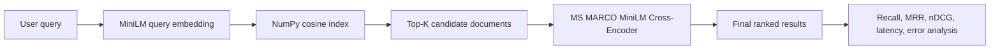

# 03 — Cross-Encoder + Bi-Encoder Ranking System

[](#local-setup)
[](#hugging-face-spaces-deployment)
[](#interactive-gradio-demo)
[](../../LICENSE)

> **One-line portfolio description:** A two-stage Transformer search engine that
> retrieves candidates with MiniLM sentence embeddings and reranks them with an
> MS MARCO cross-encoder while measuring ranking quality and latency.

**Live Hugging Face demo:**  
`https://huggingface.co/spaces/<YOUR_HF_USERNAME>/<SPACE_NAME>`

**GitHub repository:**  
`https://github.com/<YOUR_GITHUB_USERNAME>/transformer-projects`

## Responsible-use notice

This project is for educational and portfolio demonstration purposes only.

- Search-ranking models may return incomplete, biased, irrelevant, or misleading results.
- A reranking score is a model-based relevance estimate. It does not guarantee
  factual correctness, suitability, fairness, or completeness.
- Do not use job or resume rankings as the sole basis for hiring, rejection,
  promotion, compensation, immigration, legal, or employment decisions.
- Do not upload private, confidential, sensitive, copyrighted, proprietary, or
  personally identifiable text into a public demo.
- A human should review outputs before any real-world use.

## Strict project pattern

| Field | Selection |
|---|---|
| Project number | 03 |
| Application | Two-stage search-ranking engine |
| Stage 1 | MiniLM Sentence-BERT bi-encoder retrieval |
| Stage 2 | MS MARCO MiniLM cross-encoder reranking |
| Dataset | Public-safe synthetic quality analytics and job-search sample; scripts support custom ranking CSVs |
| Metrics | Recall@K, MRR@10, nDCG@10, reranking improvement, latency |
| Deployment | Hugging Face Spaces with Gradio |

## Search-ranking problem

A single ranking model usually cannot maximize both speed and relevance at
large scale.

- A **bi-encoder** embeds queries and documents independently. Document
  embeddings can be reused, so candidate retrieval is fast.
- A **cross-encoder** reads the query and document together. It can model
  token-level interactions more precisely, but it must score each pair.
- A **two-stage system** applies the cross-encoder only to a small candidate set,
  giving a practical relevance–latency tradeoff.

## Project objective

Build an end-to-end system that:

1. Loads and validates query, document, and qrels data.
2. Preserves meaningful Unicode, numbers, skills, part codes, and domain terms.
3. Generates normalized MiniLM document embeddings.
4. Stores them in a portable NumPy cosine-similarity index.
5. Retrieves top-K candidates with the bi-encoder.
6. Reranks selected candidates with the MS MARCO cross-encoder.
7. Shows scores, original ranks, reranked ranks, and rank movement.
8. Measures Recall@K, MRR@10, nDCG@10, improvement, and latency.
9. Exposes the complete workflow through a CPU-compatible Gradio application.

## Architecture



## Model selection

### Bi-encoder

`sentence-transformers/all-MiniLM-L6-v2`

Why it was selected:

- compact sentence-transformer suitable for CPU demonstrations;
- reusable document embeddings;
- broad semantic similarity capability;
- simple export path to larger vector databases later.

### Cross-encoder

`cross-encoder/ms-marco-MiniLM-L-6-v2`

Why it was selected:

- trained for query-passage relevance;
- practical quality and CPU latency;
- commonly used as a compact second-stage reranker;
- exposes the relevance-versus-speed tradeoff clearly.

Cross-encoder outputs are ranking scores, not calibrated probabilities.

## Dataset

The committed sample is intentionally small, synthetic, public-safe, and free of
personal resumes or confidential company records.

| File | Rows | Purpose |
|---|---:|---|
| `data/sample_documents.csv` | 24 | Quality search, IR, RAG, evaluation, deployment, and synthetic job descriptions |
| `data/sample_queries.csv` | 12 | Test and validation queries |
| `data/sample_qrels.csv` | 36 | Graded relevance labels from 1 to 3 |
| `data/sample_job_search_data.csv` | 5 | Public-safe job-search demonstration subset |

Core columns:

- Documents: `document_id`, `title`, `document`, `category`, `source`
- Queries: `query_id`, `query`, `split`, `domain`
- Qrels: `query_id`, `document_id`, `relevance`

See [`data/README_data.md`](data/README_data.md) before replacing the sample data.

## Text preprocessing

The shared preprocessing pipeline performs:

- HTML entity decoding and HTML tag removal;
- Unicode NFKC normalization;
- non-breaking-space and whitespace cleanup;
- missing query and document filtering;
- minimum-length validation;
- duplicate ID and duplicate document removal;
- relevance-label validation;
- title and document concatenation for indexing.

Unlike the original notebook, the productionized pipeline does **not** remove
all non-ASCII characters. This preserves multilingual text and meaningful names.

## Vector index

The public demo uses a normalized NumPy matrix and dot product, equivalent to
cosine similarity after normalization.

Why NumPy is the default:

- stable on Windows, Linux, Docker, and Hugging Face CPU environments;
- no native FAISS build requirement;
- appropriate for the 24-document demo;
- easy to replace with FAISS, Qdrant, Pinecone, Elasticsearch, or another vector
  database when scaling.

Run `python scripts/build_index.py` to save a reusable index under
`models/vector_index/`. When no compatible saved index exists, the app builds
only the small sample index after the first request. It does not train models.

## Two-stage inference output

The application returns:

- user query;
- bi-encoder candidate results;
- bi-encoder cosine scores;
- cross-encoder scores;
- retrieval rank;
- reranked rank;
- rank movement;
- query-embedding latency;
- retrieval latency;
- reranking latency;
- total search latency;
- model names and run mode.

The final order of reranked candidates uses the cross-encoder score directly.
The original notebook blended bi-encoder and cross-encoder scores. This version
keeps the stages separate so the reranking effect is technically clear.

## Evaluation

No metric is invented or hard-coded. The committed JSON files initially contain
`status: not_run`.

Run:

```bash
python scripts/evaluate_model.py
python scripts/benchmark_latency.py
```

### Recall@K

Measures what fraction of known relevant documents appears in the first K
bi-encoder candidates. Candidate recall is essential because a reranker cannot
recover a document that was not retrieved.

### MRR@10

Measures how early the first relevant result appears in the top 10.

### nDCG@10

Uses graded relevance and discounts useful documents that appear lower in the
ranked list.

### Reranking improvement

The evaluation reports:

- `reranked MRR@10 − bi-encoder MRR@10`;
- `reranked nDCG@10 − bi-encoder nDCG@10`;
- top-document changes and query-level examples.

### Latency

The benchmark records:

- document embedding and index preparation;
- query embedding;
- candidate retrieval;
- cross-encoder reranking;
- total search time;
- mean, median, and p95 latency by candidate K.

Model download and cold-start index creation are not mixed into warm per-query
latency averages; they are reported separately.

## Manual error analysis

Use `outputs/manual_relevance_analysis.md` to record:

- good candidate retrieval;
- missed relevant documents;
- strong reranking improvements;
- reranking regressions;
- keyword matches with wrong meaning;
- semantic matches from the wrong domain;
- ambiguous queries;
- cross-encoder overconfidence;
- job-ranking bias and unsafe interpretation.

## Interactive Gradio demo

The interface provides:

- free-text query input;
- preloaded sample queries;
- candidate-K and rerank-K controls;
- bi-encoder-only and full two-stage modes;
- stage-specific result tables;
- score and rank movement columns;
- measured latency details;
- model, evaluation, limitation, and responsible-use sections.

Launch locally with:

```bash
python app.py
```

## Local setup

From the `transformer-projects` root:

```bash
cd 03-cross-encoder-bi-encoder-ranking-system

python -m venv .venv
```

Windows PowerShell:

```powershell
.venv\Scripts\Activate.ps1
```

macOS/Linux:

```bash
source .venv/bin/activate
```

Install and run:

```bash
python -m pip install --upgrade pip
pip install -r requirements.txt

python scripts/build_index.py
python scripts/evaluate_model.py
python scripts/benchmark_latency.py
python app.py
```

The first model download requires internet access. Later runs use the local
Hugging Face cache.

## Tests

The test suite uses deterministic fake encoders, so CI does not download models.

```bash
pip install -r requirements-dev.txt
pytest -q
```

## Hugging Face Spaces deployment

1. Create a new Space and select **Gradio**.
2. Copy the contents of this project folder to the Space repository root.
3. Keep `app.py`, `requirements.txt`, and `README.md` at the root.
4. Replace the GitHub and Space placeholders.
5. Commit and wait for the Space to build.
6. Run a sample query and verify both ranking stages.
7. Add the live Space URL to this README and the root repository README.

The YAML block at the top of this file configures the Space. Models are loaded
from the Hugging Face Hub, and no training occurs at startup.

See [`docs/HUGGING_FACE_DEPLOYMENT.md`](docs/HUGGING_FACE_DEPLOYMENT.md) for
manual and GitHub Actions deployment.

## Docker

```bash
docker build -t docrank360 .
docker run --rm -p 7860:7860 docrank360
```

Open `http://localhost:7860`.

## Folder structure

```text
03-cross-encoder-bi-encoder-ranking-system/
├── app.py
├── gradio_app.py
├── config.yaml
├── data/
├── notebooks/
├── src/
├── models/
├── outputs/
├── images/
├── tests/
├── scripts/
├── docs/
├── README.md
├── README_HUGGINGFACE.md
├── MODEL_CARD.md
├── CHANGES_FROM_ORIGINAL.md
├── requirements.txt
├── requirements-dev.txt
├── Dockerfile
├── .dockerignore
└── .gitignore
```

## Skills demonstrated

Transformer inference, Sentence-BERT, MiniLM, semantic search, dense retrieval,
cross-encoder reranking, query-document matching, graded qrels, NumPy vector
search, Recall@K, MRR@10, nDCG@10, latency benchmarking, manual error analysis,
Gradio, Hugging Face Spaces, Docker, testing, CI, responsible AI, and
recruiter-friendly ML documentation.

## Connection to quality data science

The same architecture can support:

- retrieval of similar GCS or complaint cases;
- ranking prior root-cause investigations;
- corrective-action and CAPA knowledge search;
- supplier issue history retrieval;
- quality document and work-instruction search;
- candidate retrieval for a grounded quality RAG assistant.

The public repository uses synthetic examples only. Confidential company data
must remain outside GitHub and public Spaces.

## Screenshots to add

1. Gradio landing page and responsible-use notice.
2. Bi-encoder candidate table.
3. Reranked table with positive and negative rank movement.
4. Latency and model details.
5. MRR/nDCG comparison chart after evaluation.
6. Latency-by-top-K chart.
7. One successful and one failed query example.

## Future improvements

- fine-tune the bi-encoder with hard negatives;
- compare BM25, hybrid search, and dense retrieval;
- add FAISS or a production vector database for scale;
- calibrate or normalize scores for display;
- evaluate on an official MS MARCO subset;
- add multilingual retrieval;
- expose a REST API;
- integrate retrieval into Project 10’s portfolio RAG assistant.
