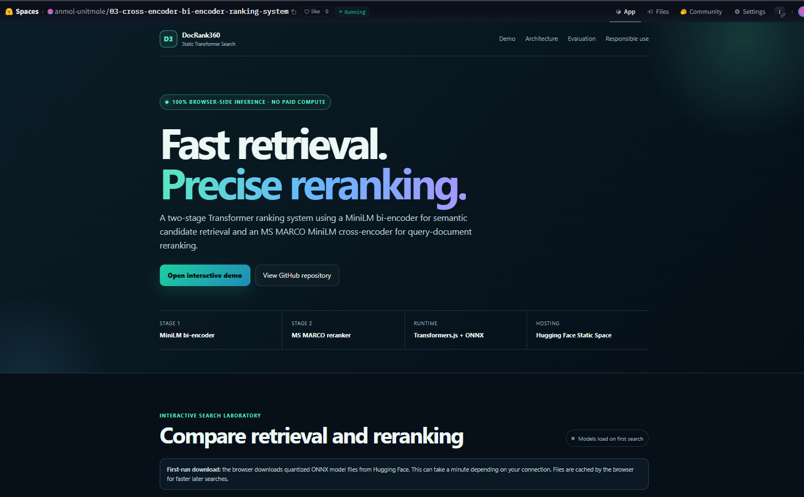
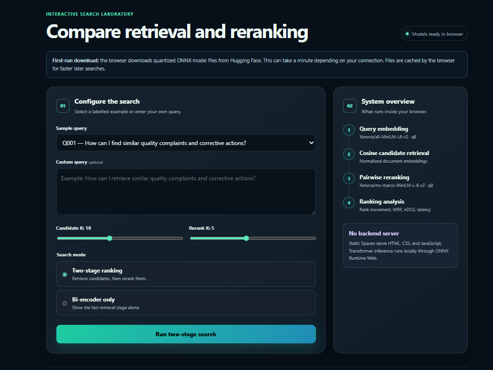
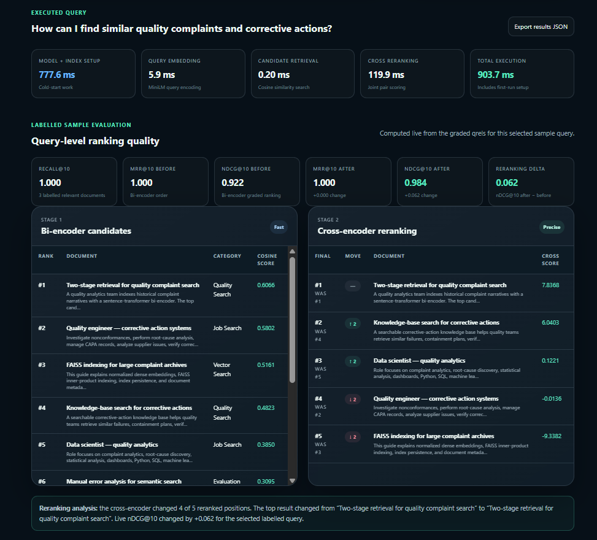

# DocRank360 — Cross-Encoder + Bi-Encoder Ranking System

[](https://www.python.org/)
[](https://pytorch.org/)
[](https://huggingface.co/docs/transformers/)
[](https://www.sbert.net/)
[](https://huggingface.co/docs/transformers.js/)
[](https://huggingface.co/spaces/anmol-unitmole/03-cross-encoder-bi-encoder-ranking-system)
[](https://github.com/unit-mole/transformer-projects/actions/workflows/03-cross-encoder-bi-encoder-ranking-system.yml)
[](../LICENSE)

An end-to-end information-retrieval project that combines a **MiniLM bi-encoder** for fast semantic candidate retrieval with an **MS MARCO MiniLM cross-encoder** for precise query-document reranking. The repository includes a complete Python implementation, browser-based Transformer inference, BEIR benchmarking, lexical baselines, graded relevance evaluation, latency analysis, automated testing, GitHub Actions, and deployment through a free Hugging Face Static Space.

**Status:** Portfolio-ready, benchmarked, tested, and deployed  
**Live application:** [Open the DocRank360 Hugging Face Static Space](https://huggingface.co/spaces/anmol-unitmole/03-cross-encoder-bi-encoder-ranking-system)  
**Repository:** [Open Project 03 on GitHub](https://github.com/unit-mole/transformer-projects/tree/main/03-cross-encoder-bi-encoder-ranking-system)  
**Primary stack:** Python · PyTorch · Hugging Face Transformers · Sentence Transformers · MiniLM · Transformers.js · ONNX Runtime Web · Vite · JavaScript · GitHub Actions · Hugging Face Spaces

---

## Responsible Use

This project is intended for educational, technical-learning, evaluation, and portfolio demonstration purposes.

- Rankings may be incomplete, biased, irrelevant, or misleading.
- Cross-encoder outputs are relevance estimates, not factual guarantees or calibrated probabilities.
- A high relevance score does not prove that a document is correct, complete, trustworthy, or suitable for a consequential decision.
- Do not upload confidential, proprietary, copyrighted, sensitive, or personally identifiable text to the public demonstration.
- Do not use ranking outputs as the sole basis for hiring, rejection, promotion, compensation, immigration, legal, medical, financial, insurance, or safety-critical decisions.
- Human review remains necessary before consequential use.

---

## Business Problem

Modern search, enterprise knowledge retrieval, quality-case discovery, and Retrieval-Augmented Generation systems must balance two competing requirements:

1. **Speed:** Search a large document collection quickly.
2. **Ranking quality:** Place the most relevant documents at the top.

A bi-encoder is efficient because queries and documents are embedded independently. However, independent embeddings may miss fine-grained query-document relationships. A cross-encoder usually provides stronger relevance estimates because it reads each query-document pair jointly, but it is too expensive to apply to every document in a large corpus.

This project answers:

> Can a fast MiniLM bi-encoder retrieve a strong candidate set and an MS MARCO cross-encoder improve the final ranking without making interactive search impractical?

The deployed application returns:

- Semantic candidate documents
- Bi-encoder cosine-similarity scores
- Cross-encoder relevance scores
- Original and final ranks
- Rank movement
- Query-level Recall@K
- MRR@10 before and after reranking
- nDCG@10 before and after reranking
- Reranking improvement
- Model-loading and inference latency
- Downloadable JSON results

---

## Project Objective

Build a professional two-stage Transformer ranking system that can:

1. Validate and preprocess queries, documents, and graded relevance judgments.
2. Preserve Unicode text during normalization.
3. Encode queries and documents using a MiniLM sentence-transformer bi-encoder.
4. Retrieve top-K candidates through normalized vector similarity.
5. Rerank selected query-document pairs using an MS MARCO cross-encoder.
6. Compare lexical retrieval, dense retrieval, and two-stage Transformer ranking.
7. Measure Recall@K, MRR@10, nDCG@10, MAP@100, and latency.
8. Evaluate on recognized BEIR datasets.
9. Quantify reranking improvements with paired bootstrap confidence intervals.
10. Run real Transformer inference directly inside the browser.
11. Export reusable JSON, CSV, Markdown, and chart artifacts.
12. Validate and deploy the application automatically through GitHub Actions.

---

## Portfolio Architecture

The project uses three complementary portfolio layers:

| Portfolio component | Purpose |
|---|---|
| GitHub repository | Complete Python project, evaluation pipeline, notebook, tests, artifacts, Gradio comparison app, browser source, and CI |
| Model documentation | Model card, base-model attribution, configuration, metrics, limitations, and responsible-use documentation |
| Hugging Face Static Space | Live Transformers.js application using browser-side ONNX inference without paid server compute |

```text
GitHub repository
├── Python retrieval and reranking implementation
├── BEIR benchmark and evaluation artifacts
├── Gradio comparison application
├── Tests and validation scripts
└── Vite browser source
        │
        ▼
Hugging Face Static Space
└── Live MiniLM retrieval and cross-encoder reranking
```

---

## Datasets

The project uses separate datasets for the live browser demonstration and the large-scale offline benchmark.

### Browser Demonstration Dataset

| Property | Value |
|---|---:|
| Documents | 24 |
| Queries | 12 |
| Graded relevance judgments | 36 |
| Relevance grades | 1, 2, and 3 |
| Purpose | Fast, public-safe interactive demonstration |
| Topics | Quality analytics, complaint retrieval, corrective actions, RAG, semantic search, and fictional job descriptions |

The browser dataset is synthetic and public-safe. It contains no confidential GCS cases, company records, personal resumes, or proprietary documents.

### BEIR Benchmark Datasets

| Dataset | Domain | Documents | Test queries | Relevance judgments |
|---|---|---:|---:|---:|
| SciFact | Scientific claim and evidence retrieval | 5,183 | 300 | 339 |
| NFCorpus | Biomedical information retrieval | 3,633 | 323 | 12,334 |
| **Total** | Two retrieval domains | **8,816** | **623** | **12,673** |

The full benchmark datasets are downloaded locally when required and are not committed to GitHub.

---

## Tools and Technologies

| Area | Technology |
|---|---|
| Language | Python, JavaScript |
| Deep learning | PyTorch |
| Transformer framework | Hugging Face Transformers |
| Embedding framework | Sentence Transformers |
| Bi-encoder | `sentence-transformers/all-MiniLM-L6-v2` |
| Cross-encoder | `cross-encoder/ms-marco-MiniLM-L6-v2` |
| Browser bi-encoder | `Xenova/all-MiniLM-L6-v2` |
| Browser cross-encoder | `Xenova/ms-marco-MiniLM-L-6-v2` |
| Browser runtime | Transformers.js, ONNX Runtime Web |
| Vector retrieval | Normalized NumPy cosine similarity |
| Lexical baselines | TF-IDF, Okapi BM25 |
| Data processing | NumPy, pandas |
| Evaluation | scikit-learn, custom IR metrics, paired bootstrap resampling |
| Visualization | Matplotlib |
| Local application | Gradio |
| Static application | Vite, HTML, CSS, JavaScript |
| Testing | pytest, Node test runner, syntax and structure validation |
| Automation | GitHub Actions |
| Hosting | Hugging Face Static Spaces |
| Benchmark hardware | NVIDIA GeForce RTX 5090 with CUDA-enabled PyTorch |

---

## Project Workflow

```text
Queries, documents, and relevance judgments
                 │
                 ▼
Validation and Unicode-preserving preprocessing
                 │
                 ├───────────────────────────────┐
                 │                               │
                 ▼                               ▼
        TF-IDF / BM25 baselines         MiniLM document embeddings
                                                 │
                                                 ▼
                                      Normalized vector index
                                                 │
User query                                       │
    │                                            │
    ▼                                            │
MiniLM query embedding ──────────────────────────┘
                 │
                 ▼
Cosine-similarity candidate retrieval
                 │
                 ▼
Top-K query-document candidates
                 │
                 ▼
MS MARCO cross-encoder pair scoring
                 │
                 ▼
Final reranked documents
                 │
                 ▼
Recall, MRR, nDCG, MAP, latency, confidence intervals,
ranking examples, regressions, charts, and JSON/CSV outputs
                 │
                 ▼
Transformers.js browser application
                 │
                 ▼
GitHub Actions validation and Hugging Face deployment
```

---

## Text Preprocessing

The project applies consistent preprocessing assumptions across Python and browser implementations.

- HTML entity decoding
- Unicode NFKC normalization
- HTML-tag removal
- Whitespace normalization
- Missing-value validation
- Minimum query and document-length validation
- Duplicate-document removal
- Title and document-text concatenation
- Query, document, and qrels identifier validation
- Relevance-grade validation
- Deterministic query ordering

ASCII-only cleanup is intentionally avoided because it may damage names, symbols, multilingual text, and domain-specific terminology.

---

## Two-Stage Transformer Architecture

### Stage 1: MiniLM Bi-Encoder Retrieval

The bi-encoder processes the query and each document independently.

```text
Query ───────────────► MiniLM encoder ─► Query embedding
Document collection ─► MiniLM encoder ─► Document embeddings
                                          │
                                          ▼
                                  Cosine similarity
                                          │
                                          ▼
                                   Top-K candidates
```

Independent document embeddings can be computed in advance, making this stage suitable for fast candidate generation.

### Stage 2: MS MARCO Cross-Encoder Reranking

The cross-encoder reads each query-document pair jointly.

```text
[Query, Candidate document]
              │
              ▼
MS MARCO MiniLM cross-encoder
              │
              ▼
Pairwise relevance score
              │
              ▼
Final reranked candidate list
```

Joint attention allows the model to capture more detailed relationships than independent embeddings, but the computational cost is higher.

### Why Scores Are Not Blended

Bi-encoder cosine similarities and cross-encoder logits are produced on different scales. The system therefore follows a clear two-stage design:

```text
Bi-encoder score
→ candidate generation only

Cross-encoder score
→ final reranking only
```

No uncalibrated weighted average is used.

---

## Model Strategy and Attribution

| Purpose | Model |
|---|---|
| Python candidate retrieval | `sentence-transformers/all-MiniLM-L6-v2` |
| Python reranking | `cross-encoder/ms-marco-MiniLM-L6-v2` |
| Browser candidate retrieval | `Xenova/all-MiniLM-L6-v2` |
| Browser reranking | `Xenova/ms-marco-MiniLM-L-6-v2` |

The current project uses pretrained and browser-converted models. It does **not** claim that these base weights were trained by the project author.

Accurate portfolio description:

> Built and rigorously evaluated a two-stage Transformer ranking system using pretrained MiniLM bi-encoder retrieval and MS MARCO cross-encoder reranking.

---

## Verified Benchmark Results

The complete benchmark evaluated:

- **623 held-out queries**
- **8,816 documents**
- **TF-IDF**
- **Okapi BM25**
- **MiniLM bi-encoder**
- **MiniLM bi-encoder + MS MARCO cross-encoder**
- **2,000 paired bootstrap samples**

### Transformer Ranking Results

| Dataset | Metric | Bi-encoder | Bi-encoder + cross-encoder | Absolute change | Relative improvement |
|---|---|---:|---:|---:|---:|
| SciFact | MRR@10 | 0.6068 | **0.6559** | **+0.0491** | **+8.1%** |
| SciFact | nDCG@10 | 0.6484 | **0.6868** | **+0.0384** | **+5.9%** |
| SciFact | MAP@100 | 0.6055 | **0.6481** | **+0.0426** | **+7.0%** |
| NFCorpus | MRR@10 | 0.5088 | **0.5634** | **+0.0546** | **+10.7%** |
| NFCorpus | nDCG@10 | 0.3190 | **0.3453** | **+0.0263** | **+8.2%** |
| NFCorpus | MAP@100 | 0.1537 | **0.1757** | **+0.0220** | **+14.3%** |

The cross-encoder improved MRR@10, nDCG@10, and MAP@100 on both benchmark datasets.

### Recall Results

| Dataset | Model | Recall@10 | Recall@100 |
|---|---|---:|---:|
| SciFact | Bi-encoder | 0.7883 | 0.9250 |
| SciFact | Bi-encoder + cross-encoder | 0.8089 | 0.9250 |
| NFCorpus | Bi-encoder | 0.1589 | 0.3149 |
| NFCorpus | Bi-encoder + cross-encoder | 0.1594 | 0.3149 |

Recall@100 remains unchanged because reranking changes the order of retrieved candidates rather than adding documents that were never retrieved.

### Statistical Evidence

| Dataset | Metric | Mean improvement | 95% confidence interval | Probability improvement is positive |
|---|---|---:|---:|---:|
| SciFact | MRR@10 | +0.0491 | [+0.0096, +0.0858] | 99.35% |
| SciFact | nDCG@10 | +0.0384 | [+0.0051, +0.0710] | 98.60% |
| SciFact | MAP@100 | +0.0426 | [+0.0052, +0.0774] | 98.90% |
| NFCorpus | MRR@10 | +0.0546 | [+0.0201, +0.0869] | 99.95% |
| NFCorpus | nDCG@10 | +0.0263 | [+0.0089, +0.0436] | 99.85% |
| NFCorpus | MAP@100 | +0.0220 | [+0.0101, +0.0354] | 100.00% |

All six paired-bootstrap confidence intervals are above zero.

### Latency Tradeoff

| Dataset | Bi-encoder mean query latency | Two-stage mean query latency |
|---|---:|---:|
| SciFact | 0.24 ms | 41.98 ms |
| NFCorpus | 0.34 ms | 42.12 ms |

The cross-encoder introduces additional latency in exchange for stronger final ranking quality. This tradeoff is explicitly reported rather than hidden.

Complete benchmark details are stored in:

```text
BENCHMARK_RESULTS.md
outputs/benchmark/latest/
web/public/data/benchmark_summary.json
model_hub/pipeline-card/evaluation_results.json
```

---

## Evaluation

The evaluation pipeline supports:

- Recall@1
- Recall@3
- Recall@5
- Recall@10
- Recall@20
- Recall@50
- Recall@100
- Precision@10
- Hit@10
- MRR@10
- nDCG@10
- MAP@100
- Reranking improvement
- Mean query latency
- Median query latency
- p95 latency
- Corpus-embedding time
- Query-embedding time
- Candidate-retrieval time
- Cross-encoder reranking time
- Total execution time
- Per-query ranking deltas
- Ranking improvements and regressions
- Paired bootstrap confidence intervals

### Why Multiple Metrics Matter

- **Recall@K** measures whether relevant documents entered the candidate set.
- **MRR@10** rewards placing the first relevant result near the top.
- **nDCG@10** uses graded relevance and rewards highly relevant documents appearing earlier.
- **MAP@100** evaluates precision across the ranked list for multiple relevant documents.
- **Latency** quantifies the speed-versus-quality tradeoff.
- **Confidence intervals** show whether average improvements are consistent across queries.
- **Per-query analysis** reveals regressions that aggregate averages can hide.

---

## Hugging Face Static Browser Demo

The deployed application runs real Transformer inference directly inside the visitor's browser.

It supports:

- Labelled sample queries
- Custom queries
- Candidate-K control
- Rerank-K control
- Bi-encoder-only mode
- Complete two-stage ranking mode
- Browser model-loading progress
- MiniLM query and document embeddings
- Cosine-similarity retrieval
- MS MARCO cross-encoder scoring
- Retrieval and final ranks
- Rank movement
- Query-level Recall@K
- MRR@10 before and after reranking
- nDCG@10 before and after reranking
- Reranking delta
- Model setup and inference latency
- Verified BEIR benchmark summary
- Downloadable JSON results
- Responsible-use guidance

No Python inference server or paid Hugging Face compute is required.

### Live Application

[](https://huggingface.co/spaces/anmol-unitmole/03-cross-encoder-bi-encoder-ranking-system)

### Application Overview



*DocRank360 deployed as a Hugging Face Static Space using Transformers.js and ONNX Runtime Web.*

### Interactive Ranking Configuration



*Interactive controls for sample or custom queries, candidate retrieval, reranking depth, and execution mode.*

### Ranking Results and Query-Level Metrics



*Live MiniLM retrieval and MS MARCO reranking with rank movement, query-level Recall, MRR, nDCG, and latency.*

---

## Browser Inference Workflow

```text
Visitor selects or enters a query
              │
              ▼
Browser loads quantized ONNX model assets
              │
              ▼
Transformers.js initializes MiniLM bi-encoder
              │
              ▼
Browser generates or reuses document embeddings
              │
              ▼
Query is encoded and normalized
              │
              ▼
Cosine similarity retrieves top-K candidates
              │
              ▼
Optional cross-encoder model loads
              │
              ▼
Query-document pairs are tokenized jointly
              │
              ▼
Cross-encoder relevance logits are generated
              │
              ▼
Candidates are reranked
              │
              ▼
Ranks, scores, metrics, latency, and JSON export are displayed
```

The first search may take longer because the browser downloads and initializes the models. Browser caching makes subsequent searches faster.

---

## Python and Browser Model Mapping

| Component | Python implementation | Browser implementation |
|---|---|---|
| Bi-encoder | `sentence-transformers/all-MiniLM-L6-v2` | `Xenova/all-MiniLM-L6-v2` |
| Cross-encoder | `cross-encoder/ms-marco-MiniLM-L6-v2` | `Xenova/ms-marco-MiniLM-L-6-v2` |
| Runtime | PyTorch | Transformers.js + ONNX Runtime Web |
| Retrieval | NumPy cosine index | Browser-memory cosine similarity |
| Deployment | Local Python and Gradio | Hugging Face Static Space |

---

## Benchmark Artifacts

| Artifact | Purpose |
|---|---|
| `BENCHMARK_RESULTS.md` | Recruiter-facing benchmark summary |
| `outputs/benchmark/latest/benchmark_summary.csv` | Complete model and baseline metric table |
| `outputs/benchmark/latest/benchmark_summary.json` | Machine-readable aggregate metrics |
| `outputs/benchmark/latest/per_query_metrics.csv` | Query-level results |
| `outputs/benchmark/latest/bootstrap_significance.json` | Confidence intervals and positive-improvement probabilities |
| `outputs/benchmark/latest/latency_breakdown.csv` | Stage-specific latency |
| `outputs/benchmark/latest/ranking_examples.csv` | Retrieved and reranked document examples |
| `outputs/benchmark/latest/reranking_deltas.csv` | Query-level ranking changes |
| `outputs/benchmark/latest/metric_comparison.png` | Metric comparison chart |
| `outputs/benchmark/latest/recall_at_k_curves.png` | Recall-by-K curves |
| `outputs/benchmark/latest/latency_comparison.png` | Latency comparison chart |
| `outputs/benchmark/latest/reranking_delta_distribution.png` | Reranking change distribution |
| `web/public/data/benchmark_summary.json` | Verified values displayed by the Static Space |

No benchmark metric is invented. Results are written only after the evaluation pipeline completes successfully.

---

## Run the Static Browser Demo Locally

### 1. Open the web project

```bash
cd 03-cross-encoder-bi-encoder-ranking-system/web
```

### 2. Install browser dependencies

```bash
npm install
```

### 3. Validate and test

```bash
npm run check
npm test
```

### 4. Start the development server

```bash
npm run dev
```

### 5. Build the production Static Space

```bash
npm run build
npm run preview
```

The deployable application is generated under:

```text
web/dist/
```

---

## Run the Python Project Locally

### 1. Create a virtual environment

**Windows**

```bat
py -3.11 -m venv .venv
.venv\Scripts\activate
```

**macOS / Linux**

```bash
python3 -m venv .venv
source .venv/bin/activate
```

### 2. Install dependencies

```bash
python -m pip install --upgrade pip
python -m pip install -r requirements.txt
```

### 3. Build the local vector index

```bash
python scripts/build_index.py
```

### 4. Evaluate the sample ranking system

```bash
python scripts/evaluate_model.py
```

### 5. Benchmark latency

```bash
python scripts/benchmark_latency.py
```

### 6. Start the local Gradio application

```bash
python app.py
```

---

## Run the Large-Scale BEIR Benchmark

### 1. Create the benchmark environment on Windows

```powershell
powershell -ExecutionPolicy Bypass -File setup_benchmark_windows.ps1
```

### 2. Activate it

```bat
.venv-benchmark\Scripts\activate.bat
```

### 3. Verify CUDA

```bat
python scripts\check_gpu.py
```

### 4. Open the benchmark notebook

```bat
jupyter lab notebooks\04-large-scale-ranking-benchmark.ipynb
```

### 5. Command-line alternative

```bat
python scripts\run_portfolio_benchmark.py --datasets scifact nfcorpus --device cuda --candidate-k 100 --rerank-k 100 --bi-batch-size 128 --cross-batch-size 64 --bootstrap-samples 2000
```

### 6. Synchronize verified results

```bat
python scripts\sync_benchmark_results.py
```

This updates the portfolio Markdown and Model Hub evaluation JSON from the completed benchmark artifacts.

---

## Deployment

- **GitHub repository:** `unit-mole/transformer-projects`
- **Source branch:** `main`
- **Project directory:** `03-cross-encoder-bi-encoder-ranking-system/`
- **Space owner:** `anmol-unitmole`
- **Space name:** `03-cross-encoder-bi-encoder-ranking-system`
- **Space SDK:** Static
- **Application entry point:** `index.html`
- **Frontend source:** `web/`
- **Published build:** `web/dist/`
- **Live application:** https://huggingface.co/spaces/anmol-unitmole/03-cross-encoder-bi-encoder-ranking-system

The GitHub Actions workflow:

1. Checks out the repository.
2. Sets up Python and Node.js.
3. Validates Hugging Face metadata.
4. Validates the browser project structure.
5. Runs JavaScript syntax checks.
6. Runs browser metric tests.
7. Builds the Vite Static Space.
8. Validates the deployment output.
9. Compiles Python files.
10. Validates Python imports.
11. Runs pytest.
12. Uploads the production build to Hugging Face.
13. Displays the deployed Space URL.

The workflow file is stored at:

```text
.github/workflows/03-cross-encoder-bi-encoder-ranking-system.yml
```

---

## Project Structure

```text
transformer-projects/
├── .github/
│   └── workflows/
│       └── 03-cross-encoder-bi-encoder-ranking-system.yml
│
└── 03-cross-encoder-bi-encoder-ranking-system/
    ├── data/
    │   ├── sample_documents.csv
    │   ├── sample_queries.csv
    │   └── sample_qrels.csv
    ├── docs/
    │   ├── ARCHITECTURE.md
    │   ├── HUGGING_FACE_DEPLOYMENT.md
    │   ├── HUGGING_FACE_MODEL_REPOSITORY.md
    │   └── PORTFOLIO_ROADMAP.md
    ├── images/
    │   ├── project-03-huggingface-static-space-home.png
    │   ├── project-03-interactive-ranking-demo.png
    │   └── project-03-ranking-results-and-metrics.png
    ├── model_hub/
    │   ├── pipeline-card/
    │   ├── bi-encoder-template/
    │   └── cross-encoder-template/
    ├── models/
    │   ├── model_metadata.json
    │   └── vector_index/
    ├── notebooks/
    │   ├── 04-large-scale-ranking-benchmark.ipynb
    │   └── original_docrank360_notebook.ipynb
    ├── outputs/
    │   └── benchmark/
    │       └── latest/
    ├── scripts/
    ├── src/
    │   └── benchmarking/
    ├── tests/
    ├── web/
    │   ├── index.html
    │   ├── package.json
    │   ├── vite.config.js
    │   ├── public/
    │   │   ├── README.md
    │   │   └── data/
    │   │       ├── benchmark_summary.json
    │   │       ├── sample_documents.json
    │   │       ├── sample_queries.json
    │   │       └── sample_qrels.json
    │   ├── src/
    │   │   ├── benchmark-summary.js
    │   │   ├── constants.js
    │   │   ├── data-loader.js
    │   │   ├── export-results.js
    │   │   ├── main.js
    │   │   ├── metrics.js
    │   │   ├── ranking-engine.js
    │   │   ├── styles.css
    │   │   └── ui.js
    │   └── tests/
    ├── app.py
    ├── gradio_app.py
    ├── BENCHMARK_RESULTS.md
    ├── config.yaml
    ├── Dockerfile
    ├── MODEL_CARD.md
    ├── README.md
    ├── README_HUGGINGFACE.md
    ├── requirements.txt
    ├── requirements-benchmark.txt
    └── requirements-dev.txt
```

---

## Tests and Validation

### Python

```bash
python -m pytest -q
python scripts/validate_web_project.py
```

### Browser

```bash
cd web
npm run check
npm test
npm run build
cd ..
python scripts/validate_dist.py
```

The project includes:

- Python unit tests
- Browser metric tests
- JavaScript syntax validation
- Static Space metadata validation
- Dataset and qrels validation
- Benchmark-summary consistency checks
- Production-build validation
- Import validation
- GitHub Actions automation

---

## Limitations

- The live browser corpus is intentionally small and synthetic.
- Browser speed depends on device hardware, browser support, available memory, and network conditions.
- The first search requires model downloads and document embedding.
- Dense retrieval can miss relevant documents with exact identifiers, product codes, or rare terminology.
- A cross-encoder cannot recover a relevant document that was not retrieved in the candidate set.
- Cross-encoder reranking may introduce regressions for some queries.
- Cross-encoder scores are not calibrated probabilities.
- The pretrained models were not fine-tuned specifically for quality analytics.
- BEIR results do not guarantee performance on private enterprise data.
- The application has not been validated for safety-critical or production use.
- Public deployment must never contain confidential company or personal data.

---

## Future Improvements

- Fine-tune the bi-encoder using domain-relevant positive pairs and hard negatives.
- Fine-tune or calibrate the cross-encoder for the target retrieval domain.
- Add BM25 and dense hybrid retrieval.
- Add reciprocal-rank fusion.
- Add exact-match boosts for product codes and technical identifiers.
- Evaluate additional BEIR datasets.
- Add confidence calibration or score normalization.
- Add browser integration tests with Playwright.
- Add progressive document-embedding caching.
- Add WebGPU benchmarking when broadly supported.
- Publish a genuinely fine-tuned model through Hugging Face Model Hub.
- Add a larger public quality-analytics dataset.
- Integrate the retriever into a grounded RAG application.
- Add retrieval monitoring and drift analysis.
- Add model and dataset version tracking.

---

## Skills Demonstrated

- Transformer inference
- Sentence-BERT and MiniLM
- Bi-encoder architecture
- Cross-encoder architecture
- Dense semantic retrieval
- Query-document reranking
- Information retrieval
- Cosine similarity
- TF-IDF
- Okapi BM25
- Graded relevance judgments
- Recall@K
- MRR@10
- nDCG@10
- MAP@100
- Paired bootstrap confidence intervals
- Latency benchmarking
- Per-query error analysis
- PyTorch
- Hugging Face Transformers
- Sentence Transformers
- Transformers.js
- ONNX Runtime Web
- Vite and browser application development
- Gradio
- Hugging Face Static Spaces
- Model documentation
- GitHub Actions
- Automated testing
- Responsible AI communication
- Portfolio-focused ML engineering

---

## Portfolio Positioning

**One-line description:** Two-stage Transformer ranking system using MiniLM bi-encoder retrieval and MS MARCO cross-encoder reranking, rigorously evaluated on SciFact and NFCorpus and deployed through browser-based Transformers.js inference.

**Pinned-repository description:** Production-style semantic retrieval and reranking portfolio project featuring Sentence Transformers, MS MARCO cross-encoder scoring, TF-IDF and BM25 baselines, BEIR evaluation, Recall/MRR/nDCG/MAP metrics, bootstrap confidence intervals, GPU latency benchmarking, Transformers.js browser inference, Hugging Face deployment, tests, and CI.

This project connects naturally to a Quality Data Scientist background because the same architecture can support:

- Similar GCS case retrieval
- Complaint-record ranking
- Root-cause-history search
- Corrective-action and CAPA retrieval
- Supplier issue-history discovery
- Quality-document search
- Historical investigation retrieval
- Grounded quality RAG systems

Confidential company data must remain outside public GitHub and Hugging Face repositories.

---

## Author

**Anmol Tripathi**

Quality Data Scientist building a professional portfolio in Data Science, Machine Learning, Applied AI, Natural Language Processing, Information Retrieval, Analytics Engineering, and Quality Analytics.
