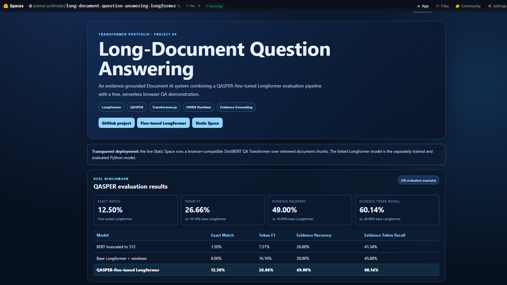
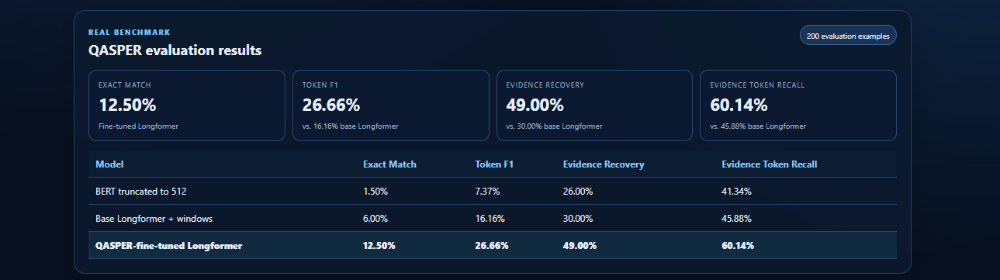
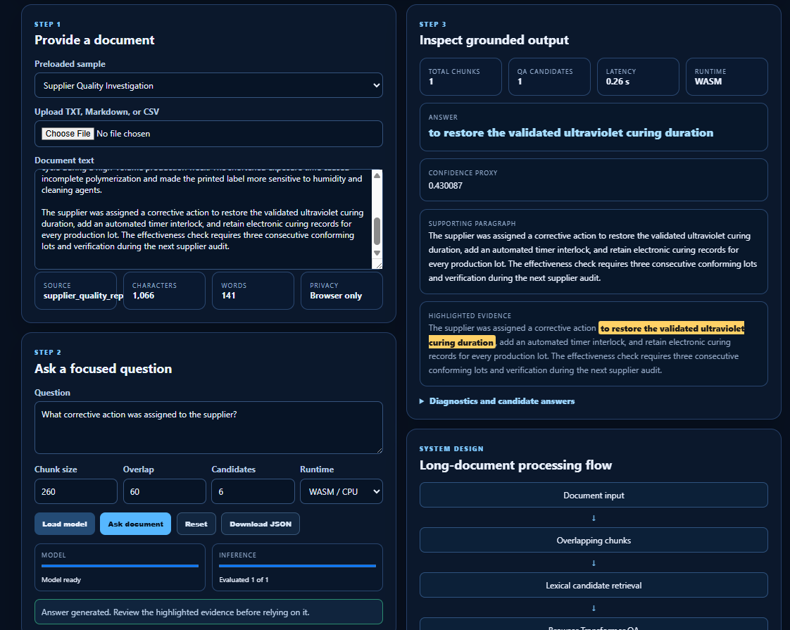
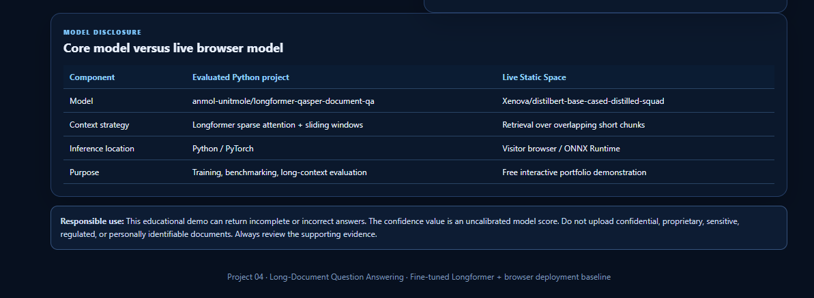

# Long-Document Question Answering with Longformer

[](https://www.python.org/)
[](https://pytorch.org/)
[](https://huggingface.co/docs/transformers/)
[](https://huggingface.co/docs/transformers/model_doc/longformer)
[](https://huggingface.co/docs/transformers.js/)
[](https://huggingface.co/spaces/anmol-unitmole/long-document-question-answering-longformer)
[](https://huggingface.co/anmol-unitmole/longformer-qasper-document-qa)
[](https://github.com/unit-mole/transformer-projects/actions/workflows/04-long-document-question-answering-longformer.yml)
[](../LICENSE)

An end-to-end **Document AI and long-document question-answering project** that fine-tunes a Longformer model on an extractive subset of **QASPER**, compares it against truncated BERT and the original Longformer checkpoint, evaluates answer quality and evidence grounding, and publishes a free browser-based Transformer demonstration through Hugging Face Static Spaces.

**Status:** Portfolio-ready, evaluated, model published, and live application deployed  
**Live application:** [Open the Long-Document QA Static Space](https://huggingface.co/spaces/anmol-unitmole/long-document-question-answering-longformer)  
**Fine-tuned model:** [Open the QASPER Longformer model repository](https://huggingface.co/anmol-unitmole/longformer-qasper-document-qa)  
**Primary stack:** Python · PyTorch · Longformer · Hugging Face Transformers · QASPER · Transformers.js · ONNX Runtime · JavaScript · GitHub Actions · Hugging Face Spaces

---

## Responsible Use

This project is intended for education, technical learning, experimentation, and portfolio demonstration.

- The model may return incomplete, incorrect, unsupported, or misleading answers.
- The confidence value is an **uncalibrated model proxy**, not a guaranteed probability of correctness.
- Highlighted text may be incomplete or may not fully support the predicted answer.
- Do not use the system as the sole basis for legal, medical, financial, academic, regulatory, safety-critical, official, or business-critical decisions.
- Do not upload private, confidential, copyrighted, proprietary, sensitive, regulated, or personally identifiable documents to the public application.
- Human review of the predicted answer and supporting evidence is required.

---

## Business Problem

Important information is often buried inside long research papers, quality reports, policies, SOPs, technical manuals, CAPA records, complaint investigations, supplier reports, and case histories. Manual review is time-consuming, repetitive, and difficult to scale.

This project answers:

> Given a long document and a focused question, can a Transformer locate a relevant answer span, recover the supporting evidence, and communicate its result transparently?

The system returns:

- Predicted answer
- Model confidence proxy
- Supporting paragraph
- Highlighted evidence
- Document and context statistics
- Number of processed windows or chunks
- Inference latency
- Model and deployment disclosure

---

## Project Objective

Build a professional long-document QA solution that can:

1. Load TXT, Markdown, CSV, PDF, pasted text, and safe sample documents.
2. Normalize and validate document text without silently inventing content.
3. Process documents that exceed a standard BERT context window.
4. Fine-tune Longformer on a reproducible extractive subset of QASPER.
5. Compare truncated BERT, the original Longformer checkpoint, and the project-fine-tuned Longformer.
6. Measure Exact Match, token-level F1, evidence recovery, evidence-token recall, latency, and context-length behavior.
7. Return answer spans with supporting paragraphs and highlighted evidence.
8. Save reproducible JSON, CSV, Markdown, and PNG evaluation artifacts.
9. Publish the fine-tuned Longformer model through Hugging Face Model Hub.
10. Deploy a free browser-based Transformer QA application through a Hugging Face Static Space.
11. Validate the Python and browser layers through GitHub Actions.
12. Present the project honestly for Data Science, Machine Learning, NLP, Document AI, and Applied AI roles.

---

## Project Pattern

| Item | Implementation |
|---|---|
| Project number | 04 |
| Project name | `04-long-document-question-answering-longformer` |
| Application | Upload, paste, or select a document and ask a question |
| Core evaluated model | QASPER-fine-tuned Longformer |
| Live browser model | DistilBERT QA through Transformers.js and ONNX Runtime |
| Required outputs | Answer, confidence proxy, supporting paragraph, highlighted evidence |
| Dataset | QASPER v0.3 contiguous-extractive subset |
| Evaluation | Exact Match, token F1, evidence recovery, evidence-token recall, latency, context-length analysis |
| Deployment | Hugging Face Model Hub + free Hugging Face Static Space |

---

## Dataset

The training and evaluation pipeline uses **QASPER v0.3**, a question-answering dataset built from NLP research papers.

Because the selected model uses extractive start and end token positions, the preparation pipeline keeps examples with **contiguous extractive answer spans** and valid evidence offsets. Yes/no, unanswerable, purely abstractive, and invalid-offset examples are excluded from this specific training objective rather than being incorrectly forced into extractive labels.

| Property | Value |
|---|---|
| Task | Long-document extractive question answering |
| Dataset | QASPER v0.3 |
| Project subset | Contiguous extractive answers only |
| Training examples | 803 |
| Validation examples | 419 |
| Final benchmark examples | 200 |
| Training papers | 495 |
| Validation papers | 220 |
| Average training-document length | Approximately 25,558 characters |
| Average validation-document length | Approximately 23,520 characters |
| Dataset license | CC BY 4.0 |
| Random seed | 42 |

The complete QASPER dataset and generated local caches are not committed to GitHub. The repository contains preparation scripts, metadata, evaluation artifacts, and safe synthetic sample documents.

---

## Tools and Technologies

| Area | Technology |
|---|---|
| Language | Python, JavaScript, HTML, CSS |
| Deep learning | PyTorch |
| Transformer library | Hugging Face Transformers |
| Core architecture | Longformer |
| Baseline architecture | BERT |
| Browser model | DistilBERT extractive QA |
| Dataset | QASPER v0.3 |
| Data analysis | pandas, NumPy |
| Evaluation | Custom EM/F1/evidence metrics, scikit-learn, Matplotlib |
| Document processing | pypdf, CSV and text loaders |
| Browser inference | Transformers.js, ONNX Runtime Web |
| Interface | Static HTML, CSS, JavaScript |
| Testing | pytest, JavaScript unit tests, import and structure validation |
| Automation | GitHub Actions |
| Model hosting | Hugging Face Model Hub |
| Application hosting | Hugging Face Static Spaces |
| Model format | Hugging Face Transformers + Safetensors |

---

## End-to-End Project Workflow

```text
QASPER papers, questions, answers, and evidence
                    │
                    ▼
       Extractive-subset preparation
                    │
                    ▼
     Answer offsets and evidence validation
                    │
                    ▼
 Question + long-document tokenization
                    │
                    ▼
 Overlapping Longformer training windows
                    │
                    ▼
 QASPER fine-tuning with BF16 on GPU
                    │
                    ▼
 BERT and base-Longformer baselines
                    │
                    ▼
 200-example benchmark evaluation
                    │
                    ▼
 EM, F1, evidence, latency, context analysis
                    │
                    ▼
 JSON, CSV, Markdown, and PNG artifacts
                    │
                    ▼
 Hugging Face fine-tuned model repository
                    │
                    ▼
 Browser-compatible Transformer QA demo
                    │
                    ▼
 GitHub Actions validation and Static Space deployment
```

---

## Longformer Architecture

Longformer extends standard Transformer encoders with a combination of:

- **Local sliding-window attention** for efficient token-to-neighbor interaction
- **Global attention** for selected tokens that need access to the full context
- Longer input support than standard 512-token BERT-style models

For question answering, the question tokens receive global attention while the document tokens use sparse local attention.

```text
Question tokens
      │
      ├── Global attention
      │
Long document tokens
      │
      ├── Sparse sliding-window attention
      │
      ▼
Longformer encoder representations
      │
      ▼
Question-answering head
      │
      ├── Start-token logits
      └── End-token logits
      │
      ▼
Best valid answer span
```

### Selected base checkpoint

```text
valhalla/longformer-base-4096-finetuned-squadv1
```

The checkpoint already contains a question-answering head trained on SQuAD. This project then performs genuine additional fine-tuning on the prepared QASPER extractive subset.

---

## Fine-Tuning Strategy

The final publishable experiment used the high-VRAM profile.

| Configuration | Value |
|---|---:|
| Training examples | 803 |
| Validation examples | 419 |
| Maximum training length | 3,072 tokens |
| Window stride | 384 tokens |
| Epochs | 2 |
| Learning rate | `1e-5` |
| Training batch size | 1 |
| Evaluation batch size | 1 |
| Gradient accumulation | 8 steps |
| Precision | BF16 |
| GPU | NVIDIA GeForce RTX 5090 |
| Global optimization steps | 202 |
| Training duration | Approximately 432 seconds |
| Final training loss | 4.2969 |
| Validation loss used for selection | 4.1394 |
| Fine-tuned by this project | Yes |

The model weights are hosted separately on Hugging Face Model Hub rather than committed directly to GitHub.

---

## Long-Context Handling

The system handles long documents through tokenizer-aware overlapping windows.

1. The question and normalized document are tokenized together.
2. `truncation="only_second"` preserves the question and windows the document.
3. Overlapping context windows reduce boundary-related answer loss.
4. Each window is processed independently by the QA model.
5. Invalid, special-token, and overlong candidate spans are removed.
6. The strongest valid answer span across all windows is selected.
7. Character offsets map the answer back to the original normalized document.
8. The supporting paragraph is selected and the answer evidence is highlighted.

The final benchmark processed an average of **3.28 Longformer windows per example**, while the truncated BERT baseline processed only the first 512-token view.

---

## Model Results

The final benchmark contains **200 extractive QASPER validation examples**.

| Model | Exact Match | Token F1 | Evidence Recovery | Evidence Token Recall |
|---|---:|---:|---:|---:|
| BERT truncated to 512 | 1.50% | 7.37% | 26.00% | 41.34% |
| Base Longformer + sliding windows | 6.00% | 16.16% | 30.00% | 45.88% |
| **QASPER-fine-tuned Longformer** | **12.50%** | **26.66%** | **49.00%** | **60.14%** |

### Improvement over the original Longformer checkpoint

| Metric | Base Longformer | Fine-tuned Longformer | Absolute improvement |
|---|---:|---:|---:|
| Exact Match | 6.00% | 12.50% | **+6.50 points** |
| Token F1 | 16.16% | 26.66% | **+10.50 points** |
| Evidence Recovery | 30.00% | 49.00% | **+19.00 points** |
| Evidence Token Recall | 45.88% | 60.14% | **+14.26 points** |

The fine-tuned model outperformed both baselines across every answer-quality and evidence-grounding metric.

These results should be interpreted as **measurable improvement**, not production-level accuracy. QASPER contains technical questions and long scientific documents, and Exact Match gives no partial credit when a predicted answer differs from the reference wording.

---

## Latency and Throughput

| Model | Average latency | Throughput | Average windows | Peak GPU memory |
|---|---:|---:|---:|---:|
| BERT truncated to 512 | 0.0287 s | 34.87 examples/s | 1.00 | 457.70 MB |
| Base Longformer + windows | 0.2562 s | 3.90 examples/s | 3.28 | 768.37 MB |
| QASPER-fine-tuned Longformer | 0.2652 s | 3.77 examples/s | 3.28 | 768.37 MB |

The BERT baseline is faster because it reads only a truncated context. Longformer is slower but provides access to substantially more of the document and achieves stronger answer and evidence metrics.

In the final benchmark, approximately **169 of 200 examples** contained answers beyond the first 512-token region, demonstrating why a long-context strategy matters.

---

## Evaluation

The evaluation pipeline supports:

- Exact Match
- Multi-reference token-level F1
- Binary evidence recovery
- Continuous evidence-token recall
- Mean latency
- Median latency
- 95th-percentile latency
- Throughput
- Peak GPU-memory usage
- Number of document windows
- Confidence-proxy analysis
- Answer-position analysis
- Context-length analysis
- Controlled-context evaluation
- Per-example prediction exports
- Error-category summaries
- Manual error analysis

### Why multiple metrics matter

- **Exact Match** measures whether the normalized prediction exactly matches a reference answer.
- **Token F1** gives partial credit based on overlapping answer tokens.
- **Evidence Recovery** checks whether the predicted supporting evidence sufficiently overlaps the reference evidence.
- **Evidence Token Recall** measures how much of the reference evidence token content was recovered.
- **Latency** shows the computational cost of processing long contexts.
- **Context-length analysis** reveals whether quality changes as documents become longer.
- **Answer-position analysis** demonstrates whether long-context models recover answers that occur beyond BERT's truncation boundary.

---

## Context-Length Analysis

The controlled evaluation includes approximate context lengths around:

```text
384 tokens
768 tokens
1,536 tokens
3,072 tokens
4,608 tokens
```

The evaluation records:

- Exact Match by context length
- Token F1 by context length
- Evidence recovery by context length
- Evidence-token recall by context length
- Average latency by context length
- Number of processed windows
- Truncation and answer-position behavior

Documents that exceed one Longformer window are processed through overlapping windows and best-span aggregation.

---

## Answer Extraction and Evidence Grounding

The QA head produces start and end logits for every token. The extraction pipeline:

- Restricts candidate positions to document-context tokens
- Ranks likely start and end locations
- Enforces valid start/end ordering
- Rejects empty and overlong spans
- Rejects special-token and question-token positions
- Selects one candidate per window
- Chooses the highest-scoring valid answer across windows
- Maps token offsets back to document character offsets

The final response contains:

- Predicted answer
- Confidence proxy
- Supporting paragraph
- Highlighted answer span
- Paragraph or section information when available
- Document token and window statistics
- Inference latency

The application does not invent highlighted evidence when the answer span cannot be mapped reliably.

---

## Confidence Proxy

The confidence value is derived from model start/end scores for the selected answer span.

It is useful for relative inspection, but it is **not calibrated** and should not be interpreted as a guaranteed probability that the answer is correct.

A high value can accompany an incorrect answer, while a low value can accompany a correct answer. The predicted answer must always be reviewed together with the supporting evidence.

---

## Live Browser Demo

The deployed application performs real Transformer inference inside the visitor's browser.

### Live Application

[](https://huggingface.co/spaces/anmol-unitmole/long-document-question-answering-longformer)

### Fine-Tuned Longformer Model

[](https://huggingface.co/anmol-unitmole/longformer-qasper-document-qa)

### Application Overview



*Live Project 04 interface showing the Transformer portfolio positioning, deployment links, and project technologies.*

### QASPER Evaluation Results



*Final 200-example comparison of truncated BERT, base Longformer, and the QASPER-fine-tuned Longformer.*

### Question-Answering Demonstration



*Browser-based document QA example displaying the predicted answer, confidence proxy, supporting paragraph, and highlighted evidence.*

### Core Model and Browser Model Disclosure



*Transparent comparison between the evaluated Python Longformer model and the browser-compatible DistilBERT model used by the free Static Space.*

---

## Core Model Versus Live Browser Model

The free Static Space and the evaluated Python project use different Transformer models for practical deployment reasons.

| Component | Evaluated Python project | Live Static Space |
|---|---|---|
| Model | `anmol-unitmole/longformer-qasper-document-qa` | `Xenova/distilbert-base-cased-distilled-squad` |
| Architecture | Longformer | DistilBERT |
| Context strategy | Sparse attention + sliding windows | Retrieval over overlapping short chunks |
| Runtime | Python / PyTorch | Visitor browser / ONNX Runtime |
| Purpose | Training, benchmarking, long-context evaluation | Free interactive portfolio demonstration |

The Static Space performs genuine Transformer inference, but it does **not** claim to execute Longformer. The separately published Longformer is the trained and evaluated core model.

---

## Browser Inference Workflow

```text
User selects, uploads, or pastes a document
                  │
                  ▼
       Browser validates and parses text
                  │
                  ▼
      Document is split into overlapping chunks
                  │
                  ▼
 Candidate chunks are ranked for the question
                  │
                  ▼
DistilBERT QA runs through Transformers.js / ONNX
                  │
                  ▼
 Best answer candidate is selected
                  │
                  ▼
 Supporting paragraph and evidence are mapped
                  │
                  ▼
Answer + confidence proxy + evidence + diagnostics
```

The public browser application requires no Python inference server and no paid Hugging Face compute.

---

## Supported Document Inputs

| Input | Behavior |
|---|---|
| `.txt` | Plain-text extraction |
| `.md` | Markdown text extraction while retaining paragraph structure |
| `.csv` | Attempts to identify a usable text/content/document column |
| `.pdf` | Selectable-text extraction in the Python application |
| Pasted text | Direct in-memory document input |
| Sample documents | Safe synthetic quality, CAPA, supplier, and Longformer examples |

Scanned image-only PDFs require OCR and are not supported by the lightweight public demo.

---

## Hugging Face Model Repository

The genuine fine-tuned Longformer is published at:

```text
https://huggingface.co/anmol-unitmole/longformer-qasper-document-qa
```

The repository contains:

- `model.safetensors`
- Model configuration
- Tokenizer configuration and vocabulary
- Complete model card
- Base-model attribution
- QASPER training details
- Final evaluation metrics
- Baseline comparison
- Context-length analysis
- Intended-use and limitation documentation

The model can be loaded through the Transformers API:

```python
from transformers import AutoModelForQuestionAnswering, AutoTokenizer

MODEL_ID = "anmol-unitmole/longformer-qasper-document-qa"

tokenizer = AutoTokenizer.from_pretrained(MODEL_ID)
model = AutoModelForQuestionAnswering.from_pretrained(MODEL_ID)
```

---

## Model and Evaluation Artifacts

| Artifact | Purpose |
|---|---|
| `models/fine_tuned_longformer_metadata.json` | Fine-tuned model configuration and provenance |
| `outputs/training_summary.json` | Final training configuration and performance summary |
| `outputs/baseline_comparison.json` | Main three-model benchmark results |
| `outputs/baseline_comparison.csv` | Tabular benchmark export |
| `outputs/evaluation_manifest.json` | Evaluation completion and generated-file manifest |
| `outputs/context_length_analysis.json` | Performance grouped by document length |
| `outputs/answer_position_analysis.json` | Performance grouped by answer location |
| `outputs/confidence_analysis.json` | Confidence-proxy behavior |
| `outputs/latency_benchmark.json` | Inference latency and throughput |
| `outputs/*_qa_examples.csv` | Per-example predictions and references |
| `outputs/*_error_categories.csv` | Automated error-category summaries |
| `outputs/manual_error_analysis.md` | Human-readable error-analysis framework |
| `outputs/EVALUATION_REPORT.md` | Generated final evaluation report |
| `outputs/*.png` | Benchmark and diagnostic plots |

Large local model checkpoints, raw QASPER downloads, caches, virtual environments, and generated dependency folders are excluded from normal Git tracking.

---

## Run the Python Project Locally

### 1. Open the project

```bat
cd transformer-projects\04-long-document-question-answering-longformer
```

### 2. Create and activate a virtual environment

**Windows**

```bat
py -3.12 -m venv .venv
.venv\Scripts\activate
```

**macOS / Linux**

```bash
python3 -m venv .venv
source .venv/bin/activate
```

### 3. Install dependencies

Install a CUDA-enabled PyTorch build appropriate for the machine, then run:

```bash
python -m pip install --upgrade pip
python -m pip install -r requirements.txt -r requirements-evaluation.txt
```

### 4. Verify GPU support

```bash
python scripts/check_gpu.py
```

### 5. Run a smoke experiment

```bash
python scripts/run_complete_evaluation.py --profile smoke --examples 20
```

### 6. Run the portfolio experiment

```bash
python scripts/run_complete_evaluation.py --profile portfolio --examples 120
```

### 7. Run the high-VRAM experiment

```bash
python scripts/run_complete_evaluation.py --profile high-vram --examples 200
```

### 8. Run tests

```bash
python -m pytest tests -q
```

### 9. Run the Python application locally

```bash
python app.py
```

---

## Run the Prebuilt Static Website Locally

The ready-to-serve site can be opened without installing Node.js:

```bash
python -m http.server 8000 --directory hf-space-ready
```

Open:

```text
http://localhost:8000
```

The first browser inference may take longer because the ONNX Transformer model must be downloaded and cached.

---

## Optional Browser Source Development

The source frontend is stored under `web/`.

```bash
cd web
npm install
npm test
npm run build
```

The final static output can then be prepared for credit-free deployment.

---

## Deployment

### GitHub

- **Repository:** `unit-mole/transformer-projects`
- **Branch:** `main`
- **Project folder:** `04-long-document-question-answering-longformer/`
- **Workflow:** `.github/workflows/04-long-document-question-answering-longformer.yml`

### Hugging Face Model Hub

- **Model repository:** `anmol-unitmole/longformer-qasper-document-qa`
- **Model type:** Longformer for extractive question answering
- **Model weights:** Safetensors
- **Dataset:** QASPER extractive subset

### Hugging Face Static Space

- **Space:** `anmol-unitmole/long-document-question-answering-longformer`
- **SDK:** Static
- **Live browser model:** DistilBERT QA through Transformers.js
- **Server-side model compute:** None
- **Python backend:** Not required

The GitHub Actions workflow validates the Python project, validates the browser application, prepares the prebuilt static website, and deploys the finished files without requiring paid Hugging Face build credits.

---

## Project Structure

```text
transformer-projects/
├── .github/
│   └── workflows/
│       └── 04-long-document-question-answering-longformer.yml
│
└── 04-long-document-question-answering-longformer/
    ├── configs/
    │   ├── config.yaml
    │   └── evaluation_config.yaml
    ├── data/
    │   ├── sample_documents/
    │   ├── sample_qa_pairs.csv
    │   ├── sample_questions.csv
    │   └── README_data.md
    ├── hf-space-ready/
    │   ├── evaluation/
    │   ├── samples/
    │   ├── app.js
    │   ├── index.html
    │   ├── README.md
    │   └── styles.css
    ├── images/
    │   ├── 01-project-homepage.png
    │   ├── 02-qasper-evaluation-results.png
    │   ├── demo_result_for_question.png
    │   └── 06-core-vs-browser-model-comparison.png
    ├── models/
    │   ├── fine_tuned_longformer_metadata.json
    │   ├── model_metadata.json
    │   └── README.md
    ├── notebooks/
    │   ├── complete_longformer_training_evaluation_pipeline.ipynb
    │   ├── evidence_recall_context_length_analysis.ipynb
    │   └── long_document_question_answering_longformer.ipynb
    ├── outputs/
    │   ├── training/
    │   ├── EVALUATION_REPORT.md
    │   ├── baseline_comparison.csv
    │   ├── baseline_comparison.json
    │   ├── context_length_analysis.json
    │   ├── evaluation_manifest.json
    │   ├── manual_error_analysis.md
    │   └── generated charts and prediction files
    ├── scripts/
    │   ├── check_gpu.py
    │   ├── evaluate_qasper_benchmarks.py
    │   ├── fine_tune_longformer_qasper.py
    │   ├── prepare_qasper_dataset.py
    │   ├── push_finetuned_model_to_hub.py
    │   └── run_complete_evaluation.py
    ├── src/
    │   ├── advanced_evaluation.py
    │   ├── answer_extraction.py
    │   ├── benchmark_models.py
    │   ├── document_chunking.py
    │   ├── document_loader.py
    │   ├── evidence_highlighting.py
    │   ├── inference_pipeline.py
    │   ├── model_evaluation.py
    │   ├── qa_model.py
    │   ├── qasper_dataset.py
    │   ├── qasper_training.py
    │   └── results_reporting.py
    ├── tests/
    ├── web/
    ├── app.py
    ├── deploy_static_space.py
    ├── EVALUATION_WORKFLOW.md
    ├── MODEL_CARD.md
    ├── MODEL_CARD_QASPER_FINETUNED.md
    ├── README.md
    ├── requirements.txt
    └── requirements-evaluation.txt
```

---

## Limitations

- Exact Match and token-level F1 remain modest on difficult technical QASPER questions.
- The model is limited to extractive answer spans and cannot reliably generate abstractive explanations.
- QASPER is focused on scientific NLP papers and does not represent every business or quality-document domain.
- Supporting-evidence retrieval can succeed even when the final answer span is incomplete.
- Confidence scores are uncalibrated.
- Longformer inference is slower than truncated BERT because multiple long-context windows are processed.
- Very long documents may require several overlapping windows.
- The live Static Space uses DistilBERT rather than the fine-tuned Longformer.
- Browser performance varies by CPU, memory, browser, WebAssembly, WebGPU, and network speed.
- Candidate-chunk retrieval in the browser can miss relevant context.
- Scanned PDFs require OCR, which is not included in the lightweight deployment.
- The system has not been validated for production or safety-critical use.

---

## Future Improvements

- Add calibrated confidence scores.
- Add a stronger semantic retriever for browser candidate selection.
- Evaluate larger and more diverse QASPER subsets.
- Add domain evaluation using public quality, CAPA, SOP, and technical-report datasets.
- Compare Longformer with BigBird, ModernBERT, and retrieval-augmented short-context QA.
- Add explicit no-answer training and evaluation.
- Add answerability classification.
- Improve long-answer span extraction.
- Add automated qualitative error summaries.
- Add OCR as an optional local-only feature.
- Experiment with quantization and distillation.
- Convert a compatible long-context model to optimized ONNX when browser support permits.
- Add browser integration and accessibility tests.
- Add multilingual long-document QA.
- Extend the project into an evidence-grounded quality-document RAG system.

---

## Skills Demonstrated

- Transformer architecture
- Longformer sparse attention
- Long-document question answering
- Extractive QA fine-tuning
- QASPER dataset preparation
- Start/end span supervision
- Long-context tokenization
- Overlapping sliding windows
- Global-attention handling
- Evidence extraction and highlighting
- Supporting-paragraph selection
- Confidence-proxy design
- Exact Match evaluation
- Token-level F1 evaluation
- Evidence recovery evaluation
- Evidence-token recall
- Context-length analysis
- Answer-position analysis
- Latency and throughput benchmarking
- GPU training with BF16
- Model artifact management
- Hugging Face Model Hub publishing
- Transformers.js browser inference
- ONNX Runtime Web
- Static web application development
- Automated testing
- GitHub Actions
- Hugging Face Static Space deployment
- Responsible AI communication
- Portfolio-focused ML engineering

---

## Portfolio Positioning

**One-line description:** QASPER-fine-tuned Longformer system for long-document extractive question answering, evidence grounding, comparative evaluation, model publishing, and free browser deployment.

**Pinned repository description:** End-to-end Document AI portfolio project featuring QASPER preparation, Longformer fine-tuning, BERT and Longformer baselines, answer and evidence metrics, context-length analysis, Hugging Face Model Hub publishing, Transformers.js browser inference, and Static Space deployment.

This project connects naturally to a Quality Data Scientist background because the same workflow can support question answering over quality reports, GCS case histories, CAPA documents, root-cause investigations, SOPs, complaint records, technical manuals, supplier reports, and evidence-grounded quality knowledge systems.

---

## Author

**Anmol Tripathi**

Quality Data Scientist building a professional portfolio in Data Science, Machine Learning, Applied AI, Natural Language Processing, Transformer Models, Document AI, Generative AI, Analytics Engineering, and Quality Analytics.
