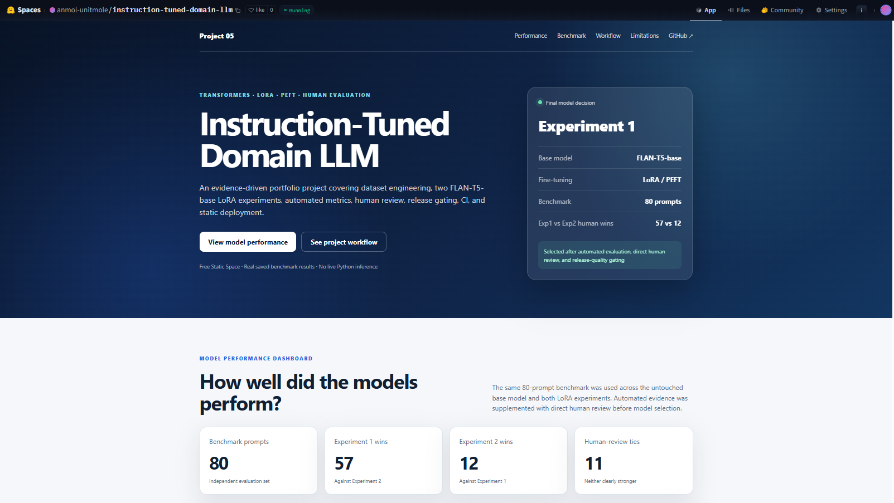
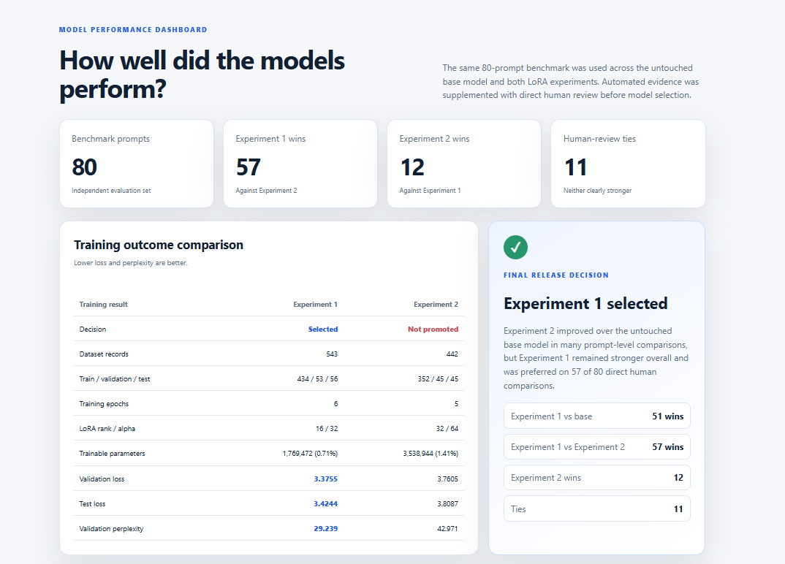
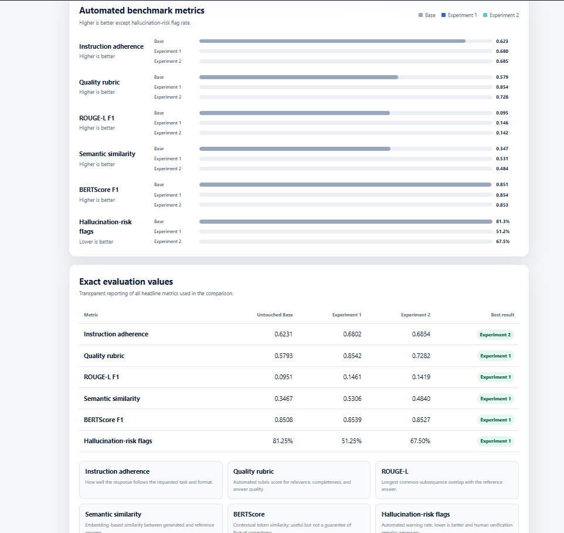
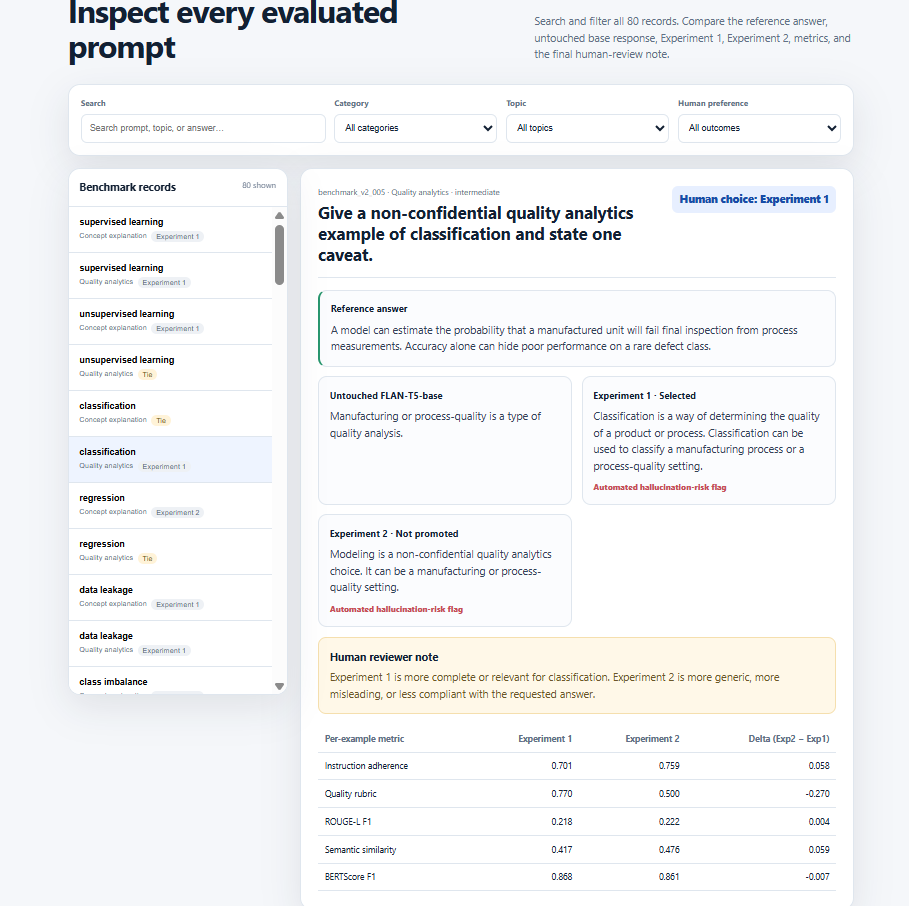

# Instruction-Tuned Domain LLM with FLAN-T5 and LoRA

[](https://www.python.org/)
[](https://pytorch.org/)
[](https://huggingface.co/docs/transformers/)
[](https://huggingface.co/google/flan-t5-base)
[](https://huggingface.co/docs/peft/)
[](https://huggingface.co/spaces/anmol-unitmole/instruction-tuned-domain-llm)
[](https://github.com/unit-mole/transformer-projects/actions/workflows/05-instruction-tuned-domain-llm.yml)

An end-to-end Natural Language Processing project that instruction-tunes **FLAN-T5-base** for Machine Learning, Data Science, evaluation-metric, and non-confidential quality-analytics questions using **LoRA and PEFT**. The project trains and compares two adapter experiments, evaluates them against the untouched base model on an independent 80-prompt benchmark, combines automated metrics with direct human review, applies a release-quality gate, and deploys the complete evidence as an interactive static application on Hugging Face Spaces.

**Status:** Portfolio-ready and deployed  
**Live demo:** [Open the Instruction-Tuned Domain LLM Evaluation Showcase](https://huggingface.co/spaces/anmol-unitmole/instruction-tuned-domain-llm)  
**Primary stack:** Python · PyTorch · Hugging Face Transformers · FLAN-T5 · PEFT · LoRA · Datasets · BERTScore · ROUGE · pandas · Matplotlib · JavaScript · HTML · CSS · GitHub Actions · Hugging Face Static Spaces

---

## Responsible Use

This project is intended for educational, technical-learning, experimentation, and portfolio demonstration purposes.

- The trained adapters may produce incomplete, circular, misleading, or factually inaccurate answers.
- Automated similarity metrics do not guarantee factual correctness.
- Hallucination-risk flags are warning indicators rather than confirmed factual-error percentages.
- Human evaluation identified meaningful limitations in factuality and instruction following.
- The selected adapter represents the strongest tested candidate, not a production-grade expert assistant.
- Responses should be verified using reliable and authoritative sources.
- The application must not be used as the sole basis for medical, legal, financial, safety-critical, hiring, insurance, regulatory, or production decisions.
- Confidential, personal, proprietary, or sensitive organizational data should not be entered into the model.
- The deployed Static Space displays saved experiment results and does not perform live model inference.

---

## Business Problem

Organizations increasingly use instruction-tuned language models to support technical learning, documentation, internal knowledge access, analytics assistance, quality review, and decision-support workflows. However, a model that produces fluent text can still return incomplete, unsupported, or incorrect information.

A reliable language-model project therefore requires more than fine-tuning. It requires:

- controlled dataset construction;
- a reproducible baseline;
- parameter-efficient training;
- multiple evaluation metrics;
- direct human review;
- model-comparison evidence;
- transparent limitations;
- a release decision based on measurable thresholds.

This project answers:

> Can FLAN-T5-base be instruction-tuned with LoRA for Machine Learning and Data Science questions, evaluated against its untouched baseline, compared across two dataset strategies, and released only after automated and human quality review?

The deployed application presents:

- Experiment 1 and Experiment 2 training results;
- untouched base-model metrics;
- automated evaluation comparisons;
- human preference results;
- an interactive 80-prompt benchmark explorer;
- reference, base, Experiment 1, and Experiment 2 answers;
- per-example evaluation metrics;
- the complete project workflow;
- the final release decision;
- known limitations and responsible-use guidance.

---

## Project Objective

Build a professional instruction-tuning and LLM-evaluation solution that can:

1. Define a focused Machine Learning and Data Science assistant domain.
2. Construct versioned instruction-response datasets.
3. Validate records for empty content, duplicates, length, PII, and confidential references.
4. Create deterministic training, validation, and test splits.
5. Establish untouched `google/flan-t5-base` as the baseline.
6. Fine-tune FLAN-T5-base using LoRA and PEFT.
7. Preserve compact adapter weights rather than retraining the complete model.
8. Record hardware, configuration, training history, loss, and perplexity.
9. Evaluate the base model and trained adapters on the same 80-prompt benchmark.
10. Compare instruction adherence, rubric quality, ROUGE-L, semantic similarity, BERTScore, and hallucination-risk flags.
11. Calculate confidence intervals and prompt-level win rates.
12. Complete direct human factuality and model-preference review.
13. Train a second experiment using a curated dataset and a higher-capacity LoRA configuration.
14. Diagnose and correct pretrained checkpoint-loading behavior.
15. Compare Experiment 1 and Experiment 2 under the same benchmark.
16. Apply a release-quality gate before model promotion.
17. Validate project files automatically using GitHub Actions.
18. Publish an interactive evidence-based application through Hugging Face Static Spaces.

---

## Dataset

The project uses custom English instruction-response datasets focused on:

- supervised and unsupervised learning;
- classification and regression;
- feature engineering;
- preprocessing and data leakage;
- model evaluation;
- precision, recall, F1, ROC-AUC, and PR-AUC;
- calibration and threshold tuning;
- MAE, RMSE, and R-squared;
- cross-validation;
- overfitting and regularization;
- neural networks and Transformers;
- attention, instruction tuning, LoRA, and PEFT;
- BERTScore, hallucination, reproducibility, and model drift;
- non-confidential manufacturing and quality-analytics examples.

### Experiment datasets

| Property | Experiment 1 | Experiment 2 |
|---|---:|---:|
| Dataset strategy | Expanded instruction dataset | Curated Version 3 dataset |
| Total valid records | 543 | 442 |
| Training records | 434 | 352 |
| Validation records | 53 | 45 |
| Test records | 56 | 45 |
| Language | English | English |
| Output type | Instruction response | Instruction response |
| Duplicate instructions | Removed | 0 |
| Possible PII | Screened | 0 |
| Confidential references | Screened | 0 |

### Independent benchmark

| Property | Value |
|---|---|
| Benchmark prompts | 80 |
| Main categories | Concept explanation, metric explanation, quality analytics |
| Compared systems | Untouched base, Experiment 1, Experiment 2 |
| Reference answers | Included |
| Human review | Completed for all benchmark records |
| Model-selection comparison | Experiment 1 versus Experiment 2 |

The benchmark is intentionally reused across the experiments so that changes in performance can be attributed to the adapter and dataset strategy rather than to a different evaluation set.

---

## Tools and Technologies

| Area | Technology |
|---|---|
| Language | Python, JavaScript |
| Deep learning | PyTorch |
| Transformer library | Hugging Face Transformers |
| Base architecture | `google/flan-t5-base` |
| Fine-tuning | PEFT and LoRA |
| Dataset processing | Hugging Face Datasets, pandas |
| Configuration | Python dataclasses and JSON metadata |
| Automated evaluation | ROUGE-L, BERTScore, semantic similarity, instruction adherence, quality rubric |
| Human evaluation | Factuality, relevance, clarity, instruction following, hallucination flags, pairwise preference |
| Visualization | Matplotlib, HTML, CSS |
| Hardware | NVIDIA GeForce RTX 5090 |
| Precision | BF16 |
| Testing | pytest, Python compilation, JSON/JSONL/notebook validation |
| Automation | GitHub Actions |
| Web interface | HTML, CSS, JavaScript |
| Hosting | Hugging Face Static Spaces |
| Deployment type | Interactive saved-results showcase |

---

## Project Workflow

```text
Define the Machine Learning and Data Science domain
                          │
                          ▼
Build versioned instruction-response datasets
                          │
                          ▼
Validate content, duplicates, length, PII and confidentiality
                          │
                          ▼
Create deterministic train, validation and test splits
                          │
                          ▼
Evaluate untouched google/flan-t5-base baseline
                          │
                          ▼
Train Experiment 1 with LoRA rank 16 and alpha 32
                          │
                          ▼
Save adapter, tokenizer, metadata, logs and training curves
                          │
                          ▼
Evaluate Base vs Experiment 1 on 80 benchmark prompts
                          │
                          ▼
Automated metrics, confidence intervals and human review
                          │
                          ▼
Identify factuality and instruction-following limitations
                          │
                          ▼
Build curated Version 3 dataset
                          │
                          ▼
Diagnose and correct FLAN-T5 checkpoint-loading behavior
                          │
                          ▼
Train Experiment 2 with LoRA rank 32 and alpha 64
                          │
                          ▼
Evaluate Base vs Experiment 2
                          │
                          ▼
Compare Experiment 1 vs Experiment 2
                          │
                          ▼
Complete direct human preference review
                          │
                          ▼
Apply release-quality gate
                          │
                          ▼
Select Experiment 1 and preserve Experiment 2 as not promoted
                          │
                          ▼
Validate repository through GitHub Actions
                          │
                          ▼
Deploy interactive evaluation showcase on Hugging Face
```

---

## FLAN-T5 Architecture

```text
User instruction
      │
      ▼
FLAN-T5 tokenizer
      │
      ▼
Input token IDs and attention mask
      │
      ▼
Transformer encoder
      │
      ▼
Contextual encoder representations
      │
      ▼
Transformer decoder with cross-attention
      │
      ▼
Autoregressive output-token generation
      │
      ▼
Decoded natural-language response
```

### Why FLAN-T5?

FLAN-T5 is an instruction-finetuned encoder-decoder Transformer. It expresses multiple NLP tasks through a unified text-to-text interface, making it suitable for:

- question answering;
- explanation generation;
- summarization;
- instruction following;
- structured text generation;
- educational assistant workflows.

This project uses FLAN-T5-base because it provides a practical balance between:

- pretrained instruction-following capability;
- manageable local training requirements;
- encoder-decoder Transformer representation;
- PEFT compatibility;
- compact LoRA adapter storage;
- repeatable benchmark evaluation.

---

## LoRA and PEFT Strategy

Low-Rank Adaptation adds small trainable matrices to selected attention projections while keeping the original FLAN-T5 parameters frozen.

```text
Pretrained FLAN-T5-base weights
              │
              ├── Frozen
              │
              ▼
Attention q and v projections
              │
              ▼
Small trainable low-rank matrices
              │
              ▼
Compact task-specific LoRA adapter
```

Benefits demonstrated in this project:

- only a small percentage of total parameters are trained;
- GPU memory requirements are lower than full fine-tuning;
- adapter files are compact;
- the base model remains reusable;
- experiments can be compared using separate adapters;
- model selection does not require duplicating the full base model.

---

## Experiment 1

Experiment 1 used the expanded instruction dataset and became the selected portfolio candidate.

| Training property | Value |
|---|---:|
| Base model | `google/flan-t5-base` |
| LoRA rank | 16 |
| LoRA alpha | 32 |
| LoRA dropout | 0.05 |
| Target modules | `q`, `v` |
| Training epochs | 6 |
| Trainable parameters | 1,769,472 |
| Trainable percentage | 0.7096% |
| Validation loss | 3.3755 |
| Test loss | 3.4244 |
| Validation perplexity | 29.239 |
| Final decision | Selected |

The compact adapter demonstrates parameter-efficient fine-tuning while preserving the pretrained model.

---

## Experiment 2

Experiment 2 tested whether a smaller curated dataset and a higher-capacity LoRA configuration would improve answer quality.

| Training property | Value |
|---|---:|
| Base model | `google/flan-t5-base` |
| Dataset | Curated Version 3 |
| LoRA rank | 32 |
| LoRA alpha | 64 |
| LoRA dropout | 0.05 |
| Target modules | `q`, `v` |
| Training epochs | 5 |
| Trainable parameters | 3,538,944 |
| Trainable percentage | 1.4093% |
| Validation loss | 3.7605 |
| Test loss | 3.8087 |
| Validation perplexity | 42.971 |
| Final decision | Not promoted |

### Checkpoint-loading correction

The first Experiment 2 attempt modified FLAN-T5's tied-word-embedding configuration before checkpoint loading. This produced suspicious missing embedding aliases and abnormally high loss.

The training implementation was corrected to:

- preserve the original FLAN-T5 checkpoint configuration;
- verify that the shared embedding was loaded;
- verify that the encoder uses the shared embedding;
- verify that the decoder uses the shared embedding;
- stop training for unexpected missing or mismatched parameters;
- save a model-loading verification report.

After correction, the first-epoch validation loss improved substantially and the complete five-epoch run finished successfully.

This debugging step is an important project outcome because it demonstrates checkpoint integrity validation rather than blindly trusting a completed training loop.

---

## Model Results

### Training comparison

| Result | Experiment 1 | Experiment 2 |
|---|---:|---:|
| Dataset records | 543 | 442 |
| Training epochs | 6 | 5 |
| LoRA rank | 16 | 32 |
| LoRA alpha | 32 | 64 |
| Trainable parameters | 1,769,472 | 3,538,944 |
| Trainable percentage | 0.7096% | 1.4093% |
| Validation loss | **3.3755** | 3.7605 |
| Test loss | **3.4244** | 3.8087 |
| Validation perplexity | **29.239** | 42.971 |
| Release decision | **Selected** | Not promoted |

A higher LoRA rank did not automatically produce a stronger final model.

### Automated benchmark comparison

| Metric | Untouched Base | Experiment 1 | Experiment 2 | Best Result |
|---|---:|---:|---:|---|
| Instruction adherence | 0.6231 | 0.6802 | **0.6854** | Experiment 2 |
| Quality-rubric score | 0.5793 | **0.8543** | 0.7283 | Experiment 1 |
| ROUGE-L F1 | 0.0951 | **0.1461** | 0.1419 | Experiment 1 |
| Semantic similarity | 0.3467 | **0.5306** | 0.4840 | Experiment 1 |
| BERTScore F1 | 0.8508 | **0.8539** | 0.8527 | Experiment 1 |
| Hallucination-risk flag rate | 81.25% | **51.25%** | 67.50% | Experiment 1 |

### Comparison summary

- Experiment 2 achieved the highest automated instruction-adherence score.
- Experiment 1 achieved the strongest quality-rubric score.
- Experiment 1 achieved the strongest ROUGE-L score.
- Experiment 1 achieved the strongest semantic-similarity score.
- Experiment 1 achieved the strongest BERTScore.
- Experiment 1 produced the lowest automated hallucination-risk flag rate.
- Automated evidence favored Experiment 1 overall.
- Human comparison strongly favored Experiment 1 over Experiment 2.
- Experiment 2 was preserved as a documented experiment but was not promoted.

---

## Evaluation

The automated evaluation pipeline includes:

- instruction-adherence scoring;
- automated quality-rubric scoring;
- ROUGE-L F1;
- semantic similarity;
- BERTScore F1;
- automated hallucination-risk rules;
- per-example model win rates;
- category-level comparisons;
- bootstrap confidence intervals;
- base-versus-adapter comparisons;
- Experiment 1-versus-Experiment 2 comparisons;
- evaluation latency;
- CSV and JSON reporting;
- metric visualizations;
- human-review templates.

### Why multiple metrics matter

- **Instruction adherence** measures whether the response follows the requested task and requested format.
- **Quality-rubric score** evaluates response relevance, completeness, and structural quality.
- **ROUGE-L** measures longest-common-subsequence overlap with a reference answer.
- **Semantic similarity** compares the meaning of generated and reference answers using embeddings.
- **BERTScore** compares contextual token representations.
- **Hallucination-risk flags** identify suspicious response patterns but do not prove that a statement is false.
- **Human review** evaluates factual correctness and practical answer quality that automated similarity metrics may miss.

No single metric is sufficient for reliable generative-model selection.

---

## Human Evaluation

Every benchmark response was reviewed using criteria such as:

- factuality;
- relevance;
- clarity;
- instruction following;
- hallucination indication;
- model preference;
- reviewer notes.

### Untouched base versus Experiment 1

| Human preference | Prompts |
|---|---:|
| Experiment 1 | **51** |
| Untouched base | 18 |
| Tie | 11 |

### Experiment 1 versus Experiment 2

| Human preference | Prompts |
|---|---:|
| Experiment 1 | **57** |
| Experiment 2 | 12 |
| Tie | 11 |

### Human-review interpretation

Experiment 1 was clearly preferred in the direct comparison with Experiment 2. However, absolute human review also identified factuality, completeness, and instruction-following weaknesses.

The final interpretation is:

> Experiment 1 is the strongest tested adapter and the correct portfolio selection, but neither adapter should be presented as a production-grade technical expert.

This distinction supports responsible model reporting and prevents relative improvement from being confused with production readiness.

---

## Release-Quality Gate

The project includes an explicit release decision rather than automatically promoting the latest trained model.

```text
Training completed
        │
        ▼
Automated evaluation completed
        │
        ▼
Human review completed
        │
        ▼
Experiment comparison completed
        │
        ▼
Release thresholds assessed
        │
        ├── Passed → eligible for promotion
        │
        └── Failed → preserved but not promoted
```

Experiment 2 was not promoted because it did not outperform Experiment 1 across the full automated and human evaluation.

The final configuration remained:

```python
EXPERIMENT2_HUMAN_REVIEW_COMPLETED = True
PROMOTE_EXPERIMENT2 = False
```

This demonstrates model governance: a completed model is not automatically a releasable model.

---

## Live Static Evaluation Application

The Hugging Face application is an interactive static showcase of real saved results generated by the project pipeline.

It supports:

- model-performance summary cards;
- training-result comparison;
- automated metric bar charts;
- exact metric tables;
- human preference results;
- prompt search;
- category filtering;
- topic filtering;
- preference filtering;
- all 80 benchmark records;
- reference answers;
- untouched base-model answers;
- Experiment 1 answers;
- Experiment 2 answers;
- per-example metrics;
- human-review notes;
- project workflow;
- limitations and responsible reporting.

The Static Space does not run the FLAN-T5 model in the visitor's browser. It displays auditable outputs produced during local GPU training and evaluation.

### Live Application

[](https://huggingface.co/spaces/anmol-unitmole/instruction-tuned-domain-llm)

### Application Overview



*Interactive Hugging Face Static Space presenting the selected experiment, project purpose, and final model decision.*

### Model Performance



*Experiment 1 and Experiment 2 training results, human preference summary, and final release decision.*

### Evaluation Metrics



*Real automated benchmark metrics comparing untouched FLAN-T5-base, Experiment 1, and Experiment 2.*

### Project Workflow



*End-to-end workflow covering dataset validation, LoRA training, evaluation, human review, release gating, CI, and deployment.*

---

## Static Application Workflow

```text
Visitor opens Hugging Face Space
                  │
                  ▼
Static index.html is served
                  │
                  ▼
styles.css creates the responsive interface
                  │
                  ▼
benchmark_data.js loads saved project results
                  │
                  ▼
app.js renders summary metrics and comparisons
                  │
                  ▼
Visitor filters by prompt, category, topic or preference
                  │
                  ▼
Application displays reference, base and adapter answers
                  │
                  ▼
Per-example metrics and human-review notes are shown
```

No Python backend, paid Gradio compute, or live model server is required.

---

## Model Artifacts

| Artifact | Purpose |
|---|---|
| `adapter_config.json` | PEFT and LoRA adapter configuration |
| `adapter_model.safetensors` | Compact trained LoRA adapter weights |
| `experiment_metadata.json` | Model, training, dataset, and hardware metadata |
| `model_metadata.json` | Auditable completed-run metadata |
| `training_log_history.json` | Step and epoch training history |
| `training_log_history.csv` | Tabular training history |
| `training_curve.png` | Training and validation loss visualization |
| `hardware_report.json` | CUDA, GPU, precision, and environment report |
| `manual_review_results.csv` | Completed absolute human model review |
| `per_example_base_vs_lora.csv` | Base-versus-adapter comparison |
| `experiment1_vs_experiment2_per_example.csv` | Direct experiment comparison |
| `experiment2_release_assessment.json` | Final Experiment 2 release decision |
| `benchmark_data.js` | Saved benchmark evidence used by the Static Space |

Large checkpoints, caches, and local virtual environments are excluded from standard Git tracking.

---

## Run the Static Application Locally

### 1. Open the deployment folder

```bat
cd /d "C:\Users\atripathi\OneDrive - Veralto\Desktop\AI Codes\GIT Projects\transformer-projects\05-instruction-tuned-domain-llm\project05_huggingspace_static_space"
```

### 2. Start a local HTTP server

```bat
python -m http.server 8000
```

### 3. Open the application

```text
http://localhost:8000
```

The static files may also open directly in a browser, but a local HTTP server provides behavior closer to the deployed environment.

---

## Run the Python Project Locally

### 1. Create and activate a virtual environment

**Windows**

```bat
py -3.12 -m venv .venv
.venv\Scripts\activate
```

**macOS / Linux**

```bash
python3.12 -m venv .venv
source .venv/bin/activate
```

### 2. Install dependencies

```bash
python -m pip install --upgrade pip
python -m pip install -r requirements.txt
```

Additional experiment-specific packages can be installed from:

```bash
python -m pip install -r requirements-experiment2.txt
```

### 3. Launch Jupyter

```bash
jupyter notebook
```

Open the notebooks under:

```text
notebooks/
```

The Experiment 2 quality-upgrade pipeline is:

```text
notebooks/05_experiment_2_quality_upgrade_pipeline.ipynb
```

### 4. Run tests

```bash
python -m pytest -q
```

---

## Deployment

- **Repository:** `unit-mole/transformer-projects`
- **Source branch:** `main`
- **Project folder:** `05-instruction-tuned-domain-llm/`
- **Static deployment folder:** `05-instruction-tuned-domain-llm/project05_huggingspace_static_space/`
- **Hosting platform:** Hugging Face Static Spaces
- **Space repository:** `anmol-unitmole/instruction-tuned-domain-llm`
- **Live application:** https://huggingface.co/spaces/anmol-unitmole/instruction-tuned-domain-llm
- **SDK:** Static
- **Application entry point:** `index.html`

The deployed application uses:

```text
README.md
index.html
styles.css
app.js
benchmark_data.js
```

No paid Gradio compute is required.

---

## Continuous Integration

The GitHub Actions workflow validates Project 05 without retraining the model or downloading the full Transformer stack.

The workflow checks:

1. Required project structure
2. Python source syntax
3. JSON syntax
4. JSONL syntax
5. Notebook JSON validity
6. Oversized repository files
7. Accidental model-weight or checkpoint inclusion
8. Project-specific path changes

The workflow file is stored at:

```text
.github/workflows/05-instruction-tuned-domain-llm.yml
```

[](https://github.com/unit-mole/transformer-projects/actions/workflows/05-instruction-tuned-domain-llm.yml)

---

## Project Structure

```text
transformer-projects/
├── .github/
│   └── workflows/
│       └── 05-instruction-tuned-domain-llm.yml
│
├── 05-instruction-tuned-domain-llm/
│   ├── data/
│   │   ├── versioned instruction datasets
│   │   ├── benchmark prompts
│   │   └── validation reports
│   │
│   ├── docs/
│   │   └── experiment and deployment documentation
│   │
│   ├── images/
│   │   ├── project05_app_overview.png
│   │   ├── project05_evaluation_metrics.png
│   │   ├── project05_model_performance.png
│   │   └── project05_project_workflow.png
│   │
│   ├── models/
│   │   └── promoted-adapter location
│   │
│   ├── notebooks/
│   │   ├── training and evaluation notebooks
│   │   └── 05_experiment_2_quality_upgrade_pipeline.ipynb
│   │
│   ├── outputs/
│   │   ├── experiments/
│   │   │   ├── flan_t5_base_lora_20260730_120312/
│   │   │   └── flan_t5_base_lora_exp2_v3_20260730_135452/
│   │   ├── automated evaluation reports
│   │   ├── human-review CSV files
│   │   ├── charts
│   │   └── release assessments
│   │
│   ├── project05_huggingspace_static_space/
│   │   ├── README.md
│   │   ├── index.html
│   │   ├── styles.css
│   │   ├── app.js
│   │   └── benchmark_data.js
│   │
│   ├── scripts/
│   │   └── dataset, training, evaluation and comparison utilities
│   │
│   ├── src/
│   │   ├── configuration and preprocessing
│   │   ├── hardware detection
│   │   ├── training pipelines
│   │   ├── evaluation utilities
│   │   ├── experiment2_training.py
│   │   ├── experiment2_comparison.py
│   │   └── release utilities
│   │
│   ├── tests/
│   │   └── project validation tests
│   │
│   ├── DATASET_CARD.md
│   ├── MODEL_CARD.md
│   ├── EXPERIMENT_2_README.md
│   ├── app.py
│   ├── gradio_app.py
│   ├── LICENSE
│   ├── README.md
│   ├── requirements.txt
│   └── requirements-experiment2.txt
│
└── README.md
```

---

## Limitations

- Both adapters can produce factually incorrect or incomplete answers.
- Some generated responses are circular or overly generic.
- The benchmark contains only 80 prompts.
- The dataset is domain-focused and does not represent all Machine Learning and Data Science questions.
- Reference-overlap metrics can reward wording similarity without confirming factual correctness.
- BERTScore and semantic similarity are not factuality metrics.
- Automated hallucination-risk rules can generate false positives and false negatives.
- Human review depends on the selected scoring rubric and reviewer judgment.
- Experiment 1 was selected relative to Experiment 2 but did not reach production-grade absolute quality.
- FLAN-T5-base has limited capacity compared with larger modern instruction models.
- The Static Space displays saved outputs and does not provide live inference.
- Results should not be generalized beyond the evaluated prompts and configuration.
- The project has not been validated for safety-critical or production use.

---

## Future Improvements

- Create a larger manually reviewed instruction dataset.
- Add more hard-negative and misconception-focused training examples.
- Add uncertainty and refusal examples.
- Improve examples for metrics, model drift, reproducibility, LoRA, attention, and Transformers.
- Expand the independent benchmark.
- Add multiple expert reviewers and inter-rater agreement.
- Add factuality evaluation using grounded source passages.
- Add retrieval-augmented generation for source-supported answers.
- Compare FLAN-T5 with a compact decoder-only instruction model.
- Evaluate QLoRA on a newer instruction-tuned base model.
- Add browser-side charts for category-level model performance.
- Add confidence-interval visualizations to the Static Space.
- Add automated accessibility and browser tests.
- Publish the selected adapter to a dedicated Hugging Face model repository.
- Add a live inference demo when suitable free compute becomes available.

---

## Skills Demonstrated

- Transformer encoder-decoder architecture
- FLAN-T5 instruction tuning
- Text-to-text generation
- Parameter-efficient fine-tuning
- PEFT
- LoRA
- Attention projection targeting
- Instruction-dataset engineering
- Dataset quality validation
- Deterministic train, validation, and test splitting
- CUDA GPU training
- BF16 mixed precision
- RTX 5090 model training
- Hugging Face Transformers
- Hugging Face Datasets
- PyTorch
- Training metadata and reproducibility
- Checkpoint-integrity debugging
- Tied-embedding verification
- Baseline development
- Controlled experiment comparison
- ROUGE-L evaluation
- BERTScore evaluation
- Semantic-similarity evaluation
- Instruction-adherence evaluation
- Automated quality rubrics
- Bootstrap confidence intervals
- Hallucination-risk analysis
- Human factuality review
- Pairwise model preference
- Release-quality gating
- Responsible AI communication
- GitHub Actions
- Static web application development
- HTML, CSS, and JavaScript
- Hugging Face Static Spaces
- Portfolio-focused ML engineering

---

## Portfolio Positioning

**One-line description:** FLAN-T5-base instruction-tuned with LoRA across two controlled experiments, evaluated against an untouched baseline using automated metrics and direct human review, governed through a release-quality gate, and deployed as an interactive Hugging Face evidence showcase.

**Pinned repository description:** End-to-end Transformer portfolio project featuring FLAN-T5 instruction tuning, LoRA/PEFT, versioned dataset engineering, base-versus-adapter evaluation, Experiment 1-versus-Experiment 2 comparison, human factuality review, release governance, GitHub Actions, and Hugging Face Static Spaces deployment.

This project connects naturally to a Quality Data Scientist background because instruction-tuned assistants can support analytics education, technical documentation, metric explanation, non-confidential quality-analysis workflows, structured model evaluation, and responsible applied-AI experimentation.

---

## Author

**Anmol Tripathi**

Quality Data Scientist building a professional portfolio in Data Science, Machine Learning, Applied AI, Natural Language Processing, Computer Vision, Analytics Engineering, and Quality Analytics.
