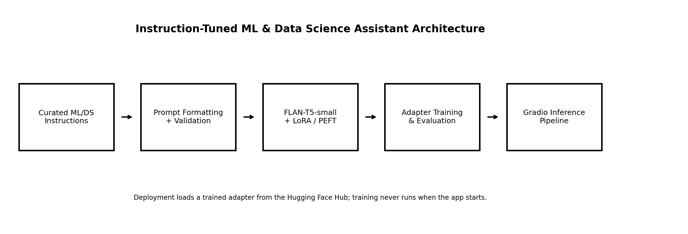

# 05 — Instruction-Tuned Domain LLM

[](https://github.com/YOUR_GITHUB_USERNAME/transformer-projects/actions/workflows/05-instruction-tuned-domain-llm.yml)
[](https://huggingface.co/spaces/YOUR_HF_USERNAME/ml-ds-instruction-tuned-assistant)

> **One-line portfolio description:** A FLAN-T5 ML/Data Science Learning Assistant adapted with LoRA / PEFT, evaluated for instruction adherence, semantic similarity, relevance, latency, and hallucination risk, and deployed with Gradio on Hugging Face Spaces.

## Responsible use

This project is for educational and portfolio demonstration purposes. The assistant may generate incomplete, incorrect, outdated, biased, or hallucinated responses. It is designed for ML and Data Science learning support—not legal, medical, financial, immigration, safety-critical, official, or autonomous decision-making. Do not paste private, confidential, proprietary, copyrighted, or personally identifiable information into the public demo. Human review is required before using any generated explanation, code, or recommendation.

## Project pattern

| Item | Selection |
|---|---|
| Project | `05-instruction-tuned-domain-llm` |
| Application | Fine-tune a small instruction-following model using LoRA / PEFT |
| Assistant theme | ML and Data Science Learning Assistant |
| Base model | `google/flan-t5-small` |
| Dataset | Custom self-authored ML/DS instruction dataset |
| Evaluation | Instruction adherence, BERTScore, response relevance, hallucination analysis, manual review, latency |
| Deployment | Hugging Face Spaces with Gradio |

## Why this project matters

Instruction tuning teaches a pretrained model to respond to natural-language tasks rather than merely continue text. The assistant supports concept explanations, algorithm comparisons, metric explanations, examples, interview answers, project workflows, and quality analytics learning scenarios. It demonstrates the progression from classical ML and sequence models toward parameter-efficient Generative AI systems.

## Architecture



```text
Instruction dataset → validation and prompt formatting → FLAN-T5-small
→ LoRA / PEFT adapter training → held-out evaluation → Gradio inference app
```

## Dataset

The repository contains **82 self-authored synthetic curriculum examples** across **8 capability categories** and **77 topics**. The data is public-safe and contains no private company data.

| Statistic | Value |
|---|---:|
| Examples | 82 |
| Train / validation / test | 64 / 9 / 9 |
| Average prompt words | 6.63 |
| Average response words | 35.94 |

See [DATASET_CARD.md](DATASET_CARD.md) and [data/README_data.md](data/README_data.md).

## Prompt template

```text
Context: You are an educational ML and Data Science learning assistant...

Instruction:
{instruction}

Input:
{optional_input}

Response:
```

The same formatter is used during training and inference.

## LoRA / PEFT design

LoRA keeps the pretrained FLAN-T5 weights frozen and trains small low-rank matrices in selected attention modules. This project uses `SEQ_2_SEQ_LM`, targets the T5 `q` and `v` modules, and starts with rank 8, alpha 16, and dropout 0.05. The resulting adapter is smaller and easier to publish than a fully fine-tuned model.

## Training workflow

```bash
python scripts/prepare_dataset.py
python scripts/train_lora.py
```

Training should run in Colab, Kaggle, or a GPU environment. The Gradio Space only performs inference.

## Evaluation

```bash
# Base-model baseline
python scripts/evaluate_model.py --base-only

# LoRA adapter after ADAPTER_MODEL_ID is configured
python scripts/evaluate_model.py
python scripts/run_hallucination_analysis.py
```

The repository intentionally ships with `status: not_run` instead of invented metrics. Evaluation writes actual results into `outputs/`.

| Metric | Purpose | Important limitation |
|---|---|---|
| Instruction adherence | Checks task, format, scope, and refusal behavior | Heuristic rubric requires human review |
| BERTScore | Semantic similarity to reference answers | Not a factuality measure |
| Response relevance | Prompt/reference alignment | TF-IDF similarity is only a proxy |
| Hallucination review | Flags unsupported or overconfident output | Semi-automated triage, not proof |
| Latency | Measures user-facing generation time | Depends on hardware and first-load caching |

## Gradio application

The app provides categories, sample prompts, optional context, generation controls, model details, current metric status, limitations, responsible-use guidance, and a base-vs-adapter selection. Model loading is lazy so CI can import the app without downloading weights.

## Run locally

```bash
git clone https://github.com/YOUR_GITHUB_USERNAME/transformer-projects.git
cd transformer-projects/05-instruction-tuned-domain-llm
python -m venv .venv

# Windows
.venv\Scripts\activate

# macOS/Linux
source .venv/bin/activate

pip install --upgrade pip
pip install -r requirements.txt
python scripts/prepare_dataset.py
python app.py
```

To use the trained adapter:

```bash
# Windows PowerShell
$env:ADAPTER_MODEL_ID="YOUR_HF_USERNAME/ml-ds-instruction-tuned-flan-t5-small-lora"

# macOS/Linux
export ADAPTER_MODEL_ID="YOUR_HF_USERNAME/ml-ds-instruction-tuned-flan-t5-small-lora"
```

## Recommended three-part portfolio deployment

| Component | Role |
|---|---|
| GitHub repository | Complete Python training, LoRA / PEFT, evaluation, tests, Gradio, and JavaScript deployment code |
| Hugging Face Model Hub | LoRA adapter repository plus a merged, ONNX browser-model repository after real training |
| Hugging Face Static Space | Live Transformers.js assistant performing inference directly in the visitor’s browser |

The existing Gradio application remains part of the engineering project. For a strictly static public demo, deploy the contents of [`web/`](web/) as a separate Static Space. The default browser demo uses `Xenova/flan-t5-small` and identifies it as a base-model demonstration. After training, merge the adapter, export the merged checkpoint to ONNX, and enter your own Hub model ID in the interface.

See [STATIC_BROWSER_DEPLOYMENT_ROADMAP.md](STATIC_BROWSER_DEPLOYMENT_ROADMAP.md) and [DEPLOYMENT_STATIC_SPACE.md](DEPLOYMENT_STATIC_SPACE.md).

## Hugging Face Spaces deployment

Create a Gradio Space, copy this project’s contents to the Space root, set `BASE_MODEL_ID` and `ADAPTER_MODEL_ID`, and push. See [DEPLOYMENT_HUGGINGFACE.md](DEPLOYMENT_HUGGINGFACE.md). The final public URL will be:

```text
https://huggingface.co/spaces/YOUR_HF_USERNAME/ml-ds-instruction-tuned-assistant
```

## Project structure

```text
05-instruction-tuned-domain-llm/
├── app.py
├── gradio_app.py
├── configs/
├── data/
├── notebooks/
├── src/
├── scripts/
├── tests/
├── web/
├── models/
├── outputs/
├── images/
├── MODEL_CARD.md
├── DATASET_CARD.md
├── DEPLOYMENT_HUGGINGFACE.md
├── DEPLOYMENT_STATIC_SPACE.md
├── STATIC_BROWSER_DEPLOYMENT_ROADMAP.md
├── VALIDATION_REPORT.md
├── requirements-export.txt
└── requirements.txt
```

## Screenshots to add after deployment

Capture the Space landing page, a concept explanation, an algorithm comparison, a code example, the model metadata tab, the evaluation tab after real metrics exist, and the mobile layout. Save them in `images/` and replace the placeholder section only after the public app is working.

## Skills demonstrated

Transformer architecture, FLAN-T5, instruction tuning, LoRA, PEFT, custom dataset design, prompt formatting, sequence-to-sequence training, model cards, dataset cards, responsible AI, BERTScore, evaluation design, hallucination analysis, Gradio, Hugging Face Spaces, testing, CI, and deployment documentation.

## Career positioning

For a Quality Data Scientist moving toward ML, Applied AI, and Generative AI roles, this project shows how to convert domain learning needs into an end-to-end assistant: safe data design, parameter-efficient adaptation, measurable evaluation, transparent limitations, and a public deployment. The quality analytics examples connect the system naturally to case prioritization, defect trends, root-cause classification, technical onboarding, and future internal knowledge assistants.

## Future improvements

Expand the curriculum with expert review, add multilingual examples, execute generated code in a sandbox, compare FLAN-T5-small with a 0.5B causal instruction model, add retrieval grounding with citations, calibrate human-evaluation rubrics, and publish reproducible experiment tracking.
