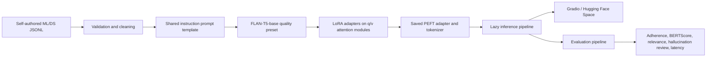

# 05 — Instruction-Tuned Domain LLM

[](https://www.python.org/)
[](https://huggingface.co/)
[](https://huggingface.co/docs/peft/)
[](https://www.gradio.app/)
[](../../actions)

> **Responsible use:** This project is for educational and portfolio demonstration purposes only. The assistant may generate incomplete, incorrect, outdated, biased, or hallucinated responses. It is designed for ML and Data Science learning support—not legal, medical, financial, immigration, safety-critical, or official decision-making. Do not paste private, confidential, sensitive, proprietary, copyrighted, or personally identifiable information into the public demo. Human review is required before real-world use.

## Live Links

- **Hugging Face Space:** `https://huggingface.co/spaces/<your-huggingface-username>/ml-ds-instruction-tuned-assistant`
- **LoRA adapter/model:** `https://huggingface.co/<your-huggingface-username>/flan-t5-base-ml-ds-lora`
- **GitHub repository:** `https://github.com/<your-github-username>/transformer-models-projects`

## Project Pattern

| Field | Selection |
|---|---|
| Project number | 05 |
| Project name | `05-instruction-tuned-domain-llm` |
| Application | Fine-tune a small instruction-following model using LoRA/PEFT |
| Assistant theme | ML and Data Science Learning Assistant |
| Base model | `google/flan-t5-base` quality preset; `flan-t5-small` fallback |
| Dataset | Reviewed custom ML/DS instruction dataset, target 600 examples |
| Evaluation | Held-out base-vs-LoRA benchmark, BERTScore, ROUGE-L, semantic similarity, adherence, quality rubric, latency, hallucination review, bootstrap confidence intervals |
| Deployment | Hugging Face Spaces using Gradio |

## Why This Project Matters

Instruction tuning teaches a language model to follow explicit tasks such as explaining a concept, comparing algorithms, producing a small example, or answering an interview-style question. This project converts a general instruction-processing prototype into a domain-focused ML/Data Science assistant with a reproducible data pipeline, parameter-efficient fine-tuning, transparent evaluation, responsible-use controls, automated tests, and a public Gradio interface.

## Assistant Capabilities

The demo supports:

- concept and metric explanations;
- algorithm comparisons;
- beginner-friendly and interview-style answers;
- small Python or pseudocode examples;
- Data Science workflows and project guidance;
- non-confidential quality analytics examples;
- uncertainty and scope notices for unsupported requests.

## Architecture



## Model Selection

The **quality preset** uses `google/flan-t5-base`, an encoder-decoder Transformer loaded with `AutoModelForSeq2SeqLM`. It provides a stronger portfolio experiment than the original small-model scaffold while remaining practical for LoRA training on a modern RTX GPU. `google/flan-t5-small` remains available as a lower-memory or faster CPU fallback.

The training workflow auto-detects CUDA, GPU VRAM, BF16 support, and a safe micro-batch/gradient-accumulation combination. LoRA is applied to T5 attention `q` and `v` projections with `TaskType.SEQ_2_SEQ_LM`.

The repository distinguishes between:

- **base model:** `google/flan-t5-base` downloaded from the Hub;
- **LoRA adapter:** trained PEFT weights saved as `adapter_model.safetensors` and `adapter_config.json`;
- **merged model:** optional artifact created only when explicitly requested;
- **demo model:** base model plus the reviewed adapter;
- **base-model fallback:** clearly labeled when no adapter is available.

No claim of full fine-tuning is made. Result files remain honest placeholders until the notebook is executed.

## Full RTX Notebook Workflow

Run [`notebooks/05_full_training_evaluation_pipeline.ipynb`](notebooks/05_full_training_evaluation_pipeline.ipynb). It is the primary experiment notebook and automatically saves:

- GPU, CUDA, package, seed, and configuration metadata;
- an expanded dataset quality report, duplicate-removal log, and benchmark-leakage log;
- the best LoRA adapter, tokenizer, trainer state, validation/test loss, perplexity, CSV/JSON logs, and a real training curve;
- base and LoRA per-example responses on an independent 80-prompt benchmark;
- BERTScore, ROUGE-L, sentence-embedding similarity, adherence, response-quality, latency, and hallucination-risk results;
- category and difficulty slices, paired deltas, win rates, and 95% bootstrap confidence intervals;
- manual-review CSVs, before/after examples, a release manifest, and a portfolio-readiness report.

Human approval gates prevent synthetic candidate data or unreviewed generated answers from being promoted as final results.

## Dataset

The repository now uses three distinct data assets:

| Asset | Purpose | Status before running the notebook |
|---|---|---|
| `ml_ds_instruction_dataset.jsonl` | 93 self-authored seed examples | Included |
| `ml_ds_instruction_dataset_v2.jsonl` | Reviewed expanded training corpus, target about 600 examples | Generated locally |
| `benchmark_prompts_v2.jsonl` | Independent 80-example reference benchmark | Included |

The local expansion workflow uses a compact Qwen instruction model only as a **teacher** to draft candidate ML/DS examples. Candidates are not accepted blindly. The pipeline validates required fields, answer length, PII/confidential terms, exact duplicates, near duplicates, and similarity against the held-out benchmark. It then assigns category-stratified train, validation, and internal test splits. A human review gate must be approved before training.

The benchmark contains self-authored reference answers and is never used for LoRA training. This separation supports a credible base-versus-LoRA comparison.

Each training JSONL record contains:

```json
{
  "id": "ml_ds_v2_00001",
  "instruction": "Compare precision and recall for an imbalanced classification problem.",
  "input": "Use a non-confidential quality analytics example.",
  "output": "Precision measures...",
  "category": "Algorithm comparison",
  "difficulty": "intermediate",
  "topic": "classification metrics",
  "source": "local-teacher-synthetic-reviewed",
  "split": "train"
}
```

See [DATASET_CARD.md](DATASET_CARD.md) and [data/README_data.md](data/README_data.md).

## Shared Prompt Template

Training and inference use the same formatter:

```text
System: You are an educational ML and Data Science learning assistant...

Category: {category}
Guidance: {category-specific guidance}

Instruction: {instruction}

Input: {optional input}

Response:
```

Consistency between training and inference reduces prompt-format mismatch.

## LoRA / PEFT Configuration

The quality preset in `src/config.py` uses:

| Parameter | Value |
|---|---:|
| Base model | `google/flan-t5-base` |
| Rank `r` | 16 |
| LoRA alpha | 32 |
| LoRA dropout | 0.05 |
| Target modules | `q`, `v` |
| Task type | `SEQ_2_SEQ_LM` |
| Learning rate | `1e-4` |
| Maximum epochs | 6 |
| Scheduler | cosine |
| Warmup ratio | 0.08 |
| Label smoothing | 0.05 |
| Early stopping patience | 2 evaluations |
| Precision | BF16 when supported, otherwise FP16 |
| Effective batch | hardware-aware, normally about 16 |

LoRA freezes the base model and learns low-rank attention updates. Gradient checkpointing and accumulation are enabled on lower-memory RTX cards. The best validation-loss checkpoint is restored before adapter export.

## Training Workflow

The recommended workflow is the full notebook, but every stage also has a command-line entry point:

```bash
# 1. Generate, validate, de-duplicate, and split the enhanced dataset
python scripts/generate_enhanced_dataset.py --target-examples 600

# 2. Review the generated dataset before training

# 3. Train the LoRA adapter on the local RTX GPU
python scripts/train_lora.py \
  --dataset data/ml_ds_instruction_dataset_v2.jsonl \
  --base-model google/flan-t5-base \
  --epochs 6

# 4. Evaluate base and LoRA models on the identical held-out benchmark
python scripts/evaluate_base_vs_lora.py

# 5. Verify the evidence checklist
python scripts/check_portfolio_readiness.py
```

A one-command orchestrator is also provided:

```bash
python scripts/run_full_experiment.py --target-examples 600 --base-model google/flan-t5-base
```

Training exports adapter weights, tokenizer, hardware report, package versions, data statistics, training arguments, train/validation/test metrics, validation perplexity, trainer state, log history, and a real loss curve. The Space never trains during startup.

## Inference Pipeline

`InstructionAssistant` loads the model lazily on the first request. The app does not download or initialize the model during module import, which keeps CI lightweight. At inference time it:

1. checks empty and out-of-scope requests;
2. loads the base model and optional adapter;
3. applies the shared prompt template;
4. generates with configurable token length, temperature, top-p, and repetition penalty;
5. reports model mode, latency, adapter source, device, and merge status.

## Evaluation

The final evaluation is a paired experiment, not a single training-loss number. Base FLAN-T5 and the LoRA model answer the same 80 held-out prompts with deterministic decoding.

### Quantitative metrics

- **Instruction adherence:** transparent checks for relevance, scope, requested format, and safe-prompt refusals.
- **Response-quality rubric:** completeness, topic coverage, required caveats, and category-specific format.
- **BERTScore precision/recall/F1:** contextual similarity to a reference answer.
- **ROUGE-L F1:** longest-common-subsequence overlap with the reference.
- **Sentence-embedding similarity:** semantic cosine similarity using `all-MiniLM-L6-v2`.
- **TF-IDF relevance:** transparent lexical diagnostic.
- **Latency and response length:** deployment practicality.
- **Validation/test loss and perplexity:** sequence-model training evidence.

### Reliability analysis

- base-versus-LoRA mean deltas and per-example win rates;
- 95% paired bootstrap confidence intervals;
- category and difficulty slices;
- semi-automated hallucination-risk flags;
- manual 1–5 factuality, relevance, clarity, and instruction-following fields;
- before/after examples showing both improvements and regressions.

BERTScore, ROUGE, embeddings, and heuristic flags do **not** prove factual correctness. Human review is mandatory, especially for code, advanced topics, flagged outputs, and cases where LoRA performs worse.

Expected promoted outputs include:

```text
outputs/base_model_metrics.json
outputs/lora_model_metrics.json
outputs/base_vs_lora_comparison.json
outputs/per_example_base_vs_lora.csv
outputs/before_after_finetuning_examples.md
outputs/base_vs_lora_metric_comparison.png
outputs/training_curve.png
outputs/release_manifest.json
outputs/portfolio_readiness_report.json
```

## Gradio Demo

The interface provides:

- prompt-category selection;
- optional context;
- grouped sample prompts;
- maximum-token, temperature, top-p, and repetition controls;
- response, latency, and inference metadata;
- model, LoRA, evaluation, hallucination, and limitation tabs;
- responsible-use guidance and repository/model placeholders.

Run locally:

```bash
python app.py
```

## Local Setup

```bash
git clone https://github.com/<your-github-username>/transformer-models-projects.git
cd transformer-models-projects/05-instruction-tuned-domain-llm

python -m venv .venv
# Windows
.venv\Scripts\activate
# macOS/Linux
source .venv/bin/activate

pip install --upgrade pip
pip install -r requirements-training.txt

pytest
jupyter lab
# Open notebooks/05_full_training_evaluation_pipeline.ipynb
# After reviewed artifacts are promoted:
python app.py
```

The first model request downloads the base model unless it is already cached.

## Hugging Face Spaces Deployment

1. Create a new Space and choose **Gradio**.
2. Copy this project folder's contents to the Space repository root.
3. Keep `app.py`, `requirements.txt`, and this README at the root.
4. Push the trained adapter to a Hugging Face model repository.
5. In Space **Settings → Variables and secrets**, add `ADAPTER_ID` with the adapter repository ID.
6. Set `BASE_MODEL_ID=google/flan-t5-base` and `ADAPTER_ID=<username>/flan-t5-base-ml-ds-lora`; use the small model only if the free CPU Space cannot meet acceptable latency.
7. Rebuild the Space and verify the app reports `lora_adapter` rather than `base_model_fallback`.
8. Run the evaluation scripts locally or in a GPU notebook, commit only genuine outputs, and add the live Space URL above.

Spaces reads the YAML metadata at the top of this README, runs `app.py`, and installs Python dependencies from `requirements.txt`.

## Model and File Size Strategy

Do not commit large model artifacts to ordinary Git history. Recommended options:

- push the LoRA adapter to a Hugging Face model repository;
- load the base model directly from the Hub;
- use Git LFS only when local model files must be versioned;
- merge the adapter only when a deployment environment specifically benefits from a merged model;
- keep training checkpoints and caches ignored.

## Folder Structure

```text
05-instruction-tuned-domain-llm/
├── app.py
├── gradio_app.py
├── README.md
├── README_HUGGINGFACE.md
├── MODEL_CARD.md
├── DATASET_CARD.md
├── data/
├── docs/
├── images/
├── models/
├── notebooks/
├── outputs/
├── scripts/
├── src/
├── tests/
├── requirements.txt
├── requirements-training.txt
├── requirements-dev.txt
├── Dockerfile
├── .dockerignore
└── .gitignore
```

## Original Notebook Improvements

The supplied notebook was retained as the conceptual starting point for dataset creation, prompt formatting, generation, evaluation, and output reporting. The production project replaces generic multi-domain tasks, repeated diagnostics, rule-based default generation, a fine-tuning placeholder, and Streamlit export with:

- a focused ML/DS dataset;
- real LoRA/PEFT training code;
- a shared training/inference template;
- a lazy FLAN-T5 adapter pipeline;
- Gradio and Hugging Face Space deployment;
- adherence, BERTScore, relevance, hallucination, and manual-review modules;
- tests, CI, model and dataset cards, and honest result placeholders.

See [docs/ORIGINAL_NOTEBOOK_REVIEW.md](docs/ORIGINAL_NOTEBOOK_REVIEW.md).

## Results and Screenshots

Add only real outputs after training and deployment:

- Gradio landing page;
- generated response for a concept prompt;
- algorithm comparison response;
- small code example;
- model metadata showing adapter mode;
- dataset category chart;
- training curve from trainer state;
- evaluation summary;
- before/after response comparison;
- Hugging Face Space page.

## Limitations

Before the full notebook is executed, the adapter and metric files are not real results. After execution, remaining limitations still include:

- a synthetic/custom educational corpus rather than a production-scale audited curriculum;
- possible teacher-model errors or style bias despite validation and human review;
- FLAN-T5-base capacity limits on complex reasoning and code;
- reference-similarity metrics that do not prove factual correctness;
- imperfect heuristic hallucination detection;
- benchmark conclusions limited to the included topics and prompts;
- slower cold-start and generation latency on a free CPU Space.

## Future Improvements

- independently review a larger percentage of the generated corpus;
- add a second benchmark written by another reviewer;
- run controlled LoRA rank and learning-rate ablations;
- add factuality checks against a curated ML glossary;
- publish the reviewed adapter and dataset as separate Hugging Face repositories;
- add experiment tracking and carbon/energy reporting;
- add retrieval grounding for course notes and portfolio documentation;
- evaluate robustness to ambiguous, adversarial, and out-of-scope prompts.

## Skills Demonstrated

Transformer modeling, instruction tuning, FLAN-T5, LoRA, PEFT, sequence-to-sequence training, custom dataset creation, prompt design, model evaluation, BERTScore, relevance scoring, hallucination analysis, responsible AI, Gradio, Hugging Face Spaces, testing, GitHub Actions, Docker, and portfolio documentation.

## Portfolio Positioning

**One-line description:** Fine-tuned FLAN-T5 with LoRA/PEFT on a custom ML/Data Science instruction dataset and deployed a responsible Gradio learning assistant on Hugging Face Spaces.

This project connects naturally to a Quality Data Scientist background by demonstrating how an educational assistant can explain model choices, compare algorithms for quality use cases, generate training examples, support technical onboarding, and provide a foundation for future internal learning assistants without exposing confidential company information.

## License

MIT. Review the licenses and usage conditions of the base model and any future external datasets or adapters before redistribution.
