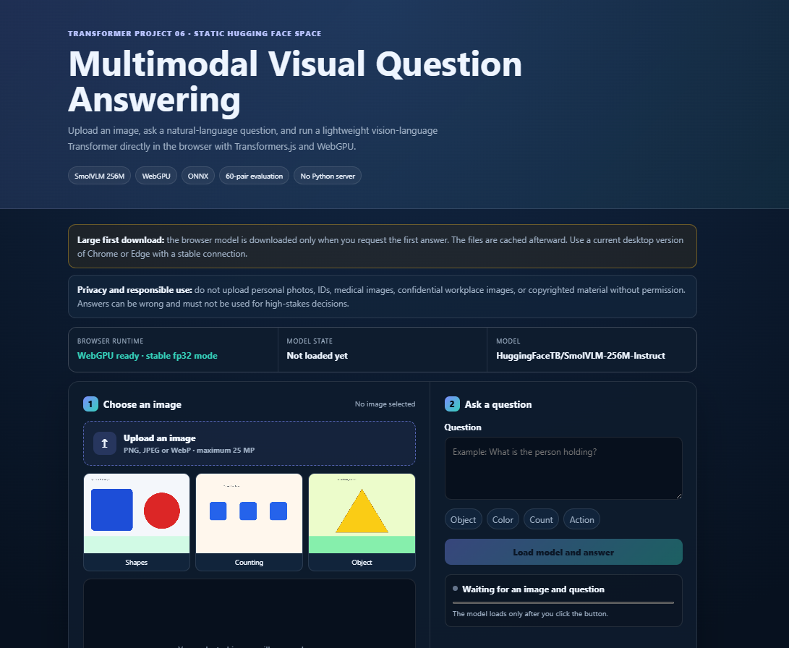
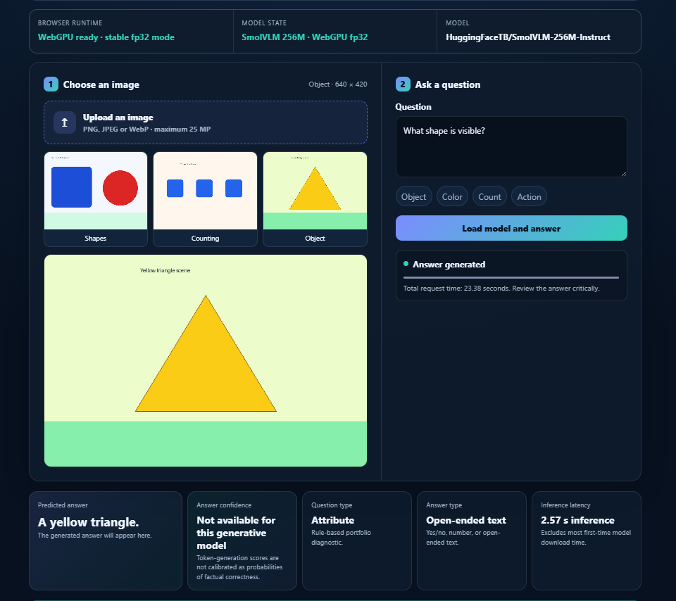
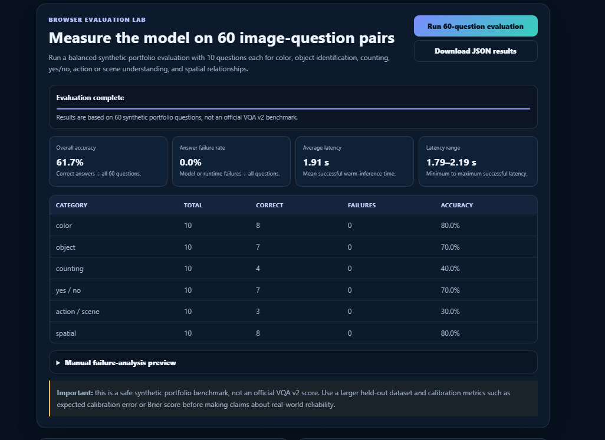

# Multimodal Visual Question Answering with SmolVLM and WebGPU

[](https://www.python.org/)
[](https://pytorch.org/)
[](https://huggingface.co/docs/transformers/)
[](https://huggingface.co/docs/transformers.js/)
[](https://developer.mozilla.org/en-US/docs/Web/API/WebGPU_API)
[](https://huggingface.co/spaces/anmol-unitmole/06-multimodal-visual-question-answering-transformer)
[](https://github.com/unit-mole/transformer-projects/actions/workflows/06-multimodal-visual-question-answering-transformer.yml)
[](../LICENSE)

An end-to-end multimodal AI project that uses a lightweight **vision-language Transformer** to answer natural-language questions about images. The repository includes safe sample data, image and question preprocessing, browser-based inference with **SmolVLM-256M-Instruct**, a local Python ViLT reference pipeline, confidence interpretation, category-wise evaluation, latency analysis, failure analysis, automated validation, and deployment through a free **Hugging Face Static Space**.

**Status:** Portfolio-ready and deployed  
**Live demo:** [Open the Multimodal Visual Question Answering Application](https://huggingface.co/spaces/anmol-unitmole/06-multimodal-visual-question-answering-transformer)  
**Primary stack:** Python · PyTorch · Hugging Face Transformers · SmolVLM · ViLT · Transformers.js · ONNX Runtime Web · WebGPU · JavaScript · HTML · CSS · GitHub Actions · Hugging Face Spaces

---

## Responsible Use

This project is intended for educational, technical-learning, evaluation, and portfolio demonstration purposes.

- The model may return incomplete, incorrect, biased, or misleading answers, particularly for ambiguous questions, small objects, poor-quality images, unfamiliar scenes, text-heavy images, or out-of-distribution content.
- The displayed token-generation diagnostic, when available, is not a calibrated probability that an answer is factually correct.
- The application must not be used as the sole basis for medical, legal, security, surveillance, identity verification, safety-critical, hiring, insurance, financial, or production decisions.
- Do not upload private photographs, IDs, medical images, confidential workplace images, proprietary documents, copyrighted material without permission, or personally identifiable information to a public demonstration.
- The application must not be used to identify real people, infer sensitive personal attributes, or make high-stakes decisions about individuals.
- Model answers should be reviewed by a human before any real-world use.

---

## Business Problem

Organizations increasingly work with visual information in product inspection, defect review, inventory verification, document analysis, equipment monitoring, image-based quality analytics, and operator-assistance workflows. Manual image review can be repetitive, inconsistent, time-consuming, and difficult to scale.

Traditional image classifiers return a fixed category. A visual question-answering system provides a more flexible interface by allowing a user to ask a natural-language question about the visual content.

This project answers:

> Given an uploaded image and a natural-language question, can a lightweight vision-language Transformer generate a relevant answer directly inside the browser without a Python backend?

The deployed application returns:

- Predicted answer
- Question type
- Answer type
- Inference latency
- Browser and model runtime status
- Honest answer-confidence guidance
- Optional token-generation confidence proxy when supported by the runtime
- Responsible-use and image-privacy guidance
- Browser-based evaluation metrics and failure-analysis outputs

---

## Project Objective

Build a professional multimodal visual question-answering solution that can:

1. Load and validate uploaded images.
2. Convert images into a format supported by the vision-language processor.
3. Clean natural-language questions without changing their meaning.
4. Combine visual and textual inputs through a vision-language Transformer.
5. Generate concise answers about objects, colors, counts, actions, scenes, and spatial relationships.
6. Run inference entirely in the browser using Transformers.js and WebGPU.
7. Report question type, answer type, and inference latency.
8. Explain confidence honestly for a generative model.
9. Evaluate the model on a balanced 60-pair synthetic VQA suite.
10. Calculate overall accuracy, category-wise accuracy, answer failure rate, and latency statistics.
11. Support manual failure analysis and downloadable evaluation results.
12. Validate and publish the static application through GitHub Actions and Hugging Face Spaces.

---

## Dataset

The public repository contains a safe **60-pair synthetic visual question-answering evaluation suite** designed for portfolio testing. Its structure follows common VQA-style fields while avoiding redistribution of the full VQA v2 dataset.

| Property | Value |
|---|---|
| Task | Multimodal visual question answering |
| Evaluation records | 60 image-question-answer pairs |
| Categories | 6 |
| Questions per category | 10 |
| Categories | Color, object identification, counting, yes/no, action or scene, spatial relationship |
| Image format | PNG |
| Public data type | Synthetic, non-sensitive portfolio samples |
| Browser model | `HuggingFaceTB/SmolVLM-256M-Instruct` |
| Python reference model | `dandelin/vilt-b32-finetuned-vqa` |
| Official VQA v2 benchmark | No |

### Evaluation-category distribution

| Category | Questions |
|---|---:|
| Color | 10 |
| Object identification | 10 |
| Counting | 10 |
| Yes/no | 10 |
| Action or scene | 10 |
| Spatial relationship | 10 |
| **Total** | **60** |

Typical record fields include:

```text
image_id
image_path
question
accepted_answers
question_type
answer_type
category
split
```

The complete VQA v2 dataset is not committed to GitHub. The repository uses generated samples and documents how a larger VQA-style dataset could be integrated for formal evaluation.

---

## Tools and Technologies

| Area | Technology |
|---|---|
| Languages | Python, JavaScript, HTML, CSS |
| Deep learning | PyTorch |
| Transformer libraries | Hugging Face Transformers, Transformers.js |
| Browser vision-language model | SmolVLM-256M-Instruct |
| Python VQA reference model | ViLT fine-tuned for VQA |
| Browser runtime | ONNX Runtime Web, WebGPU |
| Image processing | Pillow, browser image APIs |
| Data processing | pandas, NumPy |
| Evaluation | Custom accepted-answer scoring, category analysis, latency analysis |
| Testing | pytest, Python compilation, JavaScript syntax and structure validation |
| Automation | GitHub Actions |
| Hosting | Hugging Face Static Spaces |
| Model delivery | Hugging Face Hub runtime download |
| Application type | Fully static browser application |

---

## Project Workflow

```text
Safe image-question samples
          │
          ▼
Dataset and file validation
          │
          ▼
Image loading and RGB-compatible decoding
          │
          ▼
Question whitespace and length validation
          │
          ▼
Vision-language processor
          │
          ▼
SmolVLM image and text representations
          │
          ▼
Autoregressive answer generation
          │
          ▼
Predicted answer cleanup
          │
          ▼
Question-type and answer-type diagnostics
          │
          ▼
Latency measurement
          │
          ▼
Optional token-generation diagnostic
          │
          ▼
Browser evaluation and failure analysis
          │
          ▼
GitHub Actions validation
          │
          ▼
Hugging Face Static Space deployment
```

---

## Image Preprocessing

The project relies on the selected model processor for model-specific image preparation instead of manually reproducing normalization assumptions.

The browser and Python pipelines support:

- PNG, JPEG, and WebP inputs
- File-size and image-dimension validation
- Uploaded-image preview
- RGB-compatible browser decoding
- Conversion to a browser data URL when required
- Safe model-processor resizing and normalization
- Corrupt-image and unsupported-file handling
- Maximum-image-size protection
- Removal of unnecessary metadata from repository sample images

Preserving equivalent assumptions across browser and Python inference is important. Incorrect resizing, color conversion, or normalization can substantially reduce visual question-answering quality.

---

## Question Preprocessing

The project cleans questions conservatively so that meaning is preserved.

The preprocessing pipeline includes:

- Empty-question validation
- Leading and trailing whitespace removal
- Repeated-whitespace normalization
- Maximum-length validation
- Preservation of object names, colors, numbers, spatial terms, and question words
- Clear user-facing messages for invalid inputs

Aggressive stemming, lowercasing, punctuation removal, or semantic rewriting is avoided because those transformations may alter the intended question.

---

## Vision-Language Transformer Architecture

```text
Input image
    ↓
Vision encoder
    ↓
Visual token representations

Natural-language question
    ↓
Text tokenizer and embedding layers
    ↓
Text token representations

Visual tokens + text tokens
    ↓
Multimodal Transformer reasoning
    ↓
Autoregressive language decoder
    ↓
Generated answer tokens
    ↓
Decoded natural-language answer
```

### Why a vision-language Transformer?

A vision-language model jointly processes visual and textual information. Unlike a conventional image classifier, it is not restricted to a fixed set of class labels. The same image can be queried in different ways, such as:

```text
What object is visible?
What color is the circle?
How many blocks are present?
Is the triangle yellow?
What is happening in the image?
Where is the circle relative to the square?
```

This flexibility makes multimodal Transformers useful for visual inspection support, product-image review, document understanding, operator assistance, and future quality-analytics systems that combine images with natural-language reasoning.

---

## Model Strategy

The project intentionally maintains two model paths.

### 1. Static browser model

| Property | Value |
|---|---|
| Model | `HuggingFaceTB/SmolVLM-256M-Instruct` |
| Task | Image-to-text / visual question answering |
| Runtime | Transformers.js + ONNX Runtime Web + WebGPU |
| Data type | Stable browser `fp32` configuration |
| Deployment | Hugging Face Static Space |
| Training at startup | No |
| Python server | No |

SmolVLM-256M-Instruct was selected because it provides a practical balance between multimodal capability and browser-deployment feasibility. It is suitable for portfolio demonstrations and edge-style inference, although it should not be treated as a state-of-the-art or high-stakes VQA system.

### 2. Local Python reference model

| Property | Value |
|---|---|
| Model | `dandelin/vilt-b32-finetuned-vqa` |
| Task | Classification-style visual question answering |
| Runtime | Python + PyTorch + Hugging Face Transformers |
| Purpose | Reproducible local inference and additional evaluation experiments |

The Python reference pipeline is separate from the deployed Static Space. Metrics from one model must not be presented as metrics for the other model.

---

## Answer Confidence and Calibration

SmolVLM is a generative model. It creates an answer token by token and does not automatically provide a calibrated probability that the complete answer is factually correct.

The application therefore uses the label:

```text
Answer confidence
Not available for this generative model
```

with the explanation:

```text
Token-generation scores are not calibrated as probabilities of factual correctness.
```

When the browser runtime exposes usable per-token generation scores, the project can calculate a **generation confidence proxy** using the geometric mean of selected-token probabilities.

That value is:

- A token-generation diagnostic
- Useful for comparing decoding certainty
- Not a factual-correctness probability
- Not automatically calibrated
- Not suitable for high-stakes decisions

A genuinely calibrated confidence estimate would require:

1. A held-out labeled validation dataset.
2. Model outputs and correctness labels for every record.
3. A calibration method such as temperature scaling or isotonic regression.
4. Calibration metrics such as expected calibration error and Brier score.
5. Independent validation before publishing probability-like claims.

---

## Model Results

### Functional browser test

| Test | Result |
|---|---|
| Image | Synthetic blue square and red circle |
| Question | `What color is the circle?` |
| Predicted answer | `Red.` |
| Pipeline status | Answer generated successfully |
| Inference mode | Browser-based WebGPU inference |

This successful example confirms that the complete image-to-text inference pipeline is operational. It does not, by itself, establish overall model accuracy.

### Published aggregate metrics

| Metric | Current status |
|---|---|
| Overall evaluation accuracy | Run the complete browser evaluation before publishing |
| Category-wise accuracy | Calculated by the Evaluation Lab |
| Answer failure rate | Calculated by the Evaluation Lab |
| Average latency | Device- and browser-dependent |
| Minimum and maximum latency | Calculated by the Evaluation Lab |
| Official VQA v2 score | Not claimed |

The repository intentionally avoids invented performance numbers. Numerical portfolio claims should be published only after the complete evaluation has been run on documented hardware and the downloaded results have been manually reviewed.

---

## Evaluation

The browser Evaluation Lab supports:

- Overall accepted-answer accuracy
- Category-wise accuracy
- Correct-answer count
- Incorrect-answer count
- Answer failure rate
- Average inference latency
- Minimum inference latency
- Maximum inference latency
- Per-record predictions
- Downloadable JSON results
- Manual failure-analysis preview

### Why multiple metrics matter

- **Overall accuracy** measures the proportion of accepted answers across the complete evaluation suite.
- **Category-wise accuracy** identifies strengths and weaknesses across color, object, counting, yes/no, action, and spatial questions.
- **Answer failure rate** measures how often the browser or model does not generate a usable answer.
- **Latency metrics** reveal the user experience after the initial model load.
- **Manual failure analysis** identifies wrong colors, objects, counts, actions, spatial relationships, ambiguous questions, and runtime issues.

The 60-pair suite is a synthetic portfolio benchmark and must not be described as an official VQA v2 leaderboard result.

---

## Failure Analysis

The project supports manual review of examples such as:

- Correct answers
- Incorrect object identification
- Incorrect color recognition
- Incorrect counting
- Incorrect yes/no answers
- Ambiguous questions
- Spatial-reasoning errors
- Action or scene misunderstandings
- Small-object failures
- Text or OCR limitations
- Poor-image-quality failures
- Out-of-distribution images
- Browser or WebGPU runtime failures

Failure analysis is essential because aggregate accuracy alone does not explain why a multimodal model succeeds or fails.

---

## Browser Demo

The static application performs inference directly in the user's browser.

It supports:

- Image upload
- Safe preloaded sample images
- Natural-language question input
- Sample question buttons
- Browser-based SmolVLM inference
- Predicted answer
- Question-type classification
- Answer-type classification
- Inference latency
- Model and runtime status
- Responsible-use information
- 60-question evaluation workflow
- Downloadable evaluation results

No Python backend is required. The uploaded image is processed locally by the browser application, while model artifacts are downloaded from the Hugging Face Hub when required.

### Live Application

[](https://huggingface.co/spaces/anmol-unitmole/06-multimodal-visual-question-answering-transformer)

### Application Overview



*Portfolio-ready visual question-answering interface deployed through a Hugging Face Static Space using Transformers.js and WebGPU.*

### Model Running Example



*Browser-based SmolVLM inference on a synthetic image. The model correctly answers a color question while the interface reports answer type, question type, latency, and honest confidence guidance.*

### Evaluation Interface



*The browser Evaluation Lab runs a balanced 60-pair suite and reports overall accuracy, category-wise performance, answer failures, latency statistics, and examples for manual review.*

---

## Browser Inference Workflow

```text
User selects or uploads an image
          │
          ▼
Browser validates the file
          │
          ▼
Image preview and data representation are created
          │
          ▼
User enters a natural-language question
          │
          ▼
Question validation and normalization are applied
          │
          ▼
Transformers.js loads the processor and SmolVLM model
          │
          ▼
WebGPU executes vision-language inference
          │
          ▼
The decoder generates answer tokens
          │
          ▼
The answer is decoded and cleaned
          │
          ▼
Question type, answer type, and latency are calculated
          │
          ▼
Optional token-generation diagnostic is calculated when available
          │
          ▼
Results and responsible-use guidance are displayed
```

---

## Browser Evaluation Workflow

```text
Load the 60-pair synthetic evaluation suite
          │
          ▼
Validate image and question records
          │
          ▼
Run each image-question pair through SmolVLM
          │
          ▼
Normalize predicted and accepted answers
          │
          ▼
Calculate accepted-answer correctness
          │
          ▼
Aggregate overall and category-wise accuracy
          │
          ▼
Calculate failure and latency statistics
          │
          ▼
Display summary and failure-analysis examples
          │
          ▼
Download the complete JSON report
```

---

## Model and Evaluation Artifacts

| Artifact | Purpose |
|---|---|
| `models/model_metadata.json` | Browser model, Python model, preprocessing, confidence, and evaluation configuration |
| `models/vqa_model_reference.txt` | Reference model identifiers and usage notes |
| `data/evaluation/vqa_evaluation_60.csv` | Human-readable 60-pair evaluation records |
| `data/evaluation/vqa_evaluation_60.json` | Browser-compatible evaluation records |
| `data/evaluation/images/` | Safe synthetic evaluation images |
| `outputs/browser_evaluation_results.json` | Placeholder or reviewed browser-evaluation report |
| `outputs/category_wise_accuracy.json` | Category-level result artifact |
| `outputs/latency_results.json` | Latency-analysis artifact |
| `outputs/failure_analysis.md` | Manual failure-analysis notes |
| `space/index.html` | Static application structure |
| `space/src/main.js` | Browser interaction, result handling, and evaluation logic |
| `space/src/model-worker.js` | SmolVLM processor, model loading, and WebGPU inference |
| `space/src/style.css` | Responsive application styling |

Model weights are not committed to GitHub. They are loaded from the Hugging Face Hub when the browser application starts inference.

---

## Run the Browser Demo Locally

### 1. Open the Static Space folder

**Windows CMD**

```bat
cd /d "C:\Users\atripathi\OneDrive - Veralto\Desktop\AI Codes\GIT Projects\transformer-projects\06-multimodal-visual-question-answering-transformer\space"
```

### 2. Start a local web server

```bat
python -m http.server 8016
```

### 3. Open the application

```text
http://localhost:8016/
```

Use a current desktop version of Chrome or Edge with WebGPU enabled. The first model load is slower because the browser must download and cache model artifacts.

---

## Run the Python Project Locally

### 1. Open the project folder

```bat
cd /d "C:\Users\atripathi\OneDrive - Veralto\Desktop\AI Codes\GIT Projects\transformer-projects\06-multimodal-visual-question-answering-transformer"
```

### 2. Create and activate a virtual environment

**Windows**

```bat
py -3.11 -m venv .venv
.venv\Scripts\activate
```

**macOS / Linux**

```bash
python3 -m venv .venv
source .venv/bin/activate
```

### 3. Install dependencies

```bash
python -m pip install --upgrade pip
python -m pip install -r requirements.txt
```

### 4. Validate the evaluation suite

```bash
python scripts/generate_synthetic_evaluation_set.py --check
```

### 5. Run tests

```bash
python -m pytest -q
```

### 6. Run local ViLT inference

```bash
python scripts/run_local_vilt.py data/sample_images/shapes_scene.png "What color is the circle?"
```

### 7. Run Python evaluation when required

```bash
python scripts/evaluate_vqa.py --limit 3
```

### 8. Benchmark latency when required

```bash
python scripts/benchmark_latency.py --repeats 5
```

The local ViLT reference model and the deployed SmolVLM browser model are different. Their results must be reported separately.

---

## Deployment

- **GitHub repository:** `unit-mole/transformer-projects`
- **Source branch:** `main`
- **Published source folder:** `06-multimodal-visual-question-answering-transformer/space/`
- **Hosting platform:** Hugging Face Static Spaces
- **Space repository:** `anmol-unitmole/06-multimodal-visual-question-answering-transformer`
- **Live application:** https://huggingface.co/spaces/anmol-unitmole/06-multimodal-visual-question-answering-transformer

The GitHub Actions workflow:

1. Checks out the repository.
2. Installs lightweight CI dependencies.
3. Runs Python tests.
4. Validates the 60-record evaluation suite.
5. Validates required Static Space files.
6. Checks JavaScript syntax.
7. Confirms that large model files were not accidentally committed.
8. Copies the contents of the `space/` folder into a clean deployment branch.
9. Pushes the deployment contents to the Hugging Face Space using `HF_TOKEN` and `HF_SPACE_REPO`.
10. Allows Hugging Face Spaces to rebuild and publish the application over HTTPS.

The workflow file is stored at:

```text
.github/workflows/06-multimodal-visual-question-answering-transformer.yml
```

Required GitHub Actions configuration:

| Type | Name | Purpose |
|---|---|---|
| Repository secret | `HF_TOKEN` | Fine-grained Hugging Face CI/CD token with write access |
| Repository variable | `HF_SPACE_REPO` | `anmol-unitmole/06-multimodal-visual-question-answering-transformer` |

---

## Project Structure

```text
transformer-projects/
├── .github/
│   └── workflows/
│       └── 06-multimodal-visual-question-answering-transformer.yml
│
└── 06-multimodal-visual-question-answering-transformer/
    ├── data/
    │   ├── evaluation/
    │   │   ├── images/
    │   │   ├── vqa_evaluation_60.csv
    │   │   └── vqa_evaluation_60.json
    │   ├── sample_images/
    │   ├── README_data.md
    │   ├── sample_questions.csv
    │   └── sample_vqa_pairs.csv
    ├── images/
    │   ├── Demo_images.png
    │   ├── Evaluation_Model.png
    │   └── Model_Running.png
    ├── models/
    │   ├── model_metadata.json
    │   └── vqa_model_reference.txt
    ├── notebooks/
    │   ├── legacy_multimodal_image_text_understanding.ipynb
    │   └── multimodal_visual_question_answering_transformer.ipynb
    ├── outputs/
    │   ├── browser_evaluation_results.json
    │   ├── category_wise_accuracy.json
    │   ├── failure_analysis.md
    │   ├── latency_results.json
    │   └── model_metrics.json
    ├── scripts/
    │   ├── benchmark_latency.py
    │   ├── deploy_static_space.ps1
    │   ├── deploy_static_space.sh
    │   ├── evaluate_vqa.py
    │   ├── generate_synthetic_evaluation_set.py
    │   ├── prepare_sample_data.py
    │   └── run_local_vilt.py
    ├── space/
    │   ├── evaluation/
    │   ├── samples/
    │   ├── src/
    │   │   ├── main.js
    │   │   ├── model-worker.js
    │   │   └── style.css
    │   ├── index.html
    │   └── README.md
    ├── src/
    │   └── vqa/
    ├── tests/
    ├── DATASET_CARD.md
    ├── MODEL_CARD.md
    ├── README.md
    ├── README_HUGGINGFACE.md
    ├── requirements-ci.txt
    └── requirements.txt
```

---

## Limitations

- SmolVLM-256M is optimized for efficiency rather than maximum multimodal accuracy.
- Complex visual reasoning may require a larger vision-language model.
- Counting, small-object recognition, OCR, and detailed spatial reasoning may be inconsistent.
- Ambiguous questions can produce plausible but incorrect answers.
- The model can generate fluent text that is not supported by the image.
- The optional token-generation proxy is not a calibrated factual-correctness probability.
- The browser runtime may not expose per-token generation scores for every model or WebGPU execution path.
- Browser performance varies by device, browser version, GPU, available memory, and WebGPU implementation.
- The first visit may require a substantial model download.
- The 60-pair evaluation suite is synthetic and is not an official VQA v2 benchmark.
- The project has not been validated for safety-critical or production use.

---

## Future Improvements

- Run and publish a documented 60-pair evaluation report.
- Expand the evaluation suite with more complex real-world and public-domain images.
- Add a carefully documented VQA v2 subset evaluation.
- Compare SmolVLM-256M with larger SmolVLM variants, BLIP, ViLT, and other vision-language models.
- Add calibrated reliability estimates using a held-out labeled dataset.
- Report expected calibration error and Brier score where appropriate.
- Add OCR-focused and document-question-answering categories.
- Add automated browser integration tests.
- Add progressive model-download and cache-status reporting.
- Improve mobile-browser support.
- Add visual attention or saliency explanations when technically valid.
- Add a reviewed gallery of correct and incorrect predictions.
- Connect the application to quality-inspection examples using safe, non-confidential images.

---

## Skills Demonstrated

- Transformer models
- Multimodal AI
- Vision-language modeling
- Visual question answering
- SmolVLM browser inference
- ViLT reference inference
- Image preprocessing
- Natural-language question preprocessing
- Autoregressive answer generation
- Transformers.js
- ONNX Runtime Web
- WebGPU acceleration
- Browser-based machine learning
- Confidence and calibration interpretation
- VQA evaluation design
- Category-wise accuracy analysis
- Latency benchmarking
- Failure analysis
- Model artifact management
- Static web application development
- Python testing
- JavaScript validation
- GitHub Actions
- Hugging Face Static Space deployment
- Responsible AI communication
- Portfolio-focused machine-learning engineering

---

## Portfolio Positioning

**One-line description:** Browser-deployed multimodal visual question-answering system using SmolVLM, Transformers.js, WebGPU, responsible confidence communication, and a balanced 60-pair evaluation workflow.

**Pinned repository description:** End-to-end multimodal AI portfolio project featuring SmolVLM visual question answering, browser-based WebGPU inference, ViLT reference analysis, confidence interpretation, category-wise evaluation, latency benchmarking, failure analysis, automated validation, and Hugging Face Static Space deployment.

This project connects naturally to a Quality Data Scientist background because multimodal visual question answering can support visual inspection, product-image review, defect explanation, image-based quality analytics, operator assistance, equipment-image investigation, and future AI systems that combine images with natural-language reasoning.

---

## Author

**Anmol Tripathi**

Quality Data Scientist building a professional portfolio in Data Science, Machine Learning, Applied AI, Generative AI, Multimodal AI, Computer Vision, Natural Language Processing, Analytics Engineering, and Quality Analytics.
