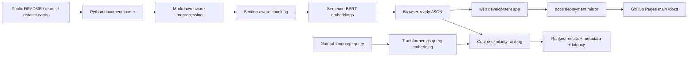

# 07 — Browser-Based Document Semantic Search with Sentence-BERT

[](https://unit-mole.github.io/transformer-projects/07-document-semantic-search-sentence-bert/)
[](MODEL_CARD.md)
[](#project-pattern)
[](../../actions)

> **Responsible-use notice:** This project is for educational and portfolio demonstration purposes only. Semantic results may be incomplete, outdated, irrelevant, or ranked imperfectly. Cosine similarity is a model-based relevance signal, not a probability or guarantee. Do not publish private, confidential, proprietary, copyrighted, sensitive, or personally identifiable documents. Review retrieved results before using them for decisions.

> **Permanent deployment standard:** This repository publishes GitHub Pages from `main` → `/docs`. The development app remains in `07-document-semantic-search-sentence-bert/web/`, while an exact deployment copy is committed to `docs/07-document-semantic-search-sentence-bert/`. No Pages deployment action, token, or `gh-pages` branch is required.

## Live demo

- **GitHub Pages:** https://unit-mole.github.io/transformer-projects/07-document-semantic-search-sentence-bert/
- **Source:** https://github.com/unit-mole/transformer-projects/tree/main/07-document-semantic-search-sentence-bert

## Project pattern

| Field | Selection |
|---|---|
| Project number | 07 |
| Application | Entirely browser-based semantic search engine |
| Searchable corpus | Portfolio READMEs, model cards, dataset cards, and ML knowledge-base documents |
| Embedding model | `sentence-transformers/all-MiniLM-L6-v2` in Python; browser-compatible `Xenova/all-MiniLM-L6-v2` through Transformers.js |
| Metrics | Recall@K, MRR, cosine-similarity analysis, and query latency |
| Deployment | GitHub Pages from `main` → `/docs` |

## One-line portfolio description

> A static GitHub Pages semantic-search engine that uses Sentence-BERT embeddings and in-browser cosine-similarity ranking to search ML portfolio documentation.

## What the project demonstrates

This project converts portfolio documentation into a searchable vector index. Documents are loaded, cleaned without removing useful technical terms, divided into section-aware chunks, embedded with Sentence-BERT, and ranked with cosine similarity. The deployed app performs inference and ranking directly in the browser—there is no Flask, FastAPI, Streamlit, Gradio, vector database, server-side API, or paid service.

## Architecture



## Browser search strategy

The application uses a static, browser-compatible strategy:

1. Python prepares public documents, section-aware chunks, metadata, and optional normalized embeddings.
2. Browser data is stored under `web/data/` using relative paths.
3. When complete precomputed vectors are present, the browser loads them directly.
4. Otherwise, Transformers.js loads `Xenova/all-MiniLM-L6-v2`, creates the sample document index in the browser, and caches it locally.
5. Each query is embedded using the same model and ranked by cosine similarity.
6. If model loading is unavailable, the app clearly switches to a labelled keyword fallback rather than claiming that lexical ranking is semantic search.

## Repository deployment structure

```text
transformer-projects/
├── 07-document-semantic-search-sentence-bert/
│   ├── web/                                  # editable development app
│   ├── data/
│   ├── src/
│   ├── scripts/
│   ├── tests/
│   └── ...
├── docs/
│   ├── .nojekyll
│   ├── index.html                            # repository demo hub, maintained separately
│   ├── 07-document-semantic-search-sentence-bert/  # exact copy of Project 07 web/
│   └── 08-image-classification-vision-transformer/
└── .github/workflows/
    └── 07-document-semantic-search-sentence-bert.yml  # validation only
```

The two Project 07 frontend locations must remain identical:

```text
07-document-semantic-search-sentence-bert/web/
docs/07-document-semantic-search-sentence-bert/
```

Synchronize them after any frontend or browser-data change:

```bash
python 07-document-semantic-search-sentence-bert/scripts/sync_docs_site.py
```

Verify without changing files:

```bash
python 07-document-semantic-search-sentence-bert/scripts/sync_docs_site.py --check
```

## Corpus

The included corpus is a small, synthetic/public portfolio knowledge base representing Transformer, CNN, RNN, and quality-analytics projects. Replace these files with real public repository documentation before generating the final embedding index.

| Property | Value |
|---|---|
| Raw documents | `data/raw_documents/` |
| Processed corpus | `data/processed/corpus.json` |
| Search chunks | `data/processed/document_chunks.json` |
| Development browser index | `web/data/` |
| Published browser index | `../docs/07-document-semantic-search-sentence-bert/data/` |
| Default chunk size | 180 words |
| Default overlap | 40 words |
| Metadata | project name/category, source file, section, document type, tags, URL/path |
| Embedding dimension | 384 |
| Similarity | Cosine similarity over normalized vectors |

## Model choice

`all-MiniLM-L6-v2` offers a strong balance of retrieval quality, compact 384-dimensional embeddings, practical latency, and browser-compatible ONNX variants. Python generation uses the original Sentence Transformers model; the browser uses the compatible Transformers.js model with mean pooling and normalization.

See [MODEL_CARD.md](MODEL_CARD.md) for intended use, limitations, risks, and deployment details.

## Search experience

The static app provides natural-language queries, sample-query buttons, configurable top-K, category and document-type filters, ranked result cards, similarity scores, source metadata, per-query latency, model status, corpus statistics, and an explicit responsible-use section.

## Evaluation

Evaluation scripts are included, but no Sentence-BERT metric is fabricated. Run the real embedding workflow before recording results.

| Metric | Meaning |
|---|---|
| Recall@K | Whether a relevant chunk or document appears within the top K results |
| MRR | Reciprocal rank of the first relevant result, averaged across queries |
| Cosine-similarity analysis | Distribution and error analysis of semantic similarity scores |
| Query latency | Embedding, ranking, and end-to-end search time |
| Manual relevance analysis | Human review of useful results, false positives, and missed results |

Output JSON files initially use `"status": "not_run"`. Replace them only with values generated by the evaluation scripts.

## Local setup

```bash
git clone https://github.com/unit-mole/transformer-projects.git
cd transformer-projects/07-document-semantic-search-sentence-bert

python -m venv .venv
# Windows: .venv\Scripts\activate
# macOS/Linux: source .venv/bin/activate

python -m pip install --upgrade pip
pip install -r requirements.txt
```

### Prepare corpus and embeddings

```bash
python scripts/prepare_corpus.py --input-dir data/raw_documents --output-dir data/processed --chunk-size 180 --chunk-overlap 40
python scripts/generate_embeddings.py --chunks data/processed/document_chunks.json --output data/processed/embeddings.json --model sentence-transformers/all-MiniLM-L6-v2
python scripts/export_browser_data.py --processed-dir data/processed --web-data-dir web/data
```

### Synchronize the published `/docs` copy

From the repository root:

```bash
python 07-document-semantic-search-sentence-bert/scripts/sync_docs_site.py
```

### Evaluate

```bash
python scripts/evaluate_search.py
python scripts/benchmark_latency.py
```

### Run locally

```bash
cd web
python -m http.server 8000
```

Open `http://localhost:8000`. Do not use a `file://` URL because browsers block local JSON requests.

## Testing

From the Project 07 folder:

```bash
pytest tests -q
node --check web/app.js
node --check web/search.js
node --check web/embeddings.js
python scripts/sync_docs_site.py --check
```

## GitHub Pages deployment

The repository is already configured globally as:

```text
Source: Deploy from a branch
Branch: main
Folder: /docs
```

Deployment therefore requires only these steps:

1. Make changes inside `07-document-semantic-search-sentence-bert/web/`.
2. Run `python 07-document-semantic-search-sentence-bert/scripts/sync_docs_site.py` from the repository root.
3. Commit both the Project 07 source and `docs/07-document-semantic-search-sentence-bert/`.
4. Push to `main`.
5. GitHub's built-in `pages build and deployment` workflow republishes `/docs` automatically.

The Project 07 workflow is validation-only. It does not use `actions/configure-pages`, `actions/deploy-pages`, `actions/upload-pages-artifact`, a Pages token, or a `gh-pages` branch.

See [README_GITHUB_PAGES.md](README_GITHUB_PAGES.md) for exact deployment and troubleshooting instructions.

## Folder structure

```text
07-document-semantic-search-sentence-bert/
├── data/
│   ├── raw_documents/
│   ├── processed/
│   └── README_data.md
├── models/
├── notebooks/
├── outputs/
├── scripts/
│   ├── prepare_corpus.py
│   ├── generate_embeddings.py
│   ├── export_browser_data.py
│   ├── sync_docs_site.py
│   ├── evaluate_search.py
│   └── benchmark_latency.py
├── src/
├── tests/
├── web/
│   ├── data/
│   ├── index.html
│   ├── style.css
│   ├── app.js
│   ├── search.js
│   └── embeddings.js
├── DATASET_CARD.md
├── MODEL_CARD.md
├── README_GITHUB_PAGES.md
├── package.json
└── requirements.txt
```

## Limitations

- First-time model loading and browser-side corpus embedding can take time.
- Browser inference may be slower on mobile hardware.
- Large or access-controlled enterprise corpora require a governed backend architecture.
- Semantic similarity can retrieve plausible but irrelevant passages.
- The sample corpus is not a substitute for evaluation using real portfolio documents.
- Keyword highlighting is lexical and does not explain every semantic match.

## Future improvements

Add compressed precomputed vectors, WebGPU acceleration, hybrid BM25 and vector retrieval, cross-encoder reranking, richer relevance labels, IndexedDB caching, and privacy-preserving query analytics.

## Career positioning

This project connects a Quality Data Scientist background to applied information retrieval. The same architecture can support safe and governed search over quality reports, complaint summaries, corrective actions, SOPs, root-cause documentation, technical knowledge bases, and future RAG systems—while demonstrating Transformer embeddings, retrieval evaluation, frontend engineering, static deployment, and responsible data handling.
