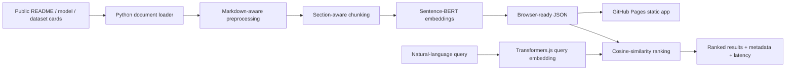

# 07 — Browser-Based Document Semantic Search with Sentence-BERT

[](https://unit-mole.github.io/transformer-projects/07-document-semantic-search-sentence-bert/)
[](MODEL_CARD.md)
[](#project-pattern)
[](../../actions)

> **Responsible-use notice:** This project is for educational and portfolio demonstration purposes only. Semantic results may be incomplete, outdated, irrelevant, or ranked imperfectly. Cosine similarity is a model-based relevance signal, not a probability or guarantee. Do not publish private, confidential, proprietary, copyrighted, sensitive, or personally identifiable documents. Review retrieved results before using them for decisions.


> **Deployment method:** The workflow publishes the static site to a dedicated `gh-pages` branch and does not call `actions/configure-pages` or the GitHub Pages REST API. After the first successful workflow run, select **Settings → Pages → Deploy from a branch → `gh-pages` → `/ (root)`** once.

## Live demo

- **GitHub Pages:** https://unit-mole.github.io/transformer-projects/07-document-semantic-search-sentence-bert/
- **Source:** https://github.com/unit-mole/transformer-projects/tree/main/07-document-semantic-search-sentence-bert

## Project pattern

| Field | Selection |
|---|---|
| Project number | 07 |
| Application | Entirely browser-based semantic search engine |
| Searchable corpus | Portfolio READMEs, model cards, dataset cards, and ML knowledge-base documents |
| Embedding model | `sentence-transformers/all-MiniLM-L6-v2` in Python; browser-compatible `Xenova/all-MiniLM-L6-v2` through Transformers.js |
| Metrics | Recall@K, MRR, cosine-similarity analysis, and query latency |
| Deployment | GitHub Pages |

## What the project demonstrates

This project converts portfolio documentation into a searchable vector index. Documents are loaded, cleaned without removing useful technical terms, divided into section-aware chunks, embedded with Sentence-BERT, and ranked with cosine similarity. The deployed app performs inference and ranking directly in the browser—there is no Flask, FastAPI, Streamlit, Gradio, vector database, server-side API, or paid service.

### One-line portfolio description

> A GitHub Pages semantic-search engine that uses Sentence-BERT embeddings and in-browser cosine-similarity ranking to search ML portfolio documentation.

## Architecture



## GitHub Pages implementation

The application uses a **hybrid static strategy**:

1. The recommended production workflow precomputes normalized document embeddings offline and exports them to `web/data/embeddings.json`.
2. The repository ships with a safe sample corpus and an empty embedding payload so it remains lightweight.
3. On first visit, the browser downloads the quantized ONNX Sentence-BERT model through Transformers.js, generates document embeddings once, and caches them locally.
4. Every query is embedded with the same model; JavaScript ranks filtered chunks by cosine similarity.
5. If the model or CDN is unavailable, the interface labels the mode correctly and uses a keyword fallback rather than falsely presenting lexical ranking as semantic search.

All browser assets use relative paths. The included workflow publishes `web/` under the nested GitHub Pages route `/transformer-projects/07-document-semantic-search-sentence-bert/` and creates a root redirect.

## Corpus

The included corpus is a small, synthetic/public portfolio knowledge base representing Transformer, CNN, RNN, and quality-analytics projects. Replace these files with your real public repository documentation before generating the final embedding index.

| Property | Value |
|---|---|
| Raw document directory | `data/raw_documents/` |
| Processed corpus | `data/processed/corpus.json` |
| Search chunks | `data/processed/document_chunks.json` |
| Browser index | `web/data/` |
| Default chunk size | 180 words |
| Default overlap | 40 words |
| Metadata | project name/category, source file, section, document type, tags, URL/path |
| Embedding dimension | 384 |
| Similarity | Cosine similarity over normalized vectors |

## Model choice

`all-MiniLM-L6-v2` was selected because it offers a strong balance of semantic retrieval quality, 384-dimensional compact embeddings, practical latency, and browser-compatible ONNX variants. Python preprocessing uses the original Sentence Transformers model; the browser uses its compatible ONNX conversion with mean pooling and normalization.

See [MODEL_CARD.md](MODEL_CARD.md) for intended use, limitations, risks, and deployment details.

## Search experience

The GitHub Pages app provides:

- natural-language query input and sample queries;
- configurable top-K;
- project-category and document-type filters;
- ranked result cards with semantic similarity scores;
- source, section, tags, and project metadata;
- per-query embedding, ranking, and total latency;
- corpus statistics and model details;
- an explicit distinction between semantic mode and keyword fallback mode;
- responsible-use and limitations sections.

## Evaluation

Evaluation scripts are included, but no Sentence-BERT metric is fabricated in the repository. Run the actual embedding workflow first, then evaluate the supplied query set.

| Metric | Meaning |
|---|---|
| Recall@K | Whether at least one relevant chunk/document appears in the top K results |
| MRR | Reciprocal rank of the first relevant result, averaged over queries |
| Cosine-similarity analysis | Distribution and error analysis of semantic closeness scores |
| Query latency | Embedding, ranking, and end-to-end search time |
| Manual relevance analysis | Human review of usefulness, false positives, and missed results |

The output JSON files initially contain `"status": "not_run"`. This is intentional; replace them only with values produced by `scripts/evaluate_search.py` and `scripts/benchmark_latency.py`.

## Local setup

```bash
git clone https://github.com/unit-mole/transformer-projects.git
cd transformer-projects/07-document-semantic-search-sentence-bert

python -m venv .venv
# Windows: .venv\Scripts\activate
# macOS/Linux: source .venv/bin/activate

python -m pip install --upgrade pip
pip install -r requirements.txt
```

### Prepare a custom corpus

```bash
python scripts/prepare_corpus.py   --input-dir data/raw_documents   --output-dir data/processed   --chunk-size 180   --chunk-overlap 40
```

### Generate real Sentence-BERT embeddings

```bash
python scripts/generate_embeddings.py   --chunks data/processed/document_chunks.json   --output data/processed/embeddings.json   --model sentence-transformers/all-MiniLM-L6-v2
```

### Export browser data

```bash
python scripts/export_browser_data.py   --processed-dir data/processed   --web-data-dir web/data
```

### Evaluate retrieval and latency

```bash
python scripts/evaluate_search.py
python scripts/benchmark_latency.py
```

### Run the web app locally

```bash
cd web
python -m http.server 8000
```

Open `http://localhost:8000`. Do not open `index.html` with a `file://` URL because browsers block local JSON requests.

## Testing

```bash
pytest tests -q
node --check web/app.js
node --check web/search.js
node --check web/embeddings.js
```

## Deployment

The root workflow `.github/workflows/07-document-semantic-search-sentence-bert.yml`:

1. runs tests and static-file validation on pushes and pull requests;
2. builds a monorepo Pages artifact;
3. copies each `NN-project-name/web/` folder into its own public route;
4. deploys only after a successful push to `main`;
5. publishes this project at the nested URL shown above.

After the workflow creates the `gh-pages` branch, select **Settings → Pages → Deploy from a branch → `gh-pages` → `/ (root)`** once. Full instructions are in [README_GITHUB_PAGES.md](README_GITHUB_PAGES.md).

## Folder structure

```text
07-document-semantic-search-sentence-bert/
├── data/
│   ├── raw_documents/
│   ├── processed/
│   └── README_data.md
├── models/
├── notebooks/
├── outputs/
├── scripts/
├── src/
├── tests/
├── web/
│   ├── data/
│   ├── index.html
│   ├── style.css
│   ├── app.js
│   ├── search.js
│   └── embeddings.js
├── DATASET_CARD.md
├── MODEL_CARD.md
├── README_GITHUB_PAGES.md
├── package.json
└── requirements.txt
```

## Limitations

- Initial model download and first-time corpus embedding can take time depending on network speed and device capability.
- Browser inference uses local CPU/WASM by default and may be slower on mobile devices.
- A small public corpus is appropriate for a static demo; a large enterprise corpus needs indexing, access control, and a backend retrieval service.
- Semantic similarity can retrieve plausible but irrelevant passages.
- The sample corpus is not a substitute for evaluation on real portfolio documents.
- Keyword highlighting is lexical and does not explain every semantic match.

## Future improvements

Add precomputed compressed vectors, WebGPU acceleration where supported, hybrid BM25 + vector retrieval, reranking with a cross-encoder, richer evaluation labels, IndexedDB vector caching, query analytics that preserve privacy, and a downstream RAG assistant.

## Why this supports my AI career transition

The project connects a Quality Data Scientist background to applied information retrieval. The same architecture can support safe search over public or properly governed quality reports, complaint summaries, corrective actions, SOPs, root-cause documentation, technical knowledge bases, and future RAG systems—while demonstrating Transformer embeddings, evaluation, frontend engineering, deployment, and responsible data handling.
