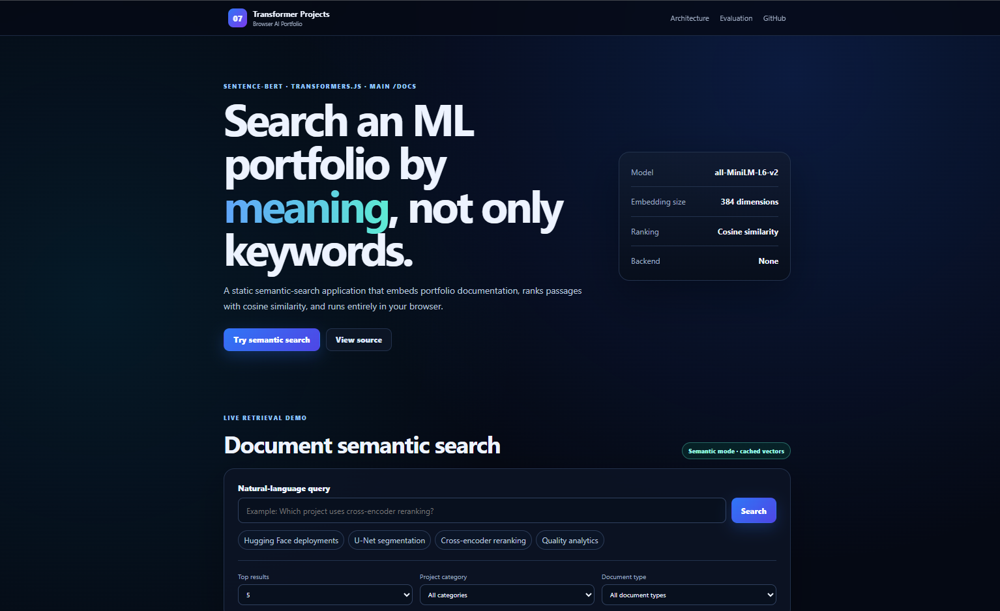
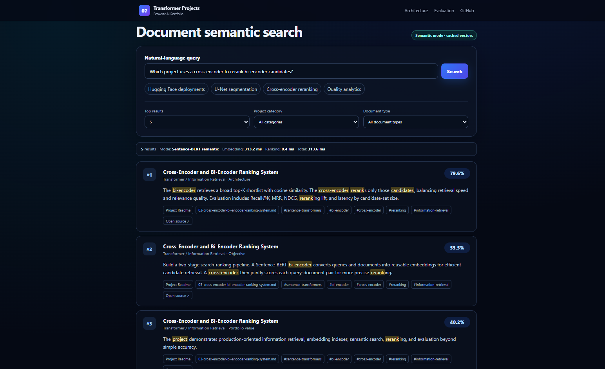
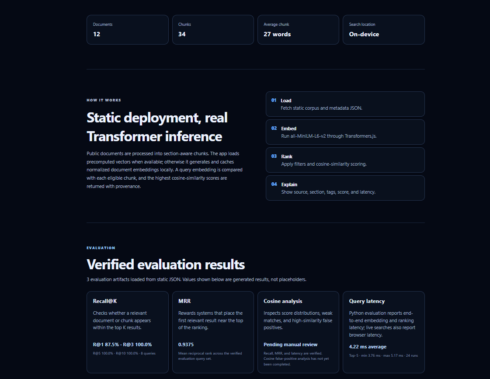

# Browser-Based Document Semantic Search with Sentence-BERT

[](https://www.python.org/)
[](https://www.sbert.net/)
[](https://huggingface.co/docs/transformers.js/)
[](#business-problem)
[](https://unit-mole.github.io/transformer-projects/07-document-semantic-search-sentence-bert/)
[](https://github.com/unit-mole/transformer-projects/actions/workflows/07-document-semantic-search-sentence-bert.yml)
[](../LICENSE)

An end-to-end information-retrieval project that converts public ML portfolio documentation into a searchable semantic index using **Sentence-BERT embeddings**. The repository includes document loading, Markdown-aware preprocessing, section-aware chunking, embedding generation, cosine-similarity ranking, retrieval evaluation, latency benchmarking, browser-based inference, automated validation, and deployment through GitHub Pages.

**Status:** Portfolio-ready and deployed  
**Live demo:** [Open the Browser-Based Document Semantic Search Engine](https://unit-mole.github.io/transformer-projects/07-document-semantic-search-sentence-bert/)  
**Primary stack:** Python · Sentence Transformers · all-MiniLM-L6-v2 · Transformers.js · NumPy · scikit-learn · JavaScript · HTML · CSS · GitHub Actions · GitHub Pages

---

## Responsible Use

This project is intended for educational, technical-learning, and portfolio demonstration purposes.

- Semantic-search results may be incomplete, outdated, irrelevant, or ranked imperfectly.
- Cosine similarity is a model-based relevance signal and is not a probability or guarantee that a result fully answers a query.
- Do not add private company files, internal quality records, complaint investigations, customer information, emails, credentials, copyrighted documents, proprietary material, or personally identifiable information to a public corpus.
- Retrieved passages should be reviewed by a human before they are used for real-world decisions.
- The application must not be used as the sole basis for medical, legal, security, safety-critical, hiring, insurance, financial, or production decisions.
- Only public, self-authored, redistributable, or synthetic documents should be published through the GitHub Pages corpus.

---

## Business Problem

Technical portfolios, internal knowledge bases, quality records, project documentation, model cards, dataset cards, and operational notes can quickly become difficult to search using exact keywords alone.

Traditional keyword search may miss relevant information when the user describes a concept differently from the wording used in the original document. For example, a query about *browser deployment of a machine-learning model* should still retrieve documentation that mentions *GitHub Pages*, *TensorFlow.js*, or *Transformers.js* even when the exact query words do not appear together.

This project answers:

> Can a static browser application retrieve the most relevant ML portfolio documentation by semantic meaning rather than exact keyword overlap?

The deployed application returns:

- Ranked document chunks
- Semantic similarity scores
- Project names and categories
- Document types and source files
- Section titles and text snippets
- Configurable Top-K results
- Category and document-type filters
- Per-query browser latency
- Corpus and model information
- Verified retrieval metrics
- Responsible-use guidance

---

## Project Objective

Build a professional document semantic-search solution that can:

1. Load Markdown, README, model-card, dataset-card, and plain-text documents.
2. Preserve project names, model names, metrics, deployment platforms, and technical terms.
3. Remove unnecessary formatting without over-cleaning meaningful content.
4. Divide long documents into section-aware chunks.
5. Generate normalized Sentence-BERT embeddings.
6. Export document chunks, embeddings, and metadata into browser-friendly JSON.
7. Generate query embeddings directly in the browser.
8. Rank documents using cosine similarity.
9. Support category and document-type filtering.
10. Evaluate retrieval quality using Recall@K and Mean Reciprocal Rank.
11. Measure end-to-end query latency.
12. Display verified evaluation results without inventing missing metrics.
13. Run without Flask, FastAPI, Streamlit, Gradio, a server-side vector database, or a paid API.
14. Publish the complete static application through GitHub Pages.
15. Connect semantic-search engineering to quality analytics and future RAG workflows.

---

## Search Corpus

The project uses a safe, public portfolio-documentation knowledge base.

| Property | Value |
|---|---|
| Task | Document semantic search |
| Documents | 12 |
| Searchable chunks | 34 |
| Evaluation queries | 8 |
| Average document length | 89.58 words |
| Average chunk length | 27.38 words |
| Configured chunk size | 180 words |
| Configured overlap | 40 words |
| Embedding dimension | 384 |
| Similarity metric | Cosine similarity |
| Python embedding model | `sentence-transformers/all-MiniLM-L6-v2` |
| Browser embedding model | `Xenova/all-MiniLM-L6-v2` |
| Data-safety rule | Public, self-authored, redistributable, or synthetic documents only |

The sample corpus represents documentation from areas such as:

```text
Transformer / NLP
Information retrieval
Generative AI and LLMs
Multimodal AI
RNN and BiLSTM projects
CNN and computer-vision projects
Portfolio deployment engineering
Quality analytics and applied AI
```

Document types include:

```text
Project README files
Model cards
Deployment guides
Knowledge notes
```

The corpus can later be replaced with additional public documentation from ANN, Simple RNN, LSTM, Bi-Directional LSTM, CNN, Transformer, analytics, or quality-focused projects.

---

## Corpus Metadata

Each searchable chunk includes metadata that helps users understand where a result came from.

Typical fields include:

```text
chunk_id
document_id
project_name
project_category
source_file
section_title
text
url_or_local_path
tags
document_type
created_from
```

Displaying metadata alongside the result makes the application more useful to recruiters, technical reviewers, and portfolio visitors because each retrieved passage remains traceable to its source.

---

## Tools and Technologies

| Area | Technology |
|---|---|
| Languages | Python, JavaScript, HTML, CSS |
| Embedding framework | Sentence Transformers |
| Python model | `sentence-transformers/all-MiniLM-L6-v2` |
| Browser model | `Xenova/all-MiniLM-L6-v2` |
| Browser inference | Transformers.js |
| Numerical processing | NumPy |
| Data processing | pandas |
| Evaluation | scikit-learn |
| Visualization support | Matplotlib |
| Similarity metric | Cosine similarity |
| Testing | pytest, JSON validation, JavaScript syntax validation |
| Automation | GitHub Actions |
| Hosting | GitHub Pages |
| Publishing source | `main` branch → `/docs` |
| Browser artifacts | Static HTML, CSS, JavaScript, and JSON |

---

## Project Workflow

```text
Public portfolio documentation
          │
          ▼
Document loading and validation
          │
          ▼
Markdown-aware preprocessing
          │
          ▼
Heading and section extraction
          │
          ▼
Section-aware document chunking
          │
          ▼
Sentence-BERT embedding generation
          │
          ▼
Embedding normalization
          │
          ▼
Browser-friendly JSON export
          │
          ▼
Static HTML / CSS / JavaScript application
          │
          ▼
Transformers.js query embedding
          │
          ▼
Cosine-similarity ranking
          │
          ▼
Top-K filtering and metadata display
          │
          ▼
Recall@K, MRR, and latency evaluation
          │
          ▼
GitHub Actions validation
          │
          ▼
GitHub Pages deployment from main /docs
```

---

## Document Loading and Preprocessing

The preprocessing pipeline supports:

- Markdown and README loading
- Model-card loading
- Dataset-card loading
- Plain-text loading
- Frontmatter cleanup
- Markdown heading extraction
- Code-block handling
- Table-text preservation
- Extra-whitespace removal
- Duplicate-document detection
- Empty-document handling
- Metadata extraction
- Safe source-file tracking

Important technical terms are deliberately preserved, including:

```text
all-MiniLM-L6-v2
Sentence-BERT
Transformers.js
Recall@K
MRR
cosine similarity
GitHub Pages
U-Net
ResNet
BERTScore
cross-encoder
bi-encoder
quality analytics
root-cause analysis
```

Over-cleaning is avoided because removing model names, metrics, deployment platforms, or project identifiers would reduce retrieval quality.

---

## Document Chunking

Long documents are divided into meaningful, section-aware chunks.

The chunking strategy:

- Preserves Markdown section headings
- Avoids splitting sentences unnecessarily
- Stores source metadata for each chunk
- Supports adjustable chunk size
- Supports configurable overlap
- Keeps project and section context attached to each passage

Default configuration:

```text
chunk_size_words = 180
chunk_overlap_words = 40
```

Chunking improves search quality because a query can retrieve the most relevant section of a long document rather than returning an entire README containing several unrelated topics.

---

## Sentence-BERT Embedding Model

The selected model is:

```text
sentence-transformers/all-MiniLM-L6-v2
```

The browser-compatible equivalent is:

```text
Xenova/all-MiniLM-L6-v2
```

### Why all-MiniLM-L6-v2?

The model provides a practical balance of:

- Strong sentence-level semantic representations
- Compact 384-dimensional embeddings
- Fast inference
- Manageable browser loading requirements
- Compatibility with cosine similarity
- Availability through Sentence Transformers and Transformers.js
- Suitability for static GitHub Pages demonstrations

The Python workflow creates normalized document embeddings. The browser generates a normalized query embedding using the compatible Transformers.js model and compares it against the static document vectors.

See [MODEL_CARD.md](MODEL_CARD.md) for intended use, limitations, risks, and deployment details.

---

## Semantic Search Architecture

```text
Document chunk
      │
      ▼
Sentence-BERT document embedding
      │
      ▼
Normalized 384-dimensional vector
      │
      ├──────────────────────────────┐
      │                              │
      │                    Natural-language query
      │                              │
      │                              ▼
      │                    Browser query embedding
      │                              │
      └───────────────► Cosine similarity
                                     │
                                     ▼
                              Ranked Top-K chunks
                                     │
                                     ▼
                       Metadata, score, snippet, latency
```

The application uses relative paths for all browser artifacts so it can run correctly from the nested GitHub Pages route:

```text
https://unit-mole.github.io/transformer-projects/07-document-semantic-search-sentence-bert/
```

No Python backend or server-side vector database is required.

---

## Ranking Logic

For each search:

1. The browser validates the natural-language query.
2. Transformers.js generates the query embedding.
3. The query vector is normalized.
4. Category and document-type filters are applied.
5. Cosine similarity is calculated against each eligible document chunk.
6. Results are sorted from highest to lowest similarity.
7. The selected Top-K results are displayed.
8. Query embedding, ranking, and total browser latency are reported.
9. Source metadata and a matched text snippet are shown for each result.

Similarity scores should be interpreted as relative semantic closeness, not as calibrated relevance probabilities.

---

## Verified Model Results

The evaluation used the included 34-chunk corpus and eight labelled queries.

| Metric | Result |
|---|---:|
| Recall@1 | **0.8750 / 87.5%** |
| Recall@3 | **1.0000 / 100%** |
| Recall@5 | **1.0000 / 100%** |
| Recall@10 | **1.0000 / 100%** |
| Mean Reciprocal Rank | **0.9375** |

The results show that a relevant document appeared in the first position for seven of the eight evaluation queries. A relevant result appeared within the top three for every evaluation query.

These metrics are loaded from completed JSON artifacts. They are not manually invented or hard-coded as unsupported model claims.

---

## Query Latency Results

Python end-to-end latency includes query embedding and ranking against the 34-chunk corpus.

| Top-K | Measurements | Average | Minimum | Maximum |
|---:|---:|---:|---:|---:|
| 3 | 24 | 5.05 ms | 3.59 ms | 25.08 ms |
| 5 | 24 | 4.22 ms | 3.76 ms | 5.17 ms |
| 10 | 24 | 3.95 ms | 3.30 ms | 5.46 ms |

The live browser application also reports browser-side latency for each search. Browser results may vary by device, browser, network conditions, model cache state, and available hardware.

---

## Evaluation

The evaluation pipeline supports:

- Recall@1
- Recall@3
- Recall@5
- Recall@10
- Mean Reciprocal Rank
- Per-query reciprocal rank
- Top retrieved document IDs
- End-to-end Python query latency
- Browser-side query latency
- Example search results
- Manual relevance review
- Cosine-similarity error analysis framework

### Why multiple metrics matter

- **Recall@K** measures whether at least one relevant result appears within the first K retrieved results.
- **MRR** rewards systems that place the first relevant result near the top of the ranking.
- **Cosine similarity** measures directional closeness between query and document embeddings.
- **Query latency** measures how quickly embedding and ranking are completed.
- **Manual relevance analysis** helps identify false positives, weak matches, and semantically similar but irrelevant results.

### Cosine-analysis status

The structured false-positive and similarity-distribution review is currently marked:

```text
Pending manual review
```

This is intentional. Recall, MRR, and latency are verified, but a numeric cosine-analysis conclusion is not presented until retrieved examples and score distributions have been reviewed.

---

## Browser Demo

The static application performs semantic search directly in the user's browser.

It supports:

- Natural-language search queries
- Sample-query buttons
- Configurable Top-K retrieval
- Project-category filtering
- Document-type filtering
- Browser-based Sentence-BERT query embeddings
- Cosine-similarity ranking
- Ranked result cards
- Similarity-score display
- Project and source metadata
- Section-aware text snippets
- Query-latency reporting
- Corpus statistics
- Verified evaluation cards
- Responsible-use information
- Labelled keyword fallback if the semantic model cannot load

No Flask, FastAPI, Streamlit, Gradio, paid API, or server-side database is required.

### Live Application

[](https://unit-mole.github.io/transformer-projects/07-document-semantic-search-sentence-bert/)

### Application Interface



*Browser-based document semantic-search interface with sample queries, Top-K selection, project-category filtering, document-type filtering, model status, and corpus statistics.*

### Semantic Search Results



*Ranked semantic-search results showing cosine similarity, project metadata, source sections, text snippets, and query latency directly in the browser.*

### Verified Evaluation Metrics



*Verified Recall@K, Mean Reciprocal Rank, and query-latency results generated from the offline evaluation pipeline. Cosine false-positive analysis remains clearly marked as pending manual review.*

---

## Browser Search Workflow

```text
User enters a natural-language query
          │
          ▼
Browser validates query and filters
          │
          ▼
Transformers.js loads all-MiniLM-L6-v2
          │
          ▼
Query is converted into a 384-dimensional embedding
          │
          ▼
Query vector is normalized
          │
          ▼
Category and document-type filters are applied
          │
          ▼
Cosine similarity is calculated
          │
          ▼
Eligible chunks are ranked
          │
          ▼
Top-K results are selected
          │
          ▼
Source metadata and snippets are rendered
          │
          ▼
Embedding, ranking, and total latency are displayed
```

---

## Browser and Evaluation Artifacts

| Artifact | Purpose |
|---|---|
| `web/data/corpus.json` | Processed document-level corpus |
| `web/data/document_chunks.json` | Searchable chunks and metadata |
| `web/data/embeddings.json` | Browser-ready normalized document embeddings |
| `web/data/evaluation_queries.json` | Labelled retrieval-evaluation queries |
| `web/data/metadata.json` | Corpus, chunking, and model configuration |
| `web/data/model_metrics.json` | Complete retrieval evaluation |
| `web/data/recall_at_k_results.json` | Verified Recall@K summary |
| `web/data/mrr_results.json` | Verified Mean Reciprocal Rank |
| `web/data/query_latency_results.json` | Latency benchmark by Top-K |
| `web/data/cosine_similarity_analysis.json` | Manual-review status and future cosine analysis |
| `web/index.html` | Browser application structure |
| `web/app.js` | Application initialization and semantic-search interface |
| `web/embeddings.js` | Transformers.js embedding pipeline |
| `web/search.js` | Ranking, keyword fallback, highlighting, and utilities |
| `web/metrics.js` | Dynamic evaluation-card loading |
| `web/style.css` | Responsive application styling |

---

## Run the Browser Demo Locally

### 1. Open the project

```bash
cd transformer-projects/07-document-semantic-search-sentence-bert
```

### 2. Start a local web server

```bash
python -m http.server 8000 --directory web
```

### 3. Open the application

```text
http://127.0.0.1:8000/
```

A local HTTP server is required because browsers generally block JSON and JavaScript module loading from direct `file://` paths.

Keep the terminal window open while using the local application. Stop the server with `Ctrl + C`.

---

## Run the Python Project Locally

### 1. Create a virtual environment

**Windows**

```bat
python -m venv .venv
.venv\Scripts\activate
```

**macOS / Linux**

```bash
python3 -m venv .venv
source .venv/bin/activate
```

### 2. Install dependencies

```bash
python -m pip install --upgrade pip
python -m pip install -r requirements.txt
```

### 3. Prepare the corpus

```bash
python scripts/prepare_corpus.py --input-dir data/raw_documents --output-dir data/processed --chunk-size 180 --chunk-overlap 40
```

### 4. Generate Sentence-BERT embeddings

```bash
python scripts/generate_embeddings.py --chunks data/processed/document_chunks.json --output data/processed/embeddings.json --model sentence-transformers/all-MiniLM-L6-v2 --batch-size 32
```

### 5. Run retrieval evaluation

```bash
python scripts/evaluate_search.py
```

### 6. Run latency benchmarking

```bash
python scripts/benchmark_latency.py
```

### 7. Export browser data

```bash
python scripts/export_browser_data.py
```

### 8. Synchronize the GitHub Pages deployment copy

From the repository root:

```bash
python 07-document-semantic-search-sentence-bert/scripts/sync_docs_site.py
```

### 9. Verify the deployment mirror

```bash
python 07-document-semantic-search-sentence-bert/scripts/sync_docs_site.py --check
```

---

## Testing and Validation

From the Project 07 folder:

```bash
python -m pytest tests -q
node --check web/app.js
node --check web/metrics.js
node --check web/search.js
node --check web/embeddings.js
```

From the repository root:

```bash
python 07-document-semantic-search-sentence-bert/scripts/sync_docs_site.py --check
```

The GitHub Actions workflow validates:

1. Python tests.
2. JavaScript syntax.
3. Required HTML, CSS, JavaScript, and JSON files.
4. Evaluation-artifact completion status.
5. JSON validity.
6. Required evaluation-interface markers.
7. Exact synchronization between the development `web/` app and the published `/docs` copy.

---

## Deployment

- **Repository:** `unit-mole/transformer-projects`
- **Source branch:** `main`
- **GitHub Pages source:** `main` → `/docs`
- **Development application:** `07-document-semantic-search-sentence-bert/web/`
- **Published application:** `docs/07-document-semantic-search-sentence-bert/`
- **Live application:** https://unit-mole.github.io/transformer-projects/07-document-semantic-search-sentence-bert/

The repository uses one permanent GitHub Pages configuration:

```text
One repository
One main branch
One /docs publishing folder
Multiple project subfolders
One unique URL per project
```

The Project 07 GitHub Actions workflow is validation-only. It does not use:

```text
actions/configure-pages
actions/deploy-pages
actions/upload-pages-artifact
PAGES_DEPLOY_TOKEN
gh-pages branch deployment
```

After changes are synchronized into `docs/07-document-semantic-search-sentence-bert/` and pushed to `main`, GitHub's built-in **pages build and deployment** workflow republishes the site.

The validation workflow is stored at:

```text
.github/workflows/07-document-semantic-search-sentence-bert.yml
```

See [README_GITHUB_PAGES.md](README_GITHUB_PAGES.md) for deployment and troubleshooting details.

---

## Project Structure

```text
transformer-projects/
├── .github/
│   └── workflows/
│       └── 07-document-semantic-search-sentence-bert.yml
│
├── 07-document-semantic-search-sentence-bert/
│   ├── data/
│   │   ├── raw_documents/
│   │   ├── processed/
│   │   └── README_data.md
│   ├── images/
│   │   ├── semantic-search-interface.png
│   │   ├── semantic-search-results.png
│   │   └── semantic-search-evaluation-metrics.png
│   ├── models/
│   │   ├── model_metadata.json
│   │   └── model_reference.txt
│   ├── notebooks/
│   │   ├── document_semantic_search_sentence_bert.ipynb
│   │   └── browser_semantic_search_evaluation.ipynb
│   ├── outputs/
│   │   ├── model_metrics.json
│   │   ├── recall_at_k_results.json
│   │   ├── mrr_results.json
│   │   ├── query_latency_results.json
│   │   └── cosine_similarity_analysis.json
│   ├── scripts/
│   │   ├── prepare_corpus.py
│   │   ├── generate_embeddings.py
│   │   ├── export_browser_data.py
│   │   ├── evaluate_search.py
│   │   ├── benchmark_latency.py
│   │   ├── run_local_web_server.py
│   │   └── sync_docs_site.py
│   ├── src/
│   │   ├── document_loader.py
│   │   ├── text_preprocessing.py
│   │   ├── document_chunking.py
│   │   ├── embedding_generator.py
│   │   ├── semantic_search.py
│   │   ├── model_evaluation.py
│   │   ├── latency_benchmark.py
│   │   ├── export_for_browser.py
│   │   └── visualization.py
│   ├── tests/
│   ├── web/
│   │   ├── data/
│   │   ├── index.html
│   │   ├── style.css
│   │   ├── app.js
│   │   ├── metrics.js
│   │   ├── search.js
│   │   ├── embeddings.js
│   │   └── metadata.json
│   ├── DATASET_CARD.md
│   ├── MODEL_CARD.md
│   ├── README.md
│   ├── README_GITHUB_PAGES.md
│   ├── package.json
│   └── requirements.txt
│
└── docs/
    ├── .nojekyll
    ├── index.html
    ├── 07-document-semantic-search-sentence-bert/
    └── 08-image-classification-vision-transformer/
```

---

## Limitations

- Semantic similarity can return plausible but irrelevant results.
- The evaluation uses a small sample corpus and eight labelled queries.
- Recall@K and MRR do not capture every aspect of search usefulness.
- Cosine similarity is not a calibrated probability.
- The structured cosine false-positive review is still pending.
- First-time browser model loading may take longer because model files must be downloaded.
- Browser performance varies by device, browser, available memory, and hardware acceleration.
- Large public embedding JSON files can increase initial page-load time.
- The sample corpus does not represent a production enterprise knowledge base.
- Access-controlled or confidential corpora require authentication, authorization, logging, and a governed backend.
- Lexical highlighting does not explain every semantic relationship.
- A static browser demo is not a substitute for a production vector-search platform.

---

## Future Improvements

- Complete the cosine-similarity distribution and false-positive review.
- Expand the labelled evaluation-query set.
- Compare semantic search with keyword and TF-IDF baselines.
- Add BM25 and vector hybrid retrieval.
- Add cross-encoder reranking.
- Add compressed or quantized browser embeddings.
- Cache model and embedding artifacts using IndexedDB or a service worker.
- Add WebGPU acceleration where supported.
- Add query-history controls without collecting private data.
- Add relevance-feedback buttons for local evaluation.
- Add richer result explanations.
- Add duplicate-result suppression at the document level.
- Add automated browser integration tests.
- Evaluate larger public portfolio corpora.
- Extend the retrieval pipeline into a governed RAG assistant.

---

## Skills Demonstrated

- Transformer embeddings
- Sentence-BERT
- Sentence Transformers
- all-MiniLM-L6-v2
- Transformers.js
- Natural-language processing
- Semantic search
- Information retrieval
- Document loading
- Markdown preprocessing
- Section-aware document chunking
- Vector normalization
- Cosine similarity
- Top-K ranking
- Recall@K evaluation
- Mean Reciprocal Rank
- Query-latency benchmarking
- Manual relevance-analysis design
- Browser-based machine learning
- JavaScript inference pipelines
- Static web-application development
- Browser-compatible JSON artifact design
- GitHub Actions validation
- GitHub Pages deployment
- Responsible AI communication
- Safe public-data handling
- Portfolio-focused ML engineering

---

## Portfolio Positioning

**One-line description:** Browser-based document semantic-search engine using Sentence-BERT, Transformers.js, cosine-similarity ranking, verified retrieval metrics, and GitHub Pages deployment.

**Pinned repository description:** End-to-end Transformer portfolio project featuring public-document ingestion, Markdown-aware preprocessing, section-aware chunking, all-MiniLM-L6-v2 embeddings, in-browser semantic search, Recall@K and MRR evaluation, latency benchmarking, automated validation, and static GitHub Pages deployment.

This project connects naturally to a Quality Data Scientist background because semantic search can support governed retrieval across:

```text
Quality reports
GCS case summaries
Complaint investigations
Corrective and preventive actions
Root-cause documentation
Standard operating procedures
Technical knowledge bases
Product and supplier documentation
Future retrieval-augmented generation systems
```

The project demonstrates a transition from quality-focused analytics toward Data Science, Machine Learning, NLP, Applied AI, Information Retrieval, Browser AI, and Generative AI engineering.

---

## Author

**Anmol Tripathi**

Quality Data Scientist building a professional portfolio in Data Science, Machine Learning, Applied AI, Generative AI, Natural Language Processing, Information Retrieval, Browser AI, Analytics Engineering, and Quality Analytics.
