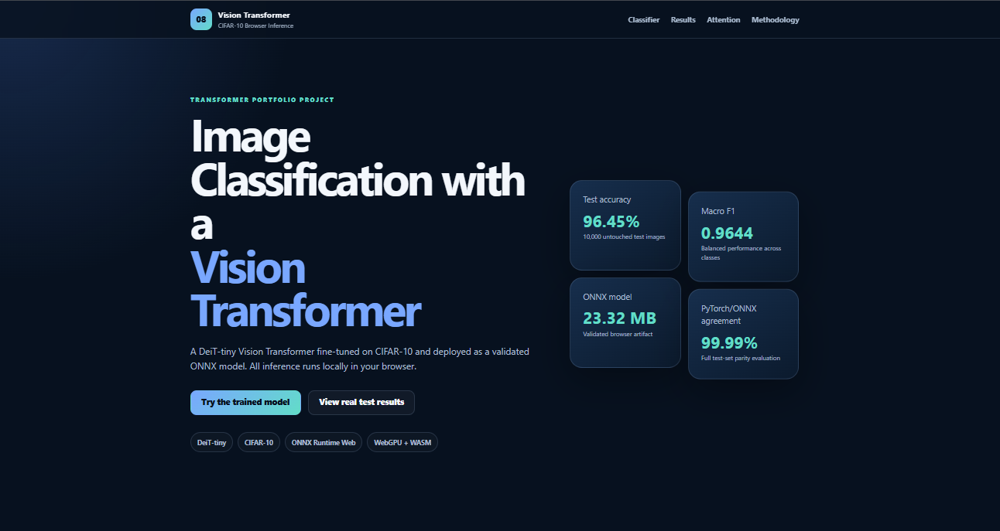
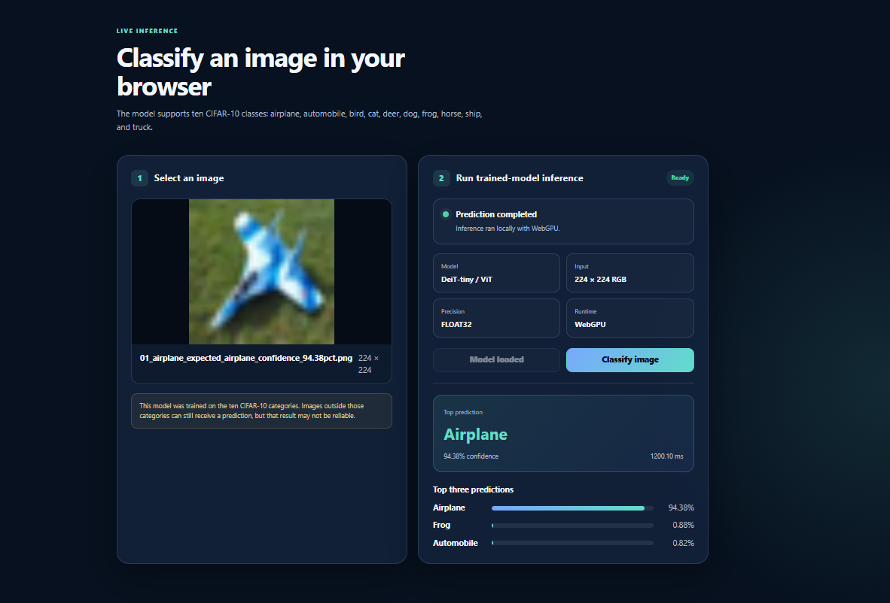

# Image Classification with Vision Transformer and ONNX Runtime Web

[](https://www.python.org/)
[](https://pytorch.org/)
[](https://huggingface.co/docs/transformers/)
[](https://huggingface.co/facebook/deit-tiny-patch16-224)
[](https://onnx.ai/)
[](https://onnxruntime.ai/docs/get-started/with-javascript/web.html)
[](https://unit-mole.github.io/transformer-projects/08-image-classification-vision-transformer/)
[](https://github.com/unit-mole/transformer-projects/actions/workflows/08-image-classification-vision-transformer.yml)

An end-to-end computer-vision project that fine-tunes a **DeiT-tiny Vision Transformer** for **CIFAR-10 image classification**, compares it with a **ResNet-18 CNN baseline**, exports the trained model to **ONNX**, validates PyTorch-to-ONNX parity, creates real **attention-rollout explanations**, and runs inference directly in the browser using **ONNX Runtime Web**.

**Status:** Portfolio-ready and deployed  
**Live demo:** [Open the Vision Transformer CIFAR-10 Classifier](https://unit-mole.github.io/transformer-projects/08-image-classification-vision-transformer/)  
**Primary stack:** Python · PyTorch · Hugging Face Transformers · Vision Transformer · ResNet-18 · ONNX · ONNX Runtime Web · JavaScript · HTML · CSS · GitHub Actions · GitHub Pages

---

## Responsible Use

This project is intended for educational, technical-learning, and portfolio demonstration purposes.

- The classifier supports only the ten CIFAR-10 categories.
- High-resolution real-world images may differ significantly from the small CIFAR-10 training images.
- A high softmax confidence score does not guarantee a correct prediction.
- Images that are blurry, heavily edited, abstract, synthetic, or outside the training distribution may produce unreliable results.
- The application must not be used as the sole basis for medical, legal, security, safety-critical, hiring, insurance, financial, or production decisions.
- Uploaded images are processed locally in the browser and are not sent to a prediction server.
- Attention rollout is an interpretability visualization and must not be presented as proof of causal model reasoning.

---

## Business Problem

Organizations increasingly use image classification to support visual inspection, product categorization, inventory review, defect triage, quality monitoring, and image-based workflow automation. Manual review can be repetitive, inconsistent, and difficult to scale.

This project answers:

> Can a pretrained Vision Transformer be fine-tuned for CIFAR-10 classification, evaluated against a CNN baseline, converted into a validated ONNX model, and deployed for private browser-side inference?

The deployed application returns:

- Predicted CIFAR-10 class
- Confidence score
- Top three predictions
- Browser inference time
- Runtime provider used
- Model and preprocessing information
- Real test metrics and comparison charts
- Attention-rollout examples
- Responsible-use and limitation guidance

---

## Project Objective

Build a professional transformer-based image-classification solution that can:

1. Load and validate CIFAR-10 image data.
2. Create deterministic training, validation, and test splits.
3. Resize source images from 32 × 32 to 224 × 224.
4. Fine-tune an ImageNet-pretrained DeiT-tiny Vision Transformer.
5. Train a ResNet-18 baseline on the same data split.
6. Compare accuracy, macro F1, parameter count, latency, and model size.
7. Generate class-level reports and confusion matrices.
8. Export the trained Vision Transformer to ONNX.
9. Validate dynamic batch support and PyTorch-to-ONNX parity.
10. Evaluate optimization and quantization candidates without forcing an unsafe deployment model.
11. Generate attention-rollout visualizations for correct and incorrect predictions.
12. Run inference entirely in the browser using WebGPU with a WebAssembly fallback.
13. Validate the project automatically through GitHub Actions.
14. Publish the static application through GitHub Pages.

---

## Dataset

The project uses the **CIFAR-10** image-classification dataset.

| Property | Value |
|---|---|
| Task | Multi-class image classification |
| Classes | 10 object categories |
| Source image size | 32 × 32 pixels |
| Color mode | RGB |
| Training images | 45,000 |
| Validation images | 5,000 |
| Test images | 10,000 |
| Model input size | 224 × 224 × 3 |
| Browser tensor layout | NCHW |
| Output | 10 classification logits |

The ten classes are:

```text
airplane, automobile, bird, cat, deer,
dog, frog, horse, ship, truck
```

The full dataset is downloaded locally when required and is not committed to the repository. Split indices, metadata, safe examples, reports, charts, and deployment assets are retained.

---

## Tools and Technologies

| Area | Technology |
|---|---|
| Language | Python, JavaScript |
| Deep learning | PyTorch |
| Transformer library | Hugging Face Transformers |
| Primary architecture | `facebook/deit-tiny-patch16-224` |
| CNN baseline | ResNet-18 |
| Data processing | NumPy, pandas |
| Image processing | Pillow, torchvision |
| Evaluation | scikit-learn, Matplotlib |
| Model exchange | ONNX |
| Native ONNX validation | ONNX Runtime |
| Browser inference | ONNX Runtime Web |
| Browser acceleration | WebGPU with WASM fallback |
| Web interface | HTML, CSS, JavaScript |
| Testing | pytest, Node.js syntax checks, structure and JSON validation |
| Automation | GitHub Actions |
| Hosting | GitHub Pages |
| Deployment format | FP32 ONNX |

---

## Project Workflow

```text
CIFAR-10 images and labels
          │
          ▼
Dataset validation and deterministic split
          │
          ▼
Training: 45,000 images
Validation: 5,000 images
Test: 10,000 images
          │
          ▼
Resize to 224 × 224 and normalize
          │
          ├───────────────────────────────┐
          ▼                               ▼
DeiT-tiny Vision Transformer         ResNet-18 baseline
          │                               │
          └───────────────┬───────────────┘
                          ▼
              Controlled model comparison
                          │
                          ▼
       Accuracy, macro F1, reports and matrices
                          │
                          ▼
              Parameter and latency analysis
                          │
                          ▼
                 Export ViT to ONNX
                          │
                          ▼
       ONNX checker, dynamic batch and parity tests
                          │
                          ▼
          Optimization and quantization review
                          │
                          ▼
          Select validated FP32 browser model
                          │
                          ▼
             Attention-rollout generation
                          │
                          ▼
       ONNX Runtime Web static browser application
                          │
                          ▼
          GitHub Actions validation and Pages
```

---

## Image Preprocessing

Equivalent preprocessing is used during training, evaluation, ONNX validation, and browser inference.

- RGB conversion
- Direct resize to 224 × 224
- Pixel rescaling
- Channel-wise normalization
- NCHW tensor conversion
- Float32 data type
- Batch-dimension handling
- CIFAR-10 label mapping
- Unsupported-file validation
- Corrupt-image error handling

Maintaining equivalent preprocessing in Python and JavaScript is essential. A mismatch between the training and browser pipelines can reduce classification quality even when the exported model is correct.

---

## Data Augmentation

Training-time transformations improve generalization while preserving class meaning.

The pipeline uses controlled image transformations appropriate for small CIFAR-10 images. Aggressive distortion is avoided because the original objects contain limited visual detail and can lose their meaning after extreme transformations.

Validation and test images use deterministic preprocessing only.

---

## Vision Transformer Architecture

```text
Input image: 224 × 224 × 3
          ↓
16 × 16 image patches
          ↓
14 × 14 patch grid = 196 patch tokens
          ↓
Patch embeddings
          ↓
Classification token + position embeddings
          ↓
12 Transformer encoder layers
          ↓
3 self-attention heads per layer
          ↓
Classification-token representation
          ↓
Linear classification head
          ↓
10 output logits
```

### Why a Vision Transformer?

A Vision Transformer divides an image into fixed-size patches and processes those patches as a sequence of visual tokens. Self-attention allows the model to learn relationships between distant image regions rather than relying only on local convolutional neighborhoods.

This project uses DeiT-tiny because it offers:

- A compact transformer architecture
- ImageNet-pretrained visual representations
- 16 × 16 patch processing
- Approximately 5.53 million trainable parameters after adapting the classifier
- Strong CIFAR-10 performance
- A practical size for ONNX browser deployment
- Attention tensors that support interpretability analysis

---

## Transfer-Learning Strategy

The project fine-tunes the ImageNet-pretrained model:

```text
facebook/deit-tiny-patch16-224
```

The original 1,000-class classification layer is replaced with a 10-class CIFAR-10 head. The model is then fine-tuned using:

- AdamW optimization
- Learning-rate warm-up
- Cosine learning-rate scheduling
- Mixed-precision GPU training
- Validation accuracy and macro F1 monitoring
- Best-checkpoint preservation
- Training-history and metadata recording

The best Vision Transformer checkpoint was obtained at epoch 10.

---

## ResNet-18 Baseline

A pretrained ResNet-18 is trained and evaluated on the same dataset split.

The baseline provides a controlled comparison between:

- Convolutional inductive bias
- Transformer self-attention
- Classification accuracy
- Macro F1
- Parameter count
- GPU latency
- Prediction agreement and disagreement patterns

The ResNet baseline is faster for single-image native GPU inference, while the Vision Transformer provides slightly stronger final test performance with fewer parameters.

---

## Model Results

| Model | Best Validation Accuracy | Test Accuracy | Macro F1 | Parameters | Average GPU Latency |
|---|---:|---:|---:|---:|---:|
| DeiT-tiny Vision Transformer | 96.98% | 96.45% | 0.9644 | 5,526,346 | 5.516 ms |
| ResNet-18 baseline | 96.74% | 96.27% | 0.9626 | 11,181,642 | 2.078 ms |

### Comparison summary

- Vision Transformer test-accuracy advantage: **+0.18 percentage points**
- Vision Transformer macro-F1 advantage: **+0.0019**
- Both models correct: **9,430 images**
- Both models incorrect: **158 images**
- ViT only correct: **215 images**
- ResNet only correct: **197 images**
- ResNet single-image GPU inference was approximately **2.65× faster**
- The Vision Transformer used fewer than half the parameters of the ResNet-18 baseline

The difference in aggregate accuracy is modest, so both class-level behavior and efficiency should be considered when comparing the architectures.

---

## Evaluation

The evaluation pipeline includes:

- Test accuracy
- Precision
- Recall
- Per-class F1-score
- Macro F1-score
- Weighted F1-score
- Classification reports
- Confusion matrices
- Normalized confusion matrices
- Correct and incorrect prediction review
- Cross-model prediction agreement
- ViT-only and ResNet-only correct examples
- Confidence analysis
- Parameter-count comparison
- GPU latency benchmarking
- ONNX parity testing

### Why multiple metrics matter

- **Accuracy** measures the overall percentage of correct classifications.
- **Precision** measures how reliable predictions for a class are.
- **Recall** measures how many real examples of a class are captured.
- **F1-score** balances precision and recall.
- **Macro F1** gives each class equal importance.
- **Confusion matrices** reveal which visual categories are commonly confused.
- **Latency** measures deployment efficiency but depends on device and runtime.
- **Prediction agreement** helps verify exported-model behavior.

---

## Browser Demo

The static application performs inference locally in the visitor's browser.

It supports:

- PNG, JPEG, and WebP images
- Drag-and-drop or file selection
- Image preview
- Trained ONNX inference
- WebGPU acceleration where available
- WebAssembly fallback
- Predicted class
- Confidence score
- Top three predictions
- Browser inference time
- Runtime-provider status
- Real evaluation metrics
- Model-comparison charts
- Attention-rollout galleries
- Responsible-use information

No Python backend is required. Uploaded images remain in the browser.

### Live Application

[](https://unit-mole.github.io/transformer-projects/08-image-classification-vision-transformer/)

### Application Overview



*Browser-based CIFAR-10 application deployed through GitHub Pages and ONNX Runtime Web.*

### Model Performance


*Real Vision Transformer and ResNet-18 evaluation results generated from the project pipeline.*

### Prediction Example



*Example browser inference displaying the predicted class, confidence, and ranked alternatives.*

---

## Browser Inference Workflow

```text
User selects an image
          │
          ▼
Browser validates file type
          │
          ▼
Image is decoded into an HTML image element
          │
          ▼
Canvas resizes image to 224 × 224
          │
          ▼
Pixels are rescaled and normalized
          │
          ▼
NCHW Float32 tensor is created
          │
          ▼
ONNX Runtime Web loads model_browser.onnx
          │
          ├── WebGPU when available
          └── WebAssembly fallback
          │
          ▼
Model returns 10 logits
          │
          ▼
Stable softmax converts logits to scores
          │
          ▼
Classes are ranked
          │
          ▼
Top prediction and top three results are displayed
```

---

## ONNX Export and Validation

The trained PyTorch Vision Transformer is exported to ONNX with a dynamic batch dimension.

Validation includes:

- ONNX graph checker
- Input-name validation: `pixel_values`
- Output-name validation: `logits`
- Dynamic batches of 1, 7, and 32
- Full 10,000-image test evaluation
- PyTorch versus ONNX prediction comparison
- Logit-difference analysis
- Confidence-difference analysis
- Deployment acceptance review

### ONNX parity results

| Metric | Result |
|---|---:|
| Prediction agreement | 99.99% |
| Prediction disagreements | 1 of 10,000 |
| Accuracy difference | 0.000000 percentage points |
| Macro-F1 difference | -0.00000063 |
| Mean absolute logit difference | 0.0003678689 |
| Maximum absolute logit difference | 0.01800394 |
| Deployment decision | Accepted with minor numerical variance |

The original strict automated threshold flagged the mean logit difference for review. The model was accepted only after all outputs were finite, prediction agreement remained 99.99%, accuracy was unchanged, macro F1 was effectively unchanged, and the single disagreement was documented.

---

## Optimization and Quantization

The pipeline attempted dynamic unsigned and signed 8-bit quantization.

No quantized candidate was accepted, so the project retained the validated FP32 model rather than forcing a smaller but unsupported or unreliable artifact.

| Deployment property | Value |
|---|---|
| Selected model | `model_browser.onnx` |
| Precision | FP32 |
| Size | 23.32 MB |
| Dynamic batch validation | Passed |
| Recommended provider | WebGPU |
| Fallback provider | WASM |

This decision demonstrates deployment governance: optimization is useful only when the candidate remains correct, compatible, and measurable.

---

## Attention Rollout

The project generates real attention-rollout visualizations from the trained Vision Transformer.

The method:

1. Collects attention tensors from all 12 transformer layers.
2. Averages the three attention heads per layer.
3. Adds identity matrices to include residual connections.
4. Row-normalizes the attention matrices.
5. Multiplies attention matrices across layers.
6. Extracts classification-token attention to the 196 image patches.
7. Reshapes the result into a 14 × 14 patch grid.
8. Resizes the mask to 224 × 224.
9. Overlays the attention map on the source image.

Generated interpretability assets include:

- 10 correct-prediction visualizations
- 10 incorrect-prediction visualizations
- Correct-example summary grid
- Incorrect-example summary grid
- 20 raw NumPy attention masks
- CSV metadata
- JSON method and summary files

Attention rollout illustrates attention propagation; it does not prove why the model made a decision.

---

## Model Artifacts

| Artifact | Purpose |
|---|---|
| `models/vit_model/config.json` | Vision Transformer configuration |
| `models/vit_model/preprocessor_config.json` | Image preprocessing metadata |
| `models/onnx_model/model.onnx` | Original validated FP32 ONNX export |
| `models/onnx_model/model_browser.onnx` | Selected browser deployment model |
| `models/onnx_model/browser_model_config.json` | Browser runtime configuration |
| `models/onnx_model/browser_model_selection.json` | Deployment-model selection record |
| `models/onnx_model/labels.json` | CIFAR-10 class order |
| `outputs/model_metrics.json` | Consolidated model metrics |
| `outputs/test_evaluation_summary.json` | Final test results |
| `outputs/vit_vs_cnn_comparison.json` | Architecture comparison |
| `outputs/onnx_parity_results.json` | Original ONNX parity results |
| `outputs/onnx_parity_review.json` | Deployment acceptance review |
| `outputs/attention_examples/` | Attention-rollout artifacts |
| `docs/08-image-classification-vision-transformer/` | GitHub Pages application |

Large training checkpoints can be excluded from standard Git tracking. The browser-ready ONNX model is retained in the `docs` deployment directory.

---

## Run the Browser Demo Locally

### 1. Open the repository

```bat
cd /d "C:\Users\atripathi\OneDrive - Veralto\Desktop\AI Codes\GIT Projects\transformer-projects"
```

### 2. Start a local HTTP server

```bat
"08-image-classification-vision-transformer\.venv\Scripts\python.exe" -m http.server 8000 --directory docs
```

A system Python installation can also be used:

```bat
python -m http.server 8000 --directory docs
```

### 3. Open the application

```text
http://localhost:8000/08-image-classification-vision-transformer/
```

Do not open `index.html` directly with a `file://` URL. The application loads JSON, JavaScript, WebAssembly, and ONNX resources over HTTP.

---

## Run the Python Project Locally

### 1. Create and activate a virtual environment

**Windows**

```bat
py -3.12 -m venv .venv
.venv\Scripts\activate
```

**macOS / Linux**

```bash
python3.12 -m venv .venv
source .venv/bin/activate
```

### 2. Install dependencies

```bash
python -m pip install --upgrade pip
python -m pip install -r requirements-training.txt
```

### 3. Launch Jupyter

```bash
jupyter notebook
```

Open:

```text
notebooks/complete_vit_training_evaluation_pipeline.ipynb
```

### 4. Run tests

```bash
python -m pytest -q
```

### 5. Run individual scripts when required

```bash
python scripts/train_model.py
python scripts/evaluate_model.py
python scripts/benchmark_latency.py
python scripts/convert_to_onnx.py
python scripts/generate_attention_examples.py
```

---

## Deployment

- **Repository:** `unit-mole/transformer-projects`
- **Source branch:** `main`
- **GitHub Pages source:** `main` → `/docs`
- **Published project folder:** `docs/08-image-classification-vision-transformer/`
- **Live application:** https://unit-mole.github.io/transformer-projects/08-image-classification-vision-transformer/

The project workflow is intentionally **validation-only**. GitHub Pages publishes the static site from the repository's configured `/docs` source, so Project 08 does not require a separate Pages deployment action inside its CI workflow.

The workflow validates:

1. Required source files
2. Required GitHub Pages deployment files
3. Browser ONNX model presence and size
4. JavaScript syntax
5. JSON syntax
6. README image references
7. Project-specific path integrity

The workflow file is stored at:

```text
.github/workflows/08-image-classification-vision-transformer.yml
```

---

## Project Structure

```text
transformer-projects/
├── .github/
│   └── workflows/
│       └── 08-image-classification-vision-transformer.yml
│
├── 08-image-classification-vision-transformer/
│   ├── data/
│   │   ├── README_data.md
│   │   ├── class_names.json
│   │   ├── sample_images/
│   │   └── splits/
│   ├── images/
│   │   ├── Demo_Images.png
│   │   ├── Model_Performance .png
│   │   └── Prediction.png
│   ├── models/
│   │   ├── cnn_or_resnet_baseline/
│   │   ├── onnx_model/
│   │   ├── tfjs_model/
│   │   └── vit_model/
│   ├── notebooks/
│   │   ├── complete_vit_training_evaluation_pipeline.ipynb
│   │   ├── image_classification_vision_transformer.ipynb
│   │   └── vit_vs_cnn_resnet_comparison.ipynb
│   ├── outputs/
│   │   ├── attention_examples/
│   │   ├── model_metrics.json
│   │   ├── test_evaluation_summary.json
│   │   ├── vit_vs_cnn_comparison.json
│   │   └── evaluation charts and reports
│   ├── scripts/
│   ├── src/
│   ├── tests/
│   ├── web/
│   ├── DATASET_CARD.md
│   ├── MODEL_CARD.md
│   ├── PROJECT_BUILD_NOTES.md
│   ├── README.md
│   ├── requirements-training.txt
│   └── requirements.txt
│
└── docs/
    ├── .nojekyll
    └── 08-image-classification-vision-transformer/
        ├── index.html
        ├── styles.css
        ├── app.js
        └── assets/
            ├── models/
            │   └── model_browser.onnx
            ├── data/
            └── images/
```

---

## Limitations

- CIFAR-10 source images are only 32 × 32 pixels.
- Real-world high-resolution photographs may differ substantially from the training distribution.
- The classifier always selects one of ten known classes, even for unsupported objects.
- Similar animal categories such as cat, dog, deer, and horse may be confused.
- Similar vehicle categories may also be confused.
- Softmax confidence is not automatically a calibrated probability.
- Browser performance varies by hardware, browser, WebGPU support, memory, and network speed.
- The 23.32 MB FP32 model may take time to load on slower connections.
- No quantized browser model passed the project acceptance process.
- Attention rollout is not a causal explanation.
- The model has not been validated for safety-critical or production use.

---

## Future Improvements

- Add browser-integrated sample images as one-click test cases.
- Add confidence calibration.
- Add calibration plots and expected calibration error.
- Evaluate static quantization with browser-compatible operators.
- Evaluate newer WebGPU graph optimizations.
- Add automated browser integration tests using Playwright.
- Add progressive model-download feedback.
- Add offline caching through a service worker.
- Add model-card rendering inside the web application.
- Compare DeiT-tiny with MobileViT, Swin Transformer, ConvNeXt, and EfficientNet.
- Evaluate robustness to image corruption and distribution shift.
- Publish the trained model through Hugging Face.
- Add class-specific attention and error-analysis galleries.

---

## Skills Demonstrated

- Vision Transformers
- DeiT architecture
- Image patch tokenization
- Multi-head self-attention
- Transfer learning
- PyTorch model training
- Hugging Face Transformers
- Multi-class image classification
- CIFAR-10 preprocessing
- Controlled model comparison
- ResNet-18 baseline development
- Accuracy and macro-F1 evaluation
- Confusion-matrix analysis
- Error analysis
- Parameter and latency benchmarking
- ONNX export
- Dynamic batch validation
- PyTorch-to-ONNX parity testing
- Model optimization review
- Quantization acceptance testing
- Attention-rollout interpretability
- Browser-based machine learning
- ONNX Runtime Web
- WebGPU and WASM execution
- JavaScript inference pipelines
- Static web application development
- GitHub Actions
- GitHub Pages deployment
- Responsible AI communication
- Portfolio-focused ML engineering

---

## Portfolio Positioning

**One-line description:** DeiT-tiny Vision Transformer fine-tuned on CIFAR-10, compared against ResNet-18, exported to a validated ONNX model, explained with attention rollout, and deployed for private browser inference through GitHub Pages.

**Pinned repository description:** End-to-end computer-vision portfolio project featuring Vision Transformer transfer learning, ResNet comparison, ONNX conversion and parity validation, attention-rollout interpretability, WebGPU/WASM browser inference, automated CI validation, and GitHub Pages deployment.

This project connects naturally to a Quality Data Scientist background because image classification can support visual inspection, product categorization, defect review, automated quality checks, image-based anomaly analysis, and applied AI for inspection workflows.

---

## Author

**Anmol Tripathi**

Quality Data Scientist building a professional portfolio in Data Science, Machine Learning, Applied AI, Computer Vision, Analytics Engineering, and Quality Analytics.
