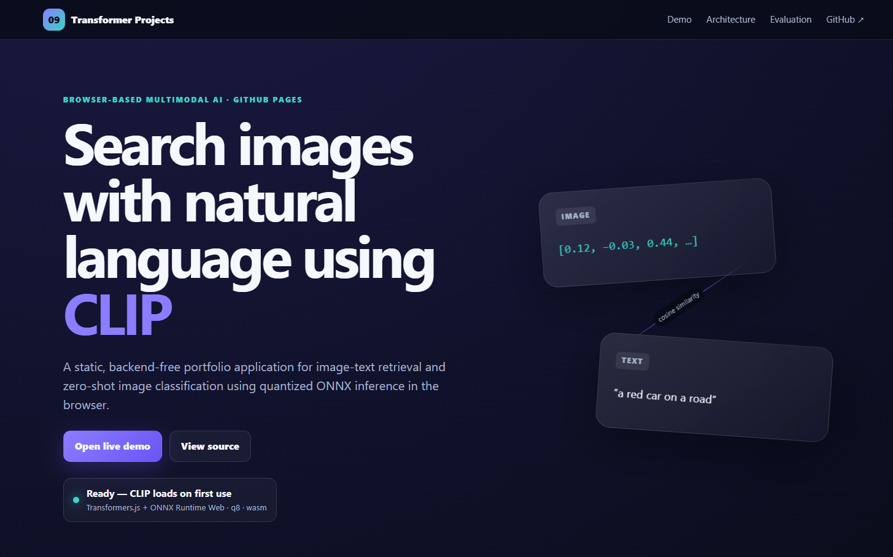
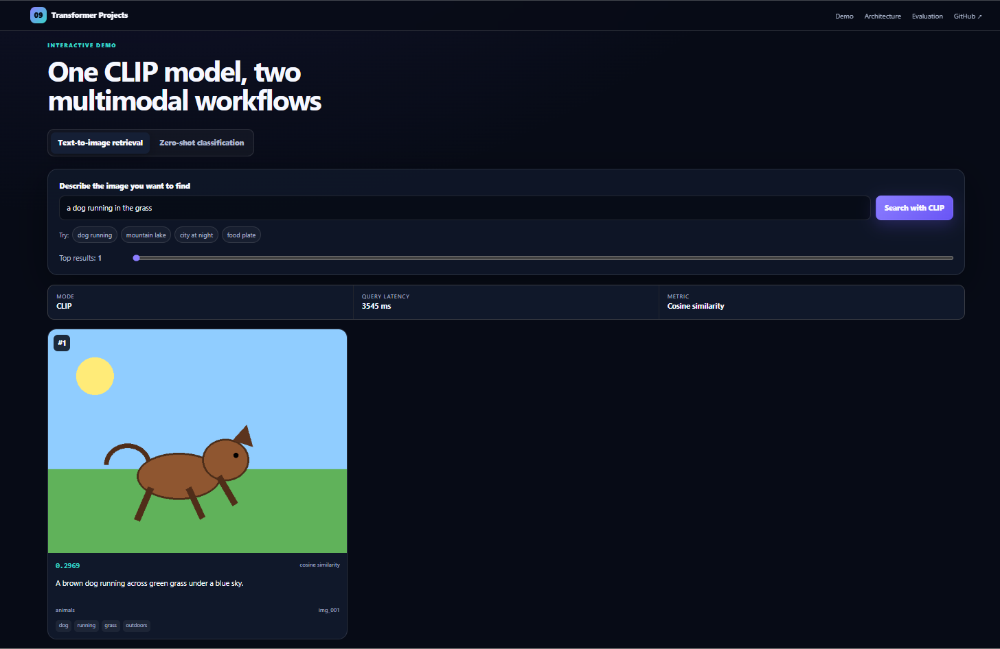
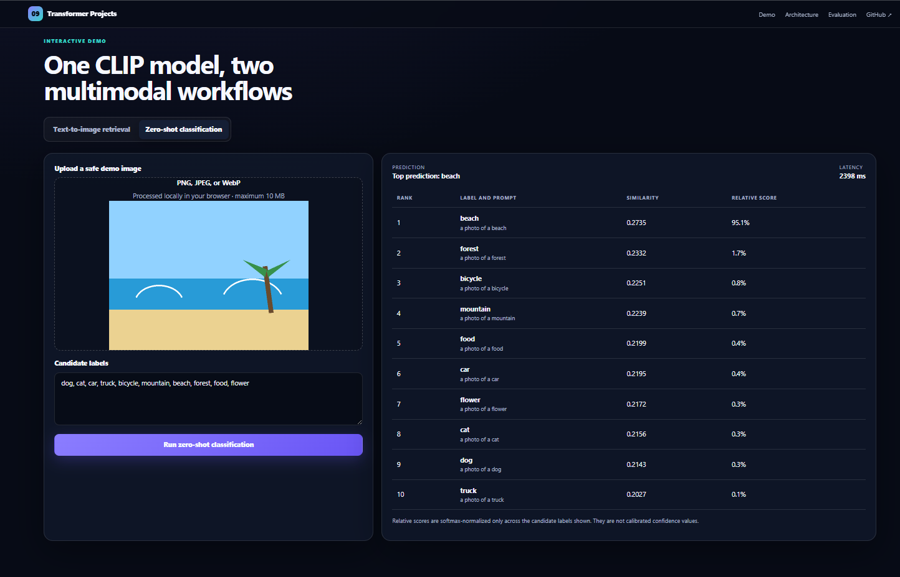
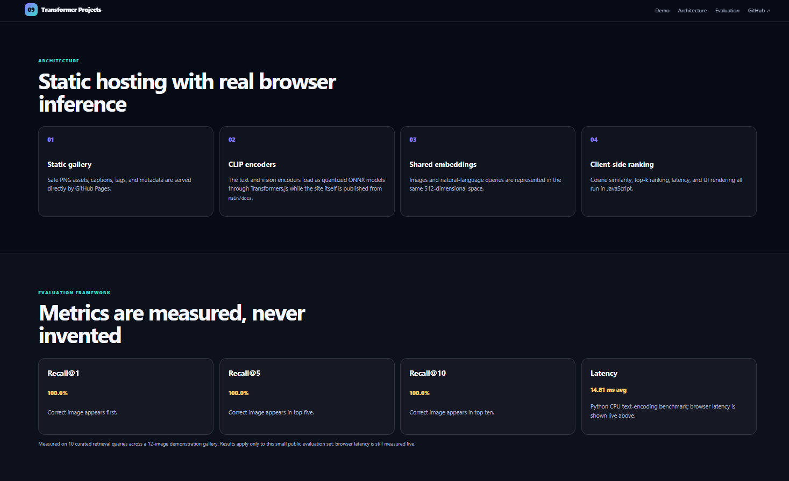

# Vision-Language Image-Text Retrieval with CLIP

[](https://www.python.org/)
[](https://pytorch.org/)
[](https://huggingface.co/docs/transformers/)
[](https://huggingface.co/openai/clip-vit-base-patch32)
[](https://huggingface.co/docs/transformers.js/)
[](https://unit-mole.github.io/transformer-projects/09-vision-language-image-text-retrieval-clip/#demo)
[](https://github.com/unit-mole/transformer-projects/actions/workflows/09-vision-language-image-text-retrieval-clip.yml)
[](../LICENSE)

An end-to-end multimodal AI project that uses **CLIP ViT-B/32** to retrieve images from natural-language queries and perform **zero-shot image classification**. The repository includes reproducible image and text preprocessing, CLIP embedding generation, cosine-similarity retrieval, Recall@K evaluation, similarity analysis, latency benchmarking, browser-based inference, automated validation, and deployment through GitHub Pages.

**Status:** Portfolio-ready, evaluated, and deployed  
**Live demo:** [Open the CLIP Image-Text Retrieval Application](https://unit-mole.github.io/transformer-projects/09-vision-language-image-text-retrieval-clip/#demo)  
**Primary stack:** Python · PyTorch · Hugging Face Transformers · CLIP · NumPy · JavaScript · Transformers.js · ONNX Runtime Web · HTML · CSS · GitHub Actions · GitHub Pages

---

## Responsible Use

This project is intended for educational, technical-learning, and portfolio demonstration purposes.

- CLIP retrieval results may be incomplete, biased, irrelevant, or misleading.
- Similarity scores measure alignment in the model's embedding space; they are not calibrated probabilities.
- Zero-shot predictions may be incorrect, especially for ambiguous, synthetic, low-quality, or out-of-distribution images.
- The application must not be used as the sole basis for medical, legal, security, surveillance, identity verification, safety-critical, hiring, insurance, financial, quality-release, or production decisions.
- Do not upload private, confidential, proprietary, copyrighted, sensitive, or personally identifiable images to a public demonstration.
- Do not use this project to identify real people or infer sensitive personal attributes.
- All outputs should be reviewed by a human before any real-world use.

---

## Business Problem

Organizations increasingly maintain large collections of product photographs, inspection images, defect examples, service records, marketing assets, and visual knowledge-base content. Traditional filename search and manual browsing can be slow, inconsistent, and difficult to scale.

This project answers two questions:

> Can a user describe an image in natural language and retrieve the most semantically relevant gallery images?

> Can the same vision-language model classify a new image against user-defined labels without retraining a task-specific classifier?

The deployed application returns:

- Ranked image-retrieval results
- Cosine-similarity scores
- Image captions, tags, and categories
- Query latency
- Uploaded-image preview
- Ranked zero-shot labels
- Relative zero-shot scores
- Classification latency
- Model, evaluation, and responsible-use information

---

## Project Objective

Build a professional vision-language solution that can:

1. Load and validate a public-safe image gallery.
2. Apply CLIP-compatible image preprocessing.
3. Clean natural-language queries without removing meaningful visual terms.
4. Generate normalized image embeddings using the CLIP image encoder.
5. Generate normalized text embeddings using the CLIP text encoder.
6. Rank gallery images using cosine similarity.
7. Support natural-language text-to-image retrieval.
8. Support zero-shot image classification with editable candidate labels.
9. Measure Recall@1, Recall@5, and Recall@10.
10. Analyze similarity-score distributions and retrieval margins.
11. Benchmark text-encoding latency.
12. Save reusable model, gallery, and evaluation artifacts.
13. Run the interactive application entirely in the browser without a Python backend.
14. Validate the project through GitHub Actions.
15. Publish the static application through the repository's `/docs` GitHub Pages structure.

---

## Dataset

The public demonstration uses a **small curated image gallery** created for safe portfolio deployment.

| Property | Value |
|---|---|
| Task | Text-to-image retrieval and zero-shot classification |
| Gallery size | 12 images |
| Evaluation queries | 10 |
| Image type | Public-safe synthetic demonstration images |
| Image format | PNG |
| Image encoder input | CLIP-compatible RGB image |
| Image embedding size | 512 dimensions |
| Text embedding size | 512 dimensions |
| Similarity metric | Cosine similarity |
| Evaluation split | Curated evaluation query set |
| Full training required | No; pretrained CLIP inference is used |

Included gallery examples:

```text
beach.png
bicycle_rider.png
cat_window.png
city_night.png
dog_running.png
flower.png
food_plate.png
forest.png
mountain_lake.png
people_table.png
red_car.png
truck_road.png
```

The repository does not include a large copyrighted image dataset. The public GitHub Pages demo uses only the small demonstration gallery. A larger benchmark such as Flickr8k can be supported through the preprocessing and evaluation scripts, but the full dataset should remain outside normal Git tracking unless redistribution is permitted.

---

## Tools and Technologies

| Area | Technology |
|---|---|
| Language | Python, JavaScript |
| Deep learning | PyTorch |
| Vision-language model | CLIP ViT-B/32 |
| Python model source | `openai/clip-vit-base-patch32` |
| Browser model source | `Xenova/clip-vit-base-patch32` |
| Model library | Hugging Face Transformers |
| Browser inference | Transformers.js / ONNX Runtime Web |
| Numerical processing | NumPy |
| Image processing | Pillow |
| Retrieval | Normalized embeddings and cosine similarity |
| Evaluation | Recall@1, Recall@5, Recall@10 |
| Analysis | Similarity statistics and latency benchmarking |
| Web interface | HTML, CSS, JavaScript |
| Testing | pytest and static-asset validation |
| Automation | GitHub Actions |
| Hosting | GitHub Pages |
| Deployment source | `main` branch, `/docs` folder |

---

## Project Workflow

```text
Curated image gallery and metadata
          │
          ▼
Image validation and RGB conversion
          │
          ▼
CLIP image preprocessing
          │
          ▼
Pretrained CLIP image encoder
          │
          ▼
Normalized 512-dimensional image embeddings
          │
          ▼
Browser-friendly embedding JSON
          │
          ├───────────────────────────────────────┐
          │                                       │
          ▼                                       ▼
Natural-language query                    Uploaded image
          │                                       │
          ▼                                       ▼
CLIP tokenization                         CLIP image preprocessing
          │                                       │
          ▼                                       ▼
CLIP text encoder                         CLIP image encoder
          │                                       │
          ▼                                       ▼
Normalized query embedding                Normalized image embedding
          │                                       │
          ▼                                       ▼
Cosine similarity with gallery            Similarity with label prompts
          │                                       │
          ▼                                       ▼
Ranked retrieval results                  Ranked zero-shot labels
          │                                       │
          └───────────────────┬───────────────────┘
                              ▼
                    Browser application
                              │
                              ▼
                    GitHub Pages deployment
```

---

## Image Preprocessing

The project uses consistent CLIP preprocessing assumptions across offline embedding generation and browser inference.

- Image loading and file validation
- RGB color conversion
- Resize and center-crop behavior compatible with CLIP
- CLIP image normalization
- Batch-dimension handling
- Uploaded-image preview
- Unsupported-format validation
- Corrupt-image error handling
- Safe sample-image loading

Consistent preprocessing is essential. If Python embedding generation and browser inference use different resize, crop, or normalization rules, image-text similarity quality can decrease significantly.

---

## Text Preprocessing

The text pipeline preserves the meaning of natural-language visual descriptions.

- Empty-query validation
- Leading and trailing whitespace removal
- Duplicate-whitespace cleanup
- Candidate-label cleanup
- Prompt-template creation
- Tokenizer input preparation
- Preservation of object names, colors, actions, and scene descriptions

For zero-shot classification, candidate labels are converted into prompts such as:

```text
a photo of a dog
a photo of a red car
a photo of a mountain
```

The same CLIP text encoder converts both retrieval queries and zero-shot label prompts into the shared embedding space.

---

## CLIP Architecture

```text
Image input
    ↓
Vision Transformer image encoder
    ↓
Image projection layer
    ↓
512-dimensional image embedding
    ↓
L2 normalization
```

```text
Text query or label prompt
    ↓
CLIP tokenizer
    ↓
Transformer text encoder
    ↓
Text projection layer
    ↓
512-dimensional text embedding
    ↓
L2 normalization
```

```text
Normalized image embedding
              +
Normalized text embedding
              ↓
Cosine similarity
              ↓
Retrieval ranking or zero-shot label ranking
```

### Why CLIP?

CLIP is a vision-language model trained to align images and natural-language descriptions in a shared embedding space.

This makes one model useful for multiple tasks:

- Natural-language image search
- Image-text matching
- Zero-shot image classification
- Visual semantic search
- Similar-image knowledge retrieval
- Multimodal search pipelines
- Future multimodal RAG systems

CLIP was selected because it supports both the primary retrieval use case and the additional zero-shot classification feature without training a separate classifier for every label set.

---

## Retrieval Strategy

The deployed application uses a browser-efficient retrieval design:

1. Gallery images are encoded offline using the pretrained CLIP image encoder.
2. The normalized image embeddings are stored in a browser-friendly JSON file.
3. A user enters a natural-language query.
4. The browser CLIP text encoder creates a query embedding.
5. JavaScript calculates cosine similarity against every gallery embedding.
6. Results are sorted from highest to lowest similarity.
7. The top-k images are displayed with rank, score, caption, category, tags, and latency.

This approach avoids repeatedly encoding the complete gallery during every browser session.

---

## Zero-Shot Classification Strategy

The zero-shot workflow uses the same shared CLIP embedding space:

1. The user uploads an image.
2. The browser validates and preprocesses the image.
3. CLIP generates an image embedding.
4. Candidate labels are converted into text prompts.
5. CLIP generates one text embedding per label prompt.
6. The image embedding is compared with all label embeddings.
7. Labels are ranked by image-text similarity.
8. The application displays the top prediction and ranked alternatives.

No task-specific classification head is trained for the candidate labels.

---

## Model Results

### Retrieval Evaluation

The CLIP retrieval pipeline was evaluated using **10 curated natural-language queries** against the **12-image demonstration gallery**.

| Metric | Result |
|---|---:|
| Recall@1 | 100.0% |
| Recall@5 | 100.0% |
| Recall@10 | 100.0% |
| Evaluation queries | 10 |
| Gallery images | 12 |

These values validate that the end-to-end retrieval pipeline works correctly on the small curated demonstration set. They must not be interpreted as general Flickr8k, production, or real-world benchmark performance.

### Similarity-Score Analysis

| Statistic | Value |
|---|---:|
| Query count | 10 |
| Minimum top similarity | 0.2459 |
| Maximum top similarity | 0.3151 |
| Mean top similarity | 0.2846 |
| Median top similarity | 0.2919 |
| Standard deviation | 0.0197 |
| Mean top-result margin | 0.0174 |

CLIP cosine-similarity values are alignment scores, not calibrated probabilities. A small top-result margin may indicate that several gallery images are semantically plausible for the same query.

### Latency Benchmark

The local Python CPU benchmark measured CLIP text encoding across five repetitions.

| Metric | Result |
|---|---:|
| Average text-encoding latency | 14.81 ms |
| Minimum latency | 6.67 ms |
| Maximum latency | 45.82 ms |
| Repetitions | 5 |
| Environment | Local Python CPU benchmark |

Browser latency is measured live in the deployed application and may vary by device, browser, model cache status, memory, and network conditions during the first model download.

### Zero-Shot Example and Failure Analysis

A zero-shot test was run on `dog_running.png` using 12 candidate labels.

| Rank | Label | Similarity |
|---:|---|---:|
| 1 | cat | 0.2827 |
| 2 | dog | 0.2734 |
| 3 | person | 0.2225 |

The stylized synthetic dog image was incorrectly ranked as **cat** first and **dog** second. This result is intentionally documented because it demonstrates a real limitation: CLIP can confuse simplified or ambiguous visual shapes even when retrieval performance is strong on a curated gallery.

Recommended improvements include:

- Use more realistic evaluation images.
- Evaluate multiple examples per class.
- Apply prompt ensembling.
- Compare several prompt templates.
- Expand the zero-shot label set carefully.
- Report aggregate zero-shot accuracy rather than one example alone.

---

## Evaluation

The evaluation pipeline supports:

- Recall@1
- Recall@5
- Recall@10
- Top-result similarity analysis
- Similarity distribution statistics
- Retrieval-margin analysis
- Query-level result inspection
- Manual relevance review
- Failure analysis
- Zero-shot classification examples
- Text-encoding latency benchmarking
- Live browser query latency
- Live browser classification latency

### Why multiple metrics matter

- **Recall@1** measures how often a relevant image appears as the first result.
- **Recall@5** measures how often a relevant image appears within the first five results.
- **Recall@10** measures how often a relevant image appears within the first ten results.
- **Similarity statistics** help identify high-confidence, low-confidence, and ambiguous queries.
- **Top-result margin** measures the separation between the two highest-ranked results.
- **Latency** describes the responsiveness of the embedding and ranking pipeline.
- **Manual failure review** reveals errors that aggregate metrics may hide.

---

## Browser Demo

The static application performs CLIP retrieval and zero-shot classification directly in the user's browser.

It supports:

- Natural-language image queries
- Sample query buttons
- Configurable top-k retrieval
- Ranked image cards
- Cosine-similarity scores
- Captions, categories, and tags
- Query latency
- Image upload and preview
- Editable zero-shot labels
- Ranked zero-shot predictions
- Classification latency
- Model and dataset details
- Measured evaluation metrics
- Responsible-use and privacy guidance

No Python backend, Flask server, FastAPI service, Streamlit application, Gradio application, database, or paid inference API is required.

Uploaded images are processed locally in the browser application.

### Live Application

[](https://unit-mole.github.io/transformer-projects/09-vision-language-image-text-retrieval-clip/#demo)

### Project Overview



*Browser-based CLIP image-text retrieval and zero-shot classification interface deployed through GitHub Pages.*

### Text-to-Image Retrieval Results



*Natural-language image search using a CLIP text embedding, precomputed gallery image embeddings, cosine-similarity ranking, and top-k result cards.*

### Zero-Shot Classification Results



*Uploaded-image zero-shot classification using editable candidate labels and ranked CLIP image-text similarity scores.*

### Retrieval Evaluation Metrics



*Measured Recall@1, Recall@5, Recall@10, and latency information displayed in the deployed browser application.*

---

## Browser Retrieval Workflow

```text
User enters a natural-language query
          │
          ▼
Browser validates and cleans the text
          │
          ▼
Transformers.js loads the quantized CLIP text encoder
          │
          ▼
Tokenizer prepares the query
          │
          ▼
CLIP creates a normalized text embedding
          │
          ▼
Browser loads precomputed gallery image embeddings
          │
          ▼
JavaScript calculates cosine similarity
          │
          ▼
Images are ranked by similarity
          │
          ▼
Top-k image cards are displayed
```

---

## Browser Zero-Shot Workflow

```text
User selects an image
          │
          ▼
Browser validates and previews the file
          │
          ▼
CLIP-compatible image preprocessing is applied
          │
          ▼
Quantized CLIP image encoder creates an embedding
          │
          ▼
Candidate labels become text prompts
          │
          ▼
CLIP text encoder creates label embeddings
          │
          ▼
Image-label similarities are calculated
          │
          ▼
Ranked zero-shot predictions are displayed
```

---

## Browser Model and Quantization

The browser application uses a Transformers.js-compatible CLIP model with quantized ONNX assets.

```text
Pretrained CLIP ViT-B/32
          ↓
Transformers.js-compatible model repository
          ↓
Quantized ONNX text encoder
          ↓
Quantized ONNX image encoder
          ↓
ONNX Runtime Web execution
          ↓
Static GitHub Pages application
```

Quantization reduces browser download size and can improve inference practicality, although the first model load may still take time depending on network speed and browser cache status.

The gallery image embeddings are generated offline and committed as browser-ready data. This avoids encoding all gallery images during each page load.

---

## Model Artifacts

| Artifact | Purpose |
|---|---|
| `web/data/image_gallery.json` | Gallery metadata used by the browser |
| `web/data/image_embeddings.json` | Generated 512-dimensional CLIP image embeddings |
| `web/data/captions.json` | Caption information for gallery images |
| `web/data/model_metrics.json` | Measured Recall@K and similarity statistics |
| `web/data/latency_results.json` | Measured Python CPU latency results |
| `web/data/zero_shot_classification_examples.json` | Saved zero-shot example |
| `web/metadata.json` | Browser model and preprocessing configuration |
| `web/zero_shot_labels.json` | Default zero-shot candidate labels |
| `outputs/model_metrics.json` | Source evaluation metrics |
| `outputs/recall_at_1_results.json` | Recall@1 output |
| `outputs/recall_at_5_results.json` | Recall@5 output |
| `outputs/recall_at_10_results.json` | Recall@10 output |
| `outputs/similarity_score_analysis.json` | Similarity-score statistics |
| `outputs/latency_results.json` | Python latency benchmark |
| `outputs/zero_shot_classification_examples.json` | Zero-shot evaluation output |
| `models/model_metadata.json` | Model, embedding, and preprocessing details |

---

## Run the Browser Demo Locally

### 1. Open the project

```bash
cd transformer-projects/09-vision-language-image-text-retrieval-clip
```

### 2. Start a local web server

```bash
python -m http.server 8000 --directory web
```

### 3. Open the application

```text
http://localhost:8000
```

A local HTTP server is required because browsers generally block module, JSON, model, and binary-asset loading from direct `file://` paths.

---

## Run the Python Project Locally

### 1. Create a virtual environment

**Windows**

```bat
python -m venv .venv
.venv\Scripts\activate
```

**macOS / Linux**

```bash
python3 -m venv .venv
source .venv/bin/activate
```

### 2. Install dependencies

```bash
python -m pip install --upgrade pip
python -m pip install -r requirements.txt
python -m pip install torch transformers huggingface-hub safetensors
```

### 3. Run tests

```bash
python -m pytest tests -q
```

Expected result:

```text
11 passed
```

### 4. Validate the gallery

```bash
python scripts/prepare_gallery.py
```

### 5. Generate CLIP image embeddings

```bash
python scripts/generate_image_embeddings.py --model-id openai/clip-vit-base-patch32 --device cpu
```

### 6. Evaluate retrieval

```bash
python scripts/evaluate_retrieval.py
```

### 7. Run a zero-shot example

```bash
python scripts/evaluate_zero_shot.py "web/sample_images/dog_running.png" --labels "dog,cat,car,truck,person,bicycle,building,mountain,beach,forest,food,flower"
```

### 8. Benchmark latency

```bash
python scripts/benchmark_latency.py
```

### 9. Validate browser assets

```bash
python scripts/export_browser_assets.py
python scripts/check_relative_paths.py
```

### 10. Synchronize the GitHub Pages copy

```bash
python scripts/sync_docs.py
python scripts/sync_docs.py --check
```

---

## Deployment

- **Repository:** `unit-mole/transformer-projects`
- **Source branch:** `main`
- **GitHub Pages source:** `main` → `/docs`
- **Development application:** `09-vision-language-image-text-retrieval-clip/web/`
- **Published folder:** `docs/09-vision-language-image-text-retrieval-clip/`
- **Live application:** https://unit-mole.github.io/transformer-projects/09-vision-language-image-text-retrieval-clip/#demo

The repository uses one permanent GitHub Pages configuration:

```text
Source: Deploy from a branch
Branch: main
Folder: /docs
```

The Project 09 workflow:

1. Checks out the repository.
2. Sets up Python.
3. Runs lightweight Python tests.
4. Validates required source and browser files.
5. Validates gallery metadata and embedding files.
6. Confirms that the development and `/docs` copies are synchronized.
7. Rejects unsafe repository-root asset paths.
8. Confirms that the workflow is validation-only.

The workflow does not deploy a `gh-pages` branch. GitHub's built-in Pages process republishes `/docs` after changes are pushed to `main`.

The workflow file is stored at:

```text
.github/workflows/09-vision-language-image-text-retrieval-clip.yml
```

---

## Project Structure

```text
transformer-projects/
├── .github/
│   └── workflows/
│       └── 09-vision-language-image-text-retrieval-clip.yml
│
├── 09-vision-language-image-text-retrieval-clip/
│   ├── data/
│   ├── images/
│   │   ├── 01-project-overview.png
│   │   ├── 02-text-to-image-retrieval-results.png
│   │   ├── 03-zero-shot-classification-results.png
│   │   └── 04-retrieval-evaluation-metrics.png
│   ├── models/
│   ├── notebooks/
│   ├── outputs/
│   │   ├── model_metrics.json
│   │   ├── recall_at_1_results.json
│   │   ├── recall_at_5_results.json
│   │   ├── recall_at_10_results.json
│   │   ├── similarity_score_analysis.json
│   │   ├── latency_results.json
│   │   ├── zero_shot_classification_examples.json
│   │   └── failure_analysis.md
│   ├── scripts/
│   ├── src/
│   ├── tests/
│   ├── web/
│   ├── DATASET_CARD.md
│   ├── MODEL_CARD.md
│   ├── README.md
│   ├── README_GITHUB_PAGES.md
│   ├── requirements.txt
│   └── pytest.ini
│
└── docs/
    └── 09-vision-language-image-text-retrieval-clip/
        ├── data/
        ├── sample_images/
        ├── app.js
        ├── clip_inference.js
        ├── clip_preprocessing.js
        ├── index.html
        ├── metadata.json
        ├── retrieval.js
        ├── style.css
        ├── zero_shot.js
        └── zero_shot_labels.json
```

---

## Limitations

- The public gallery contains only 12 demonstration images.
- The evaluation set contains only 10 curated queries.
- The 100% Recall@K result applies only to this small evaluation and does not establish broad generalization.
- Synthetic or stylized images may be more ambiguous than natural photographs.
- The demonstrated dog image was ranked as cat in zero-shot classification.
- CLIP similarity scores are not calibrated probabilities.
- Prompt wording can change retrieval and zero-shot rankings.
- The project has not yet been evaluated on a large standard retrieval benchmark.
- Browser performance varies by device, browser, CPU, memory, model cache, and network speed.
- The first visit may require downloading and caching model assets.
- A small gallery can be searched with direct cosine similarity; a large production gallery would require a vector index or approximate nearest-neighbor system.
- The model may reflect biases present in its pretraining data.
- The project has not been validated for production or safety-critical use.

---

## Future Improvements

- Expand the public evaluation gallery with more realistic and diverse images.
- Evaluate on a permitted Flickr8k or similar retrieval subset.
- Add caption keyword search and TF-IDF retrieval baselines.
- Compare CLIP retrieval with alternative vision-language models.
- Measure aggregate zero-shot accuracy across multiple labeled images.
- Add prompt ensembling for zero-shot classification.
- Add confidence and margin warnings for ambiguous predictions.
- Add query-level evaluation tables to the README.
- Add a retrieval failure gallery.
- Add browser integration tests.
- Add progressive model-loading feedback.
- Explore smaller quantized CLIP variants for faster mobile inference.
- Store embeddings in compact typed-array or binary formats.
- Add approximate nearest-neighbor search for a larger gallery.
- Extend the project into a multimodal RAG assistant.
- Connect product or inspection images with quality notes and defect descriptions.

---

## Skills Demonstrated

- Transformer models
- Vision Transformers
- CLIP architecture
- Vision-language modeling
- Multimodal AI
- Natural-language image search
- Image-text retrieval
- Zero-shot image classification
- Image preprocessing
- Text preprocessing and tokenization
- Embedding generation
- Embedding normalization
- Cosine-similarity ranking
- Recall@K evaluation
- Similarity-score analysis
- Latency benchmarking
- Failure analysis
- PyTorch inference
- Hugging Face Transformers
- Transformers.js
- ONNX Runtime Web
- Quantized browser inference
- Static web application development
- JavaScript inference pipelines
- GitHub Actions
- GitHub Pages deployment
- Responsible AI communication
- Portfolio-focused ML engineering

---

## Portfolio Positioning

**One-line description:** Browser-based CLIP image-text retrieval and zero-shot classification system using real multimodal embeddings, Recall@K evaluation, similarity analysis, and GitHub Pages deployment.

**Pinned repository description:** End-to-end multimodal AI portfolio project featuring CLIP ViT-B/32, natural-language image search, precomputed gallery embeddings, zero-shot classification, Recall@K evaluation, latency benchmarking, Transformers.js browser inference, automated validation, and GitHub Pages deployment.

This project connects naturally to a Quality Data Scientist background because CLIP-based retrieval can support:

- Searching inspection images using natural-language defect descriptions
- Retrieving visually relevant quality examples
- Connecting product photographs with service or complaint notes
- Building visual defect knowledge bases
- Reviewing image evidence alongside structured quality data
- Supporting future multimodal search and RAG workflows

---

## Author

**Anmol Tripathi**

Quality Data Scientist building a professional portfolio in Data Science, Machine Learning, Applied AI, Natural Language Processing, Computer Vision, Multimodal AI, Analytics Engineering, and Quality Analytics.
