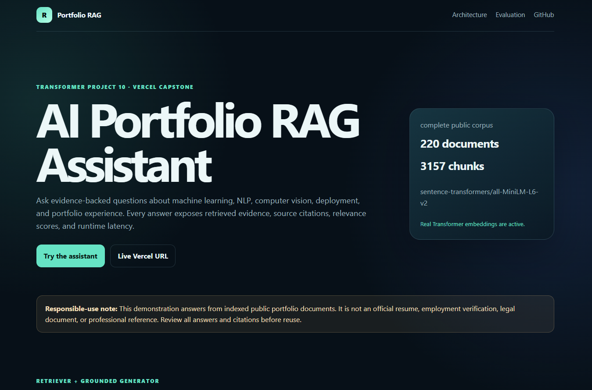
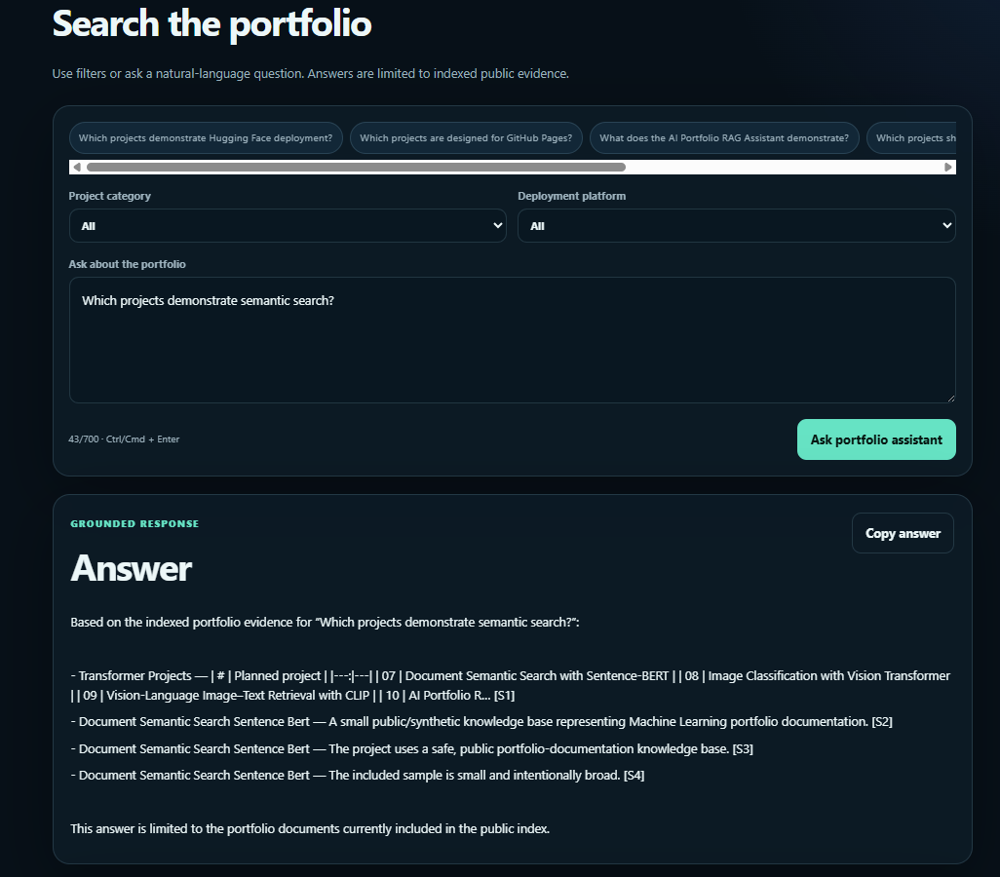
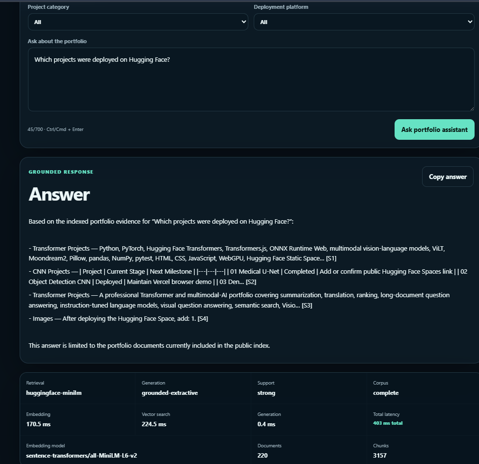

# AI Portfolio RAG Assistant with MiniLM and Vercel

[](https://www.python.org/)
[](https://pytorch.org/)
[](https://www.sbert.net/)
[](https://nextjs.org/)
[](https://www.typescriptlang.org/)
[](https://huggingface.co/)
[](https://10-ai-portfolio-rag-assistant.vercel.app/)
[](https://github.com/unit-mole/transformer-projects/actions/workflows/10-ai-portfolio-rag-assistant.yml)
[](../LICENSE)

An end-to-end **Transformer-powered Retrieval-Augmented Generation application** that searches Anmol Tripathi's public machine-learning and AI portfolio, retrieves relevant project evidence with **MiniLM semantic embeddings**, and returns grounded answers with source citations, similarity scores, retrieved context, and runtime latency.

The project combines a reproducible Python evaluation pipeline, RTX GPU inference, static vector-store generation, a Next.js and TypeScript web application, GitHub Actions validation, Hugging Face inference, and production deployment through Vercel.

**Status:** Portfolio-ready and deployed  
**Live application:** [Open the AI Portfolio RAG Assistant](https://10-ai-portfolio-rag-assistant.vercel.app/#assistant)  
**Primary stack:** Python · PyTorch · Sentence Transformers · MiniLM · FLAN-T5 · DeBERTa NLI · Next.js · TypeScript · Hugging Face · GitHub Actions · Vercel

---

## Responsible Use

This project is intended for educational, technical-learning, and portfolio demonstration purposes.

- The assistant answers from indexed public portfolio documentation and may still retrieve incomplete, duplicated, or weakly relevant text.
- Generated or extractive responses must be reviewed before they are used in a resume, job application, professional profile, or formal decision.
- The application is not an official resume, employment verification, legal document, professional reference, or source of confidential company information.
- Do not index private emails, credentials, personally identifiable information, internal reports, customer or supplier data, proprietary documents, or employer-confidential records.
- Similarity scores indicate retrieval relevance and do not prove that every answer is complete or correct.
- Automated groundedness and citation scores are evaluation signals rather than guarantees.

---

## Business Problem

A growing machine-learning portfolio can contain dozens of repositories, model cards, deployment guides, evaluation reports, and README files. Recruiters and technical reviewers may not have time to inspect every project individually, while keyword search may fail when questions use different wording from the documentation.

This project answers:

> Can a Transformer-based retrieval system search an entire public AI portfolio and provide concise, evidence-backed answers about models, skills, results, datasets, and deployments?

The deployed application returns:

- Evidence-grounded portfolio answers
- Project and repository references
- Source-file citations
- Retrieved document chunks
- Semantic and lexical relevance information
- Embedding, retrieval, generation, and total latency
- Corpus and model metadata
- Responsible-use and low-support warnings

---

## Project Objective

Build a professional portfolio RAG system that can:

1. Collect safe public documentation across multiple ML and AI repositories.
2. Clean Markdown while preserving headings, technologies, datasets, metrics, and deployment details.
3. Create section-aware document chunks with overlap and traceable metadata.
4. Generate real Transformer embeddings with `sentence-transformers/all-MiniLM-L6-v2`.
5. Compare MiniLM retrieval with TF-IDF, hash-vector, E5-small, and reranking baselines.
6. Retrieve evidence using normalized vector similarity and lexical matching.
7. Generate or compose answers only from retrieved portfolio evidence.
8. Display source citations, chunk identifiers, similarity scores, and latency.
9. Evaluate retrieval quality, answer groundedness, citation behavior, refusals, and runtime performance.
10. Export a static Vercel-ready vector store and deploy the full-stack application.

---

## Portfolio Corpus

The final public corpus combines documentation from six model families:

| Portfolio category | Included content |
|---|---|
| ANN | Artificial-neural-network and tabular deep-learning projects |
| Simple RNN | Recurrent neural-network projects and sequence modeling |
| LSTM | Long short-term memory projects and NLP applications |
| BiLSTM | Bidirectional LSTM, attention, matching, and tagging projects |
| CNN | Computer-vision, classification, detection, and segmentation projects |
| Transformer | NLP, ranking, semantic search, vision, multimodal, and RAG projects |

### Deployed corpus statistics

| Property | Value |
|---|---:|
| Public source documents | 220 |
| Section-aware chunks | 3,157 |
| Embedding model | `sentence-transformers/all-MiniLM-L6-v2` |
| Embedding dimension | 384 |
| Vector normalization | L2 normalized |
| Evaluation questions | 40 curated questions |
| Deployment format | Static JSON vector store |

The raw source-copy directory is kept local and excluded from Git. The processed chunks, metadata, evaluation artifacts, and deployment-ready vector store are committed for reproducibility and Vercel inference.

---

## Tools and Technologies

| Area | Technology |
|---|---|
| Language | Python, TypeScript, JavaScript |
| Deep learning | PyTorch with CUDA |
| Primary retriever | Sentence Transformers MiniLM |
| Retriever comparison | E5-small, TF-IDF, hash-vector baseline |
| Reranking | MiniLM cross-encoder |
| Local generator | FLAN-T5-base |
| Groundedness evaluation | DeBERTa NLI cross-encoder |
| Data processing | NumPy, pandas, scikit-learn |
| Evaluation | Custom IR metrics, NLI support, citation analysis, latency benchmarking |
| Visualization | Matplotlib |
| Web application | Next.js App Router, React, TypeScript |
| API layer | Next.js server-side route handlers |
| Hosted inference | Hugging Face Inference Providers |
| Local hardware | NVIDIA GeForce RTX 5090 |
| Automation | GitHub Actions |
| Hosting | Vercel |
| Runtime data | Precomputed JSON chunks, embeddings, metadata, and evaluation summary |

---

## Project Workflow

```text
Public portfolio repositories
          │
          ▼
Safe README, model-card, dataset-card, and deployment documentation
          │
          ▼
Markdown cleaning and duplicate-aware document loading
          │
          ▼
Section-aware chunking with metadata and overlap
          │
          ▼
MiniLM document embeddings generated on RTX GPU
          │
          ▼
Normalized static vector store
          │
          ▼
TF-IDF, hash, MiniLM, E5, and reranker evaluation
          │
          ▼
Question embedding through the same MiniLM model
          │
          ▼
Semantic and lexical retrieval
          │
          ▼
Grounded extractive or instruction-model response
          │
          ▼
Source citations, evidence cards, scores, and latency
          │
          ▼
Next.js application and API routes
          │
          ▼
GitHub Actions validation
          │
          ▼
Vercel production deployment
```

---

## RAG Architecture

```text
User question
     │
     ▼
MiniLM query embedding
     │
     ├──────────────► Lexical token matching
     │
     ▼
Cosine-similarity vector search
     │
     ▼
Category and deployment filters
     │
     ▼
Top-K portfolio evidence
     │
     ├──────────────► Optional cross-encoder reranking
     │
     ▼
Grounded response composer
     │
     ▼
Answer + [S#] citations + evidence + latency
```

### Why MiniLM?

`sentence-transformers/all-MiniLM-L6-v2` provides compact 384-dimensional semantic embeddings. It is well suited to this application because it offers a practical balance between semantic quality, vector-store size, inference latency, and serverless deployment requirements.

The same model family is used for document and query embeddings so that both are represented in a shared semantic vector space.

---

## Document Preprocessing and Chunking

The preprocessing pipeline is designed for technical portfolio documentation.

- Markdown section and heading detection
- Whitespace and formatting normalization
- Code-block and technical-term preservation
- Section-aware splitting
- Overlapping word windows
- Stable document and chunk identifiers
- Repository, category, project, path, and source metadata
- Duplicate and checksum support
- Safe exclusion of virtual environments, secrets, private data, and generated dependency folders

Default chunking uses approximately **220 words** with **50-word overlap**. This preserves enough context for project descriptions while keeping individual evidence blocks compact enough for retrieval and generation.

---

## Transformer Retrieval

The deployed application combines semantic and lexical signals.

```text
hybrid relevance = semantic similarity + lexical query coverage
```

The retriever supports:

- MiniLM semantic query embeddings
- Cosine-similarity vector search
- Lexical token-overlap scoring
- Project-category filters
- Deployment-platform filters
- Top-K result selection
- Minimum retrieval-score thresholds
- Source metadata and evidence excerpts
- Safe fallback behavior when Hugging Face inference is unavailable

The live interface identifies the active retrieval mode, such as:

```text
huggingface-minilm
```

---

## Grounded Response Generation

The initial production deployment uses:

```text
Generation mode: grounded-extractive
```

This mode composes answers directly from retrieved evidence and preserves source references. It is intentionally used as the safer default while instruction-model generation is evaluated and improved.

The local evaluation pipeline also supports:

```text
google/flan-t5-base
```

A hosted instruction model can be enabled through Vercel environment variables. API tokens remain server-side and are never exposed through `NEXT_PUBLIC_` variables or browser code.

---

## Source Citations

Each retrieved source receives a citation identifier such as:

```text
[S1] [S2] [S3]
```

Citation cards can expose:

- Project category
- Project name
- Repository
- Source file
- Document section
- Chunk ID
- Evidence excerpt
- Semantic score
- Lexical score
- Combined relevance score
- Source path or repository link

This structure makes the assistant more transparent than a conventional chatbot because users can inspect the evidence used to construct the response.

---

## Evaluation

The project evaluates both retrieval and answer behavior rather than relying on a single accuracy value.

### Retrieval metrics

| Metric | Purpose |
|---|---|
| Hit Rate@K | Whether at least one relevant project appears in the top K |
| Precision@K | Fraction of retrieved projects that are relevant |
| Recall@K | Fraction of all expected relevant projects retrieved |
| MRR | Rank of the first relevant result |
| MAP@K | Precision across relevant result positions |
| nDCG@K | Ranking quality with position-based discounting |

### Answer and system metrics

- Claim-level NLI groundedness
- Citation precision
- Citation completeness
- Unsupported-claim rate
- Unsupported-question refusal accuracy
- Query-embedding latency
- Vector-search latency
- Generation latency
- End-to-end latency
- Median, P90, and P95 timing summaries
- Manual error analysis

### Evaluation dataset

The curated evaluation set includes:

- Direct factual questions
- Paraphrased questions
- Project-comparison questions
- Model and dataset questions
- Deployment questions
- Cross-category questions
- Ambiguous questions
- Unsupported and private-information questions

Measured results are stored in committed JSON, CSV, and PNG artifacts. The project does not replace pending or weak metrics with invented values.

---

## Live Application

[](https://10-ai-portfolio-rag-assistant.vercel.app/#assistant)

### Application Homepage



*Production Vercel interface showing the public corpus summary, Transformer embedding model, navigation, responsible-use notice, and assistant entry point.*

### Source-Cited RAG Answer



*Evidence-grounded response with source citations, retrieved portfolio context, project references, and relevance information.*

### Retrieval and Latency Details



*Live runtime panel showing MiniLM retrieval, grounded-extractive generation, support status, embedding model, indexed document and chunk counts, and latency breakdown.*

---

## Application Features

The deployed application supports:

- Natural-language portfolio questions
- Example prompts
- Project-category filters
- Deployment-platform filters
- MiniLM semantic retrieval
- Lexical fallback retrieval
- Source-cited answers
- Retrieved-context inspection
- Similarity and relevance scores
- Embedding, retrieval, generation, and total latency
- Corpus coverage statistics
- Evaluation summary panels
- Responsible-use warnings
- Unsupported-question refusal behavior
- GitHub repository and live Vercel links

---

## API Routes

### `POST /api/chat`

Returns:

- Grounded answer
- Source citations
- Retrieved chunks
- Retrieval and generation modes
- Model and corpus metadata
- Support warnings
- Detailed latency

### `POST /api/retrieve`

Returns ranked source chunks without answer generation.

### `GET /api/health`

Checks the deployment and reports whether the corpus and Transformer vector store are available.

### `GET /api/evaluation`

Returns the committed evaluation summary displayed by the application.

---

## GPU Evaluation Workflow

The main notebook is:

```text
notebooks/01-build-and-evaluate-transformer-rag.ipynb
```

The notebook performs:

1. Python, PyTorch, CUDA, and GPU verification.
2. Local public-document collection.
3. Markdown preprocessing and chunk generation.
4. MiniLM and E5 embedding generation on the RTX GPU.
5. Static vector-store export.
6. TF-IDF, hash, MiniLM, E5, and reranker comparison.
7. Information-retrieval metric calculation.
8. FLAN-T5 answer generation.
9. NLI groundedness evaluation.
10. Citation and refusal evaluation.
11. Latency benchmarking.
12. JSON, CSV, and PNG artifact generation.
13. Portfolio quality-gate reporting.
14. Python, data, TypeScript, and production-build validation.

See [`PROJECT_10_GPU_RUNBOOK.md`](PROJECT_10_GPU_RUNBOOK.md) for the detailed RTX workflow.

---

## Run the Python Evaluation Locally

### 1. Open the project

```bat
cd 10-ai-portfolio-rag-assistant
```

### 2. Create and activate a virtual environment

```bat
py -3.12 -m venv .venv
.venv\Scripts\activate
```

### 3. Install the CUDA-enabled PyTorch build

Use the current command generated by the official PyTorch installation selector for the local NVIDIA GPU and Python version.

### 4. Install evaluation dependencies

```bat
python -m pip install --upgrade pip setuptools wheel
python -m pip install -r requirements-evaluation.txt
```

### 5. Register the Jupyter kernel

```bat
python -m ipykernel install --user --name project10-rag --display-name "Project 10 RAG"
```

### 6. Launch the notebook

```bat
jupyter lab notebooks\01-build-and-evaluate-transformer-rag.ipynb
```

Select the `Project 10 RAG` kernel and confirm that the GPU diagnostic reports `cuda:0` before running the complete evaluation pipeline.

---

## Run the Next.js Application Locally

Node.js is required only for local frontend development and validation.

```bash
npm install
npm run validate:data
npm test
npm run typecheck
npm run dev
```

Open:

```text
http://localhost:3000
```

The Python and Transformer evaluation pipeline can be completed independently of local Node.js installation. GitHub Actions and Vercel perform the remote Next.js production validation and build.

---

## Environment Variables

Create server-side environment variables through Vercel or a local `.env.local` file.

```env
HF_API_TOKEN=your_private_hugging_face_token
HF_EMBEDDING_MODEL=sentence-transformers/all-MiniLM-L6-v2
USE_HF_GENERATOR=false
MIN_RETRIEVAL_SCORE=0.15
NEXT_PUBLIC_GITHUB_URL=https://github.com/unit-mole/transformer-projects
```

Optional hosted generation:

```env
USE_HF_GENERATOR=true
HF_GENERATOR_MODEL=your_supported_instruction_model
```

Never commit real tokens or secrets. Only public links and non-sensitive configuration values should use the `NEXT_PUBLIC_` prefix.

---

## Deployment

- **Repository:** `unit-mole/transformer-projects`
- **Source branch:** `main`
- **Vercel root directory:** `10-ai-portfolio-rag-assistant`
- **Framework preset:** Next.js
- **Production application:** https://10-ai-portfolio-rag-assistant.vercel.app/
- **Assistant link:** https://10-ai-portfolio-rag-assistant.vercel.app/#assistant

The deployment workflow:

1. Pushes the project and generated artifacts to GitHub.
2. Runs data validation, tests, type checking, and the Next.js production build through GitHub Actions.
3. Triggers a Vercel deployment from the connected `main` branch.
4. Installs Node dependencies in Vercel's managed build environment.
5. Builds the Next.js application and route handlers.
6. Publishes the static vector store and web assets.
7. Makes the server-side Hugging Face token available to API routes.
8. Assigns the production Vercel domain.

The GitHub Actions workflow is stored at:

```text
.github/workflows/10-ai-portfolio-rag-assistant.yml
```

---

## Generated Artifacts

| Artifact | Purpose |
|---|---|
| `data/processed/portfolio_corpus.json` | Processed source-document records |
| `data/processed/document_chunks.json` | Section-aware evidence chunks |
| `data/processed/embeddings.json` | Transformer document vectors |
| `data/processed/metadata.json` | Corpus and model metadata |
| `data/processed/evaluation_questions.json` | Curated evaluation set |
| `public/data/document_chunks.json` | Vercel runtime chunks |
| `public/data/embeddings.json` | Vercel runtime vector store |
| `public/data/metadata.json` | Runtime corpus and embedding metadata |
| `public/data/evaluation_summary.json` | UI evaluation summary |
| `outputs/retrieval_recall_at_k.json` | Retrieval metric results |
| `outputs/answer_groundedness_results.json` | Claim-support evaluation |
| `outputs/citation_correctness_results.json` | Citation evaluation |
| `outputs/response_latency_results.json` | Local timing benchmark |
| `outputs/rag_answer_examples.csv` | Reviewed answer examples |
| `outputs/retrieval_method_comparison.png` | Retrieval comparison chart |
| `outputs/rag_answer_quality.png` | Answer-quality chart |
| `outputs/response_latency_distribution.png` | Runtime distribution chart |

---

## Project Structure

```text
transformer-projects/
├── .github/
│   └── workflows/
│       └── 10-ai-portfolio-rag-assistant.yml
│
└── 10-ai-portfolio-rag-assistant/
    ├── app/
    │   ├── api/
    │   │   ├── chat/
    │   │   ├── evaluation/
    │   │   ├── health/
    │   │   └── retrieve/
    │   ├── globals.css
    │   ├── layout.tsx
    │   └── page.tsx
    ├── components/
    ├── config/
    ├── data/
    │   ├── evaluation/
    │   └── processed/
    ├── images/
    │   ├── 01-rag-assistant-homepage.png
    │   ├── 02-source-cited-rag-answer.png
    │   └── 03-rag-evaluation-and-latency.png
    ├── lib/
    ├── notebooks/
    │   └── 01-build-and-evaluate-transformer-rag.ipynb
    ├── outputs/
    ├── public/
    │   └── data/
    ├── scripts/
    ├── scripts-node/
    ├── src/
    ├── tests/
    ├── tests-ts/
    ├── DATASET_CARD.md
    ├── MODEL_CARD.md
    ├── PROJECT_10_GPU_RUNBOOK.md
    ├── README.md
    ├── README_VERCEL.md
    ├── package.json
    ├── requirements-evaluation.txt
    ├── requirements.txt
    └── vercel.json
```

---

## Limitations

- Retrieval quality depends on the completeness, structure, and wording of the indexed documentation.
- Markdown tables, roadmap notes, and deployment instructions can sometimes produce noisy evidence fragments.
- A relevant top result does not guarantee that every required project was retrieved.
- The grounded-extractive composer may be less fluent than a hosted instruction model.
- Instruction-model generation can introduce unsupported statements or weak citations and must be evaluated before activation.
- Automated NLI groundedness scores may disagree with human judgment.
- Hugging Face provider availability, rate limits, or credits may affect live semantic query embedding.
- The static vector store must be regenerated when source documentation changes.
- The application is optimized for portfolio exploration rather than unrestricted general-purpose question answering.
- The project has not been validated for legal, medical, financial, hiring, or other high-stakes decisions.

---

## Future Improvements

- Improve Markdown table parsing before chunk generation.
- Add project-level canonical summaries to reduce noisy retrieval fragments.
- Tune semantic and lexical score weights using the evaluation set.
- Improve Recall@K and nDCG through metadata-aware retrieval.
- Add query expansion and multi-query retrieval.
- Add stronger cross-encoder reranking.
- Evaluate larger embedding models and multilingual retrieval.
- Improve claim-level citation placement.
- Add answer-level confidence calibration.
- Expand manual error analysis and human review.
- Add automated deployed-API quality tests.
- Add incremental corpus updates after repository changes.
- Add authenticated analytics without collecting private query content.
- Enable a hosted instruction model only after groundedness and citation quality meet the documented gates.

---

## Skills Demonstrated

- Transformer embeddings
- Sentence Transformers
- Semantic search
- Vector retrieval
- Hybrid semantic and lexical search
- Retrieval-Augmented Generation
- Cross-encoder reranking
- Instruction-model generation
- NLI groundedness evaluation
- Citation precision and completeness analysis
- Information-retrieval metrics
- Refusal and unsupported-query testing
- Latency benchmarking
- Python data pipelines
- PyTorch CUDA inference
- RTX GPU model execution
- JSON vector-store design
- Next.js App Router
- React and TypeScript
- Server-side API routes
- Hugging Face inference integration
- GitHub Actions
- Vercel deployment
- Responsible AI communication
- Portfolio-focused ML engineering

---

## Portfolio Positioning

**One-line description:** Transformer-powered portfolio RAG assistant that semantically searches 220 public AI documents and 3,157 evidence chunks, returns source-cited answers, exposes retrieval and latency details, and runs as a production Next.js application on Vercel.

**Pinned project description:** End-to-end RAG portfolio capstone featuring MiniLM semantic embeddings, hybrid retrieval, source citations, grounded response generation, RTX GPU evaluation, information-retrieval metrics, Next.js APIs, GitHub Actions, Hugging Face inference, and Vercel deployment.

This project connects naturally to a Quality Data Scientist background because the same approved-document retrieval architecture can support technical knowledge search, standard operating procedures, model documentation, analytics references, root-cause knowledge bases, and controlled internal information discovery. The public demonstration intentionally excludes employer-confidential data.

---

## Author

**Anmol Tripathi**

Quality Data Scientist building a professional portfolio in Data Science, Machine Learning, Applied AI, Generative AI, Natural Language Processing, Computer Vision, Retrieval-Augmented Generation, Analytics Engineering, and Quality Analytics.

---

## License

The project code is released under the MIT License. Source documents, pretrained models, third-party APIs, datasets, and external repositories remain subject to their respective licenses and usage terms.
